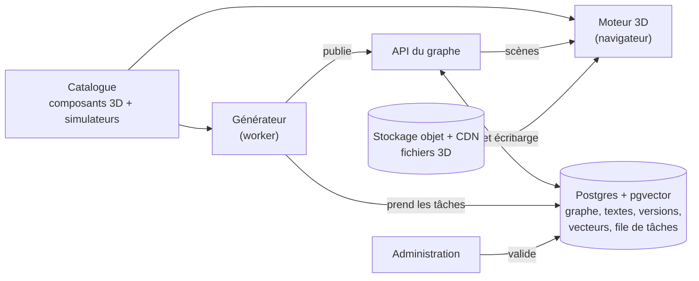

# Explorateur de systèmes — Spécification v1

Version du 9 octobre 2026. Source de vérité du projet : toute évolution de la spec passe par ce fichier.

## Vision et objectifs

L'outil fait comprendre un système technique ou un phénomène scientifique en plongeant l'utilisateur dans une scène 3D qu'il explore, de l'objet entier jusqu'à la physique fondamentale.

- **Entrée** : une question en langage naturel, par exemple « comment fonctionne l'antenne Starlink ? ».
- **Sortie** : une scène 3D navigable, une visite guidée narrée (mode Play) et des sous-systèmes cliquables.
- **Public** : adultes et enfants, avec trois niveaux d'explication.
- **Produit multi-utilisateurs** : un graphe de connaissances partagé, où chaque explication générée profite à tous.
- **Langue** : français en V1, architecture prête pour le multilingue.
- **Plateformes** : ordinateur et iPad en V1 ; casque de réalité virtuelle envisagé plus tard.
- **Références** : Branch Education pour le style visuel et la narration ; BioDigital Human et Zygote Body pour l'exploration par couches ; Google Earth pour la fluidité du zoom.

### Principes directeurs

1. **Pas de schéma** : uniquement de la 3D stylisée et des simulations manipulables.
2. **Exactitude** : les simulations physiques sont calculées, pas dessinées, et les explications sont sourcées.
3. **Première réponse complète** : tout le niveau 1 de sous-systèmes est montré dès la première question.
4. **Architecture simple et modulable** : peu de modules, reliés par des contrats stables.

## Expérience utilisateur

L'utilisateur reste dans un seul monde 3D continu : il zoome d'une échelle à l'autre, active des lentilles pour voir la physique et pose ses questions sans quitter la scène.

### Parcours type

1. **Accueil** : une barre de question et une galerie de mondes déjà explorés.
2. **Arrivée sur une scène** : une courte visite automatique de 20 à 30 secondes, puis la main passe à l'utilisateur.
3. **Exploration** : on tourne autour de l'objet ; un clic sur un composant fait plonger la caméra et révèle ses sous-systèmes.
4. **Approfondissement** : les lentilles révèlent les principes sur place ; le laboratoire permet de descendre jusqu'aux équations.

### Briques d'interaction

| Brique | Ce qu'elle fait |
| --- | --- |
| Zoom continu | Chaque nœud du graphe est un niveau de zoom, avec une transition d'entrée et de sortie. |
| Caméra contrainte | Orbite autour de l'objet sélectionné, zoom, retour. Pas de vol libre. |
| Mode Play | Visite guidée : mouvements de caméra, mises en surbrillance, réglages de curseurs, texte en sous-titres. Disponible à tout moment. |
| Lentilles | Filtres qui révèlent la physique invisible sur l'objet réel (ondes, électricité, chaleur), avec leurs curseurs. |
| Laboratoire | Espace abstrait atteint depuis une lentille, pour descendre vers la physique fondamentale, puis revenir à la scène. |
| Termes explorables | Dans un sous-titre, un terme qui a son propre nœud est souligné. Le toucher met le Play en pause et ouvre une carte (définition en une phrase, « Explorer » ou « Plus tard ») ; « Explorer » plonge vers ce nœud, « Retour » reprend le Play à l'étape interrompue, « Plus tard » le garde dans une liste « À explorer » proposée en fin de Play. Visibles mais non cliquables pendant la visite d'arrivée. |
| Menu au clic | « Comment ça marche ? » par défaut, « Pourquoi comme ça ? », « Et si on l'enlevait ? » et une question libre. |
| Barre d'échelle | Sert de fil d'Ariane (mètre, centimètre, millimètre) et permet de remonter d'un niveau. |
| Signalement | Un geste sur l'objet concerné, avec ou sans commentaire. |

### Niveaux d'explication

| Niveau | Public | Style |
| --- | --- | --- |
| Découverte | Environ 8 à 12 ans | Analogies, aucune formule |
| Essentiel (par défaut) | Adulte grand public | Le concret d'abord, puis le principe, avec les ordres de grandeur |
| Approfondi | Ingénieur ou étudiant | Équations et chiffres |

La scène et la simulation sont communes aux trois niveaux ; seuls le texte et les curseurs exposés changent. Le niveau se modifie à tout moment, sur le même nœud.

### Personnalisation

Le contenu est identique pour tous ; seule la navigation est personnalisée : badge « déjà vu », historique du parcours, rappel court d'un principe déjà exploré. La lecture se fait sans compte ; le compte sert à conserver le parcours.

### Narration

Les textes sont écrits dès la V1 pour être lus à voix haute. Un texte peut avoir deux versions : celle lue à voix haute (des mots seulement) et le sous-titre affiché, où les équations sont en notation mathématique. Toute équation définit chacun de ses termes (symbole, signification, unité), à l'écran comme à l'oral. La narration audio est générée à partir de ces textes, étape par étape, et la durée de chaque étape s'aligne sur celle de l'audio.

## Modèle de contenu

Tout le contenu vit dans un graphe partagé de nœuds versionnés : chaque nœud est une scène, et chaque lien dit comment on passe de l'une à l'autre.

### Deux types de nœuds

- **Système** : un objet ou un phénomène vu comme un ensemble de composants (le terminal Starlink, l'atmosphère qui rend le ciel bleu). On l'explore par « comment ça marche ? ».
- **Principe** : un mécanisme physique réutilisable (interférences, dipôle, ondes électromagnétiques, équations de Maxwell). On l'explore par « pourquoi ça marche ? ». Il s'affiche comme lentille dans une scène ou dans le laboratoire, et il est rattaché à un identifiant Wikidata.

Un phénomène comme le ciel bleu est traité comme un Système : une scène dont les composants (Soleil, molécules de l'air, observateur) mènent vers des principes. Chaque composant est expliqué au niveau de la scène ; descendre vers la physique fondamentale reste un choix de l'utilisateur.

### Liens

| Lien | De → vers | Exemple |
| --- | --- | --- |
| se compose de | Système → Système | Terminal Starlink → réseau d'éléments rayonnants |
| repose sur | Système ou Principe → Principe | Réseau d'éléments → interférences → ondes électromagnétiques → Maxwell |
| question libre | Nœud → nœud | Terminal Starlink → « Pourquoi une antenne plate ? » |
| dérivé de | Nœud → nœud dont il réutilise la scène | « Pourquoi une antenne plate ? » → « Orienter le faisceau » |

Les principes forment une base commune : le nœud « interférences » est atteint depuis Starlink, les casques à réduction de bruit ou les bulles de savon.

### Contenu d'un nœud

- Identifiant, type, question d'origine et alias de formulation
- Scène, au format de scène, sans aucun texte
- Textes par nœud, niveau et langue : script du Play, étiquettes, descriptions
- Sources consultées
- Version, statut (publié, à revoir) et historique des corrections
- Embedding pour la recherche par similarité

### Règles

- Un seul nœud canonique par sujet, vu par tous les utilisateurs.
- Toute question libre alimente le graphe, après normalisation (voir le pipeline).
- Une correction crée une nouvelle version ; les nœuds enfants concernés sont marqués « à revoir ».
- Multilingue : les scènes sont neutres et les textes stockés à part ; traduire revient à générer de nouveaux textes.

## Exemple de référence : le terminal Starlink

Le terminal Starlink est le premier sujet. Il est fabriqué à la main sur l'architecture cible, puis sert de référence au générateur. Les chiffres ci-dessous sont des ordres de grandeur à confirmer par les sources lors de la rédaction.

### Première réponse, niveau Essentiel

La scène montre l'antenne sur un toit, un satellite en orbite basse, la station au sol et Internet. Les sous-systèmes de niveau 1 sont cliquables : réseau d'éléments rayonnants, puces de formation de faisceau, modem, alimentation et dégivrage, routeur Wi-Fi.

Le Play compte 7 étapes, pour environ 2 à 3 minutes :

1. L'antenne communique avec un satellite situé à environ 550 km, qui se déplace à environ 27 000 km/h.
2. Le problème : viser une cible qui traverse le ciel en quelques minutes, sans aucune pièce mobile.
3. Vue en coupe : des centaines de petites antennes sous le capot.
4. Le faisceau se forme et s'oriente (curseur).
5. Le passage de relais vers le satellite suivant.
6. Le trajet des données : satellite, puis station au sol, puis Internet.
7. Les autres sous-systèmes, une phrase chacun : modem, alimentation et dégivrage, routeur Wi-Fi.

Lentilles proposées : Ondes (prioritaire en Phase 0), Électricité, Chaleur.

### Une étape aux trois niveaux : orienter le faisceau

| Niveau | Texte | Curseurs exposés |
| --- | --- | --- |
| Découverte | « Jette plein de cailloux dans une mare, un peu l'un après l'autre : les vagues s'additionnent dans une seule direction. L'antenne fait pareil avec des ondes radio. » | Direction du faisceau |
| Essentiel | « Chaque petite antenne émet la même onde avec un léger décalage sur sa voisine. Les ondes s'additionnent dans une direction et s'annulent ailleurs. On oriente ainsi le faisceau électroniquement, sans rien bouger. » | Angle du faisceau, nombre d'éléments |
| Approfondi | Relation de déphasage ci-dessous. En bande Ku (environ 12 GHz), λ vaut environ 2,5 cm, d'où un espacement d d'environ λ/2, soit 1,2 cm. | Déphasage, nombre d'éléments, rapport d/λ |

```latex
\Delta\varphi = \frac{2\pi\, d\, \sin\theta}{\lambda}
```

Au niveau Approfondi, le curseur d/λ montre ce qui se passe au-delà de λ/2 : des faisceaux parasites apparaissent (les lobes de réseau). C'est ce type de manipulation qui fait comprendre pourquoi le système est conçu ainsi.

### Une question libre : « Pourquoi l'antenne est plate au lieu d'être une parabole ? »

Le système reformule d'abord la question en « Antenne plate à commande de phase ou parabole : pourquoi ce choix », la classe comme une comparaison et identifie deux concepts : la commande de phase et la parabole. La recherche dans le graphe débouche ensuite sur l'une des quatre issues suivantes.

| Situation dans le graphe | Réponse du système |
| --- | --- |
| Doublon : un nœud « Pourquoi une antenne plate ? » existe | Il s'ouvre directement ; la formulation est enregistrée comme alias. |
| Nœud proche : « Orienter le faisceau » couvre l'essentiel | Nouveau nœud qui réutilise cette scène avec un autre script Play, lié par « dérivé de ». |
| Question nouvelle | Nœud complet, relié au terminal (question libre) et aux principes concernés (repose sur). |
| Question vague ou hors sujet | Le système demande une précision au lieu de créer un nœud. |

### Scène de contrôle

Avant de figer le format de scène v1, une deuxième scène très différente est écrite à la main : le ciel bleu (un phénomène) ou un moteur thermique (de la mécanique). Si elle s'exprime sans modifier le format, l'architecture est réellement modulable.

## Architecture technique

L'architecture tient en cinq modules reliés par trois contrats : tant que les contrats restent stables, chaque module se remplace sans toucher aux autres.



Le moteur ne sait qu'afficher une scène ; le générateur ne sait que produire une scène ; tous deux lisent le même catalogue.

### Trois contrats

- **Format de scène** : un JSON versionné qui décrit composants, positions, lentilles, étapes du Play et liens vers les enfants. Il ne contient que des clés de texte, jamais le texte lui-même. C'est l'artefact de conception le plus important du projet.
- **Catalogue** : pour chaque composant et chaque simulateur, ses paramètres, ce qu'il représente et sa plage de validité. Le LLM n'utilise que ce qui y figure.
- **Nœud** : identifiant, type, versions, textes par niveau et par langue, sources, liens.

### Cinq modules

1. **Moteur 3D** (front, Three.js) : affiche un fichier de scène. Composants, simulateurs et lentilles sont des plugins enregistrés dans le catalogue ; ajouter un simulateur ne touche pas au cœur.
2. **API du graphe** : lecture et écriture des nœuds, liens et versions, recherche par similarité.
3. **Générateur** : une chaîne d'étapes JSON vers JSON, modèle au choix par étape, chaque étape remplaçable par un humain.
4. **File de tâches** : génération, vérification des signalements, pré-génération des enfants.
5. **Administration** : file de validation des nouveaux composants et des corrections ; une simple page au départ.

### Briques écrites à la main

- **Simulateurs physiques** : une dizaine à une quinzaine (ondes, champs, circuits, thermique, mécanique, fluides). Le LLM les configure, il ne les écrit pas : l'exactitude est garantie par construction.
- **Composants 3D** : géométrie paramétrique pour les objets techniques ; API texte-vers-3D envisageables pour le décor. Tout nouveau composant passe par l'administrateur.

### Infrastructure minimale

- Un monolithe modulaire : un backend, un worker et un front statique, soit trois conteneurs sur Coolify. Pas de microservices.
- Postgres fait tout : graphe, vecteurs (pgvector), versions, file de tâches (SKIP LOCKED). Ni Redis ni base de graphes au départ.
- Stockage objet derrière un CDN pour les fichiers 3D.
- Rendu 3D côté client : aucun GPU serveur nécessaire.

## Pipeline de génération et de correction

Chaque génération est une tâche asynchrone en 7 étapes reprenables ; chaque étape prend un JSON et renvoie un JSON, peut utiliser son propre modèle et peut être faite par un humain.

1. **Normalisation** : reformuler la question, la typer (système, principe, comparaison), extraire les concepts.
2. **Recherche dans le graphe** : doublon → servir le nœud ; nœud proche → dériver ; question nouvelle → créer ; question vague → demander une précision.
3. **Sources** : recherche web ; les pages réellement ouvertes sont citées dans le nœud.
4. **Plan pédagogique** : sous-systèmes de niveau 1, étapes du Play, lentilles, textes par niveau.
5. **Description de scène** : au format de scène, avec uniquement les composants et simulateurs du catalogue. Un composant manquant devient une demande en file d'administration.
6. **Validation** : schéma, rendu en headless, cohérence entre textes et scène, vérification des faits par un second modèle face aux sources.
7. **Publication** : nouveau nœud ou nouvelle version, liens, embedding.

Dès qu'un utilisateur entre dans une scène, les nœuds enfants de niveau 1 sont générés en arrière-plan, pour éviter d'attendre au milieu d'un plongeon. Une génération peut prendre plusieurs minutes : la progression est visible et une notification signale la fin.

### Signalements

1. L'utilisateur signale une erreur sur l'objet concerné, en quelques mots ou sans commentaire.
2. Un agent vérifie en ligne et propose une correction du nœud.
3. L'administrateur valide ou rejette.
4. Une nouvelle version est publiée ; les nœuds enfants concernés sont marqués « à revoir ».

### Coûts

Le graphe partagé joue le rôle de cache : un sujet n'est généré qu'une fois pour tous. Des quotas de génération par utilisateur sont en place dès le départ. Le coût réel par nœud sera mesuré en Phase 1 ; l'estimation initiale va de quelques dizaines de centimes à environ 1 €.

## Feuille de route

Le projet avance en trois phases, toutes construites sur l'architecture cible ; chacune ne s'ouvre qu'une fois le critère de la précédente atteint.

| Phase | Contenu | Critère de passage |
| --- | --- | --- |
| 0 · Prototype | Moteur, lecteur Play, simulateur d'ondes, lentille Ondes, scènes Starlink écrites à la main sur 3 niveaux, scène de contrôle. Le générateur est remplacé par un humain. | Tests concluants auprès d'une dizaine de personnes (adultes et enfants) ; format de scène v1 figé |
| 1 · Générateur | Production de nœuds enfants à partir des composants existants du catalogue. | Le générateur reproduit Starlink à un niveau comparable à la version faite main (test de non-régression) |
| 2 · Ouverture | Questions libres, graphe complet, circuit de signalement, 20 à 30 sujets amorcés. | Coût par nœud mesuré et tenable, quotas en place |
| Ensuite | Narration audio (si elle n'est pas avancée en V1), multilingue, contributeurs experts, réalité virtuelle. | — |

## Risques et questions ouvertes

Le premier risque est la qualité des composants 3D générés ; le second, l'adhésion des utilisateurs à l'expérience immersive. La Phase 0 sert à tester le second avant d'investir dans le premier.

| Risque | Parade |
| --- | --- |
| Composants 3D de qualité inégale | Géométrie paramétrique pour les objets techniques ; validation par l'administrateur avant entrée au catalogue ; bibliothèque qui s'enrichit avec le temps |
| Rupture visuelle entre échelles | Un nœud enfant hérite de la géométrie et du style du composant parent |
| Erreurs de physique | Simulateurs calculés, sources obligatoires, vérification par un second modèle, signalements |
| Désorientation en 3D | Caméra contrainte, barre d'échelle, bouton de retour |
| Performance sur iPad | Budget de détail par scène, simplification des objets éloignés, chargement progressif |
| Démarrage à vide | 20 à 30 sujets soignés amorcés avant l'ouverture |
| Doublons dans le graphe | Normalisation, alias de formulation, fusion de nœuds |
| Format de scène calqué sur Starlink | Scène de contrôle contrastée avant de figer la v1 |

### Questions ouvertes

- [ ] Narration audio dès la V1, ou en V1.5 ?
- [ ] Le Play de 7 étapes et 2 à 3 minutes est-il bien dosé ?
- [ ] Niveau Approfondi : la relation clé suffit-elle, ou faut-il les équations complètes ?
- [ ] Sujet de la scène de contrôle : ciel bleu ou moteur thermique ?
- [ ] Liste des 20 à 30 sujets d'amorçage
- [ ] API texte-vers-3D pour les éléments de décor, à évaluer
- [ ] Modèle économique : gratuit, abonnement ou écoles ?
- [ ] Contributeurs experts : rôles et droits, le moment venu
