# Spec v3 — Frameworks d'analyse, managers, et base de connaissance dictée par le framework

> **Statut** : spec d'architecture, écrite le 2026-09-09. Elle **s'ajoute** à
> `01-spec-v2-unifiee.md` (qui reste la constitution du flux) et à
> `02-spec-autorite-vs-actualite.md` (qui reste la doctrine des trois axes). Elle ne défait
> ni l'une ni l'autre — §1 liste explicitement ce qui est préservé.
>
> **Ce qu'elle tranche** : le référentiel d'indexation de la connaissance passe d'une **grille
> fermée de 19 champs identique pour tous les émetteurs** à un jeu de **frameworks stables à
> variables par entreprise**, dont chacun **dicte ce qu'il faut aller chercher** et est **garanti
> par un manager**.
>
> **Roadmap active** : cette spec devient la roadmap active du projet à sa validation
> (pointeur dans `roadmap/provenance-cards/00-REPRISE.md`).

---

## 0. Pourquoi une v3 — les faits qui la motivent

Aucun de ces constats n'est une opinion : chacun a été mesuré sur la base réelle ou par lecture
de source, entre le 2026-09-08 et le 2026-09-09.

### 0.1 Le référentiel est fermé, et il est le même pour tout le monde

`backend/app/agents/v2/common.py` :

```python
MVDD_SPEC = [ … 8 dimensions, 19 champs requis … ]
MVDD_FIELD_PATHS = frozenset(f"{s['dimension']}.{c}" for s in MVDD_SPEC for c in s["champs_requis"])
# Un tag hors vocabulaire ne fonde rien — il est écarté, pas inventé.
```

`worker.py:141` (`_resolve_covers`) : un `covers` déclaré hors des 19 chemins retourne `None`.
**L'entry est stockée et ne fonde rien.** Elle devient orpheline.

Taux d'orphelines mesurés sur les entries courantes :

| Émetteur | Orphelines | Part |
|---|---|---|
| MSFT | — | **20 %** |
| NVDA | 26 | **50 %** |
| RVMD | — | **26 %** |

Les 26 orphelines de NVIDIA contiennent **16 faits SEC tier A** : revenu (×3), résultat net (×2),
marge brute, cash-flow opérationnel, capitaux propres, actifs totaux, trésorerie + dette LT, capex,
retour au capital (×2). Ce ne sont pas des déchets — c'est la matière première d'une analyse de
qualité financière, rangée nulle part.

### 0.2 La grille ne décrit pas certaines entreprises du tout

RVMD (biotech pré-revenus) :

- entry **#190** fabrique un ROIC pour une société sans chiffre d'affaires ;
- entry **#191** s'intitule « conversion FCF **non définie** » ;
- entry **#186** range l'incidence du cancer du pancréas sous `marche.croissance_marche_historique` ;
- **3 des 4 cibles de synthèse sont vides** → **0 synthèse grounded** sur ce ticker.

Ce qui devrait exister pour ce dossier — **runway de trésorerie**, **calendrier de lecture d'essais
cliniques**, **probabilité de succès réglementaire**, **population de patients adressable** — n'a
**aucun champ où exister**. Le système ne dit pas « je ne sais pas » : il produit des ratios vides
de sens sous des noms qui inspirent confiance.

`produits.unit_economics` compte **2 entries dans toute la base**, tous émetteurs confondus.

### 0.3 Deux vocabulaires qui ne se rencontrent jamais

Réconciliation déterministe des deux sources (script `/tmp/vocab.py`, à versionner sous
`tools/reconcilier_vocabulaires.py` — cf. lot 0) :

```
vocabulaire d'INDEXATION (covers, MVDD_SPEC) : 19 chemins
champs FEUILLES du ResearchMemo (hors refs)  : 36

⚠️  champs du mémo SANS chemin d'indexation (14) :
   financials.earnings_quality · financials.roic_trend_5y
   industry.croissance_marche_prospective · industry.cyclicite
   industry.disruption_vectors · industry.structure_5forces
   management.candeur · management.capital_allocation_scorecard
   moat.durabilite_ans · moat.trend · moat.type
   valuation.dcf_scenarios · valuation.epv · valuation.reverse_dcf

chemins indexables jamais consommés par le mémo (3) :
   marche.structure_5forces · produits.description · risques.risques_cles
```

Conséquence directe, à confronter à la **matrice de traçabilité** du benchmark
(`benchmark-methodologies-decision-investissement.md`, Partie E) :

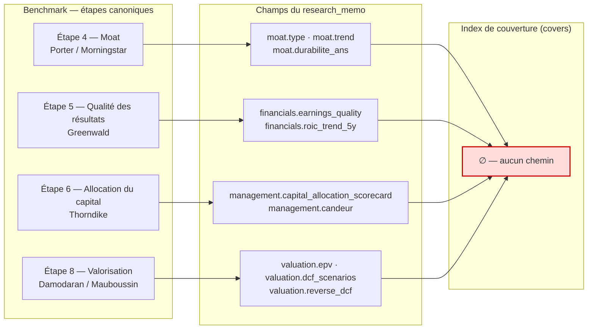

**Les étapes 4, 5, 6 et 8 du processus canonique sont produites avec zéro preuve indexable.**
Symétriquement, `risques.risques_cles` est le chemin **le plus peuplé** de la base (15 entries) et
**aucun champ du mémo ne le consomme**.

### 0.4 Le barreau 4 de la capacité 5 est mort, et sa cause est en dessous

La capacité 5 (« la dégradation déclarée ») prévoyait un barreau 4 : l'agent propose une méthode
pour approximer une donnée manquante **à partir de pièces déjà présentes dans le dossier**. Sa
ligne de base l'a réfuté **quatre fois** (détail dans `02-spec-autorite-vs-actualite.md`).

Le contre-test décisif : sur l'étalon, dépouiller la question de sa négation fait passer les rangs
de `[6, 10, —, 9, —]` à `[5, 15, —, 9, 16]`. **Aucune amélioration** — le défaut n'est pas la
formulation de la question.

La cause réelle est apparue en base : l'entry **#33** (« NVIDIA cost of revenue drivers and
inventory provisions ») est **citée dans la prose de la synthèse** et pourtant **orpheline** —
elle ne couvre rien, donc elle est absente du corpus du champ. La recherche sémantique aveugle
était le seul chemin vers elle, et elle échoue.

> **Le barreau 4 ne compense pas une limite de la recherche : il compense un défaut de rangement.**
> → **Barreau 4 hors périmètre.** Motif écrit. La v3 corrige le rangement.

### 0.5 Trois écarts avec le processus d'un vrai fonds

Ce qui est **déjà conforme** (vérifié en code et en base) : recherche séparée de l'analyse (les
analystes ne cherchent pas, ils citent) · `research_memo` neutre · bull/bear isolés + réfutation
asymétrique bear→bull + synthèse dialectique (DÉCISION #1, Option C) · scénarios bear/base/bull ·
reverse-DCF obligatoire · `iv_range` · marge de sécurité · hypothèses falsifiables à seuils
d'alerte et d'invalidation · monitoring modes 1-6 · plan de sortie · post-mortem.

Ce qui **manque** :

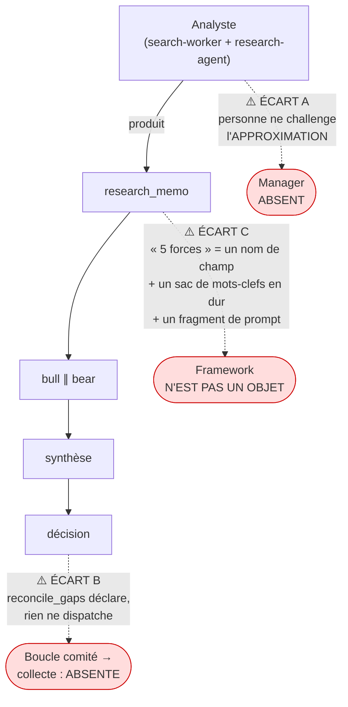

- **Écart A** — le curator garde la **suffisance des données**, le debate-agent garde la
  **conviction à la sortie**. Personne, entre les deux, ne challenge la méthode d'approximation
  d'un analyste.
- **Écart B** — `reconcile_gaps` **déclare** des lacunes ; rien ne les **dispatche**. Le worker ne
  part que sur `POST /knowledge/worker`, à la main.
- **Écart C** — un framework n'a pas d'existence : il est éparpillé entre un nom de champ, un sac
  de mots-clefs français codé en dur dans `SYNTHESIS_TARGETS`, et un fragment de prompt.

### 0.6 Les données en base sont un HISTORIQUE DE TEST, jamais un point de départ

**Règle posée le 2026-09-10, et elle gouverne tout ce qui suit.** Le corpus en base est ce qu'ont
ramassé les recettes d'un système inachevé. Il peut servir à **éprouver** la v3 ; il ne peut jamais
servir à la **concevoir**. Le système n'est en usage réel sur aucun périmètre — ni V0, ni V1, ni
V2 — donc aucune ligne en base n'est un fait à préserver, et aucune n'est un objectif à atteindre.

Ce que la règle interdit, nommément :

- **Dériver une question d'un poste EDGAR, d'un champ MVDD ou d'une entry existante.** Une question
  se dérive d'une méthodologie (Greenwald, Porter), et son énoncé est en **substance économique**
  (§2.3) — jamais en artefact comptable.
- **Écrire un test d'acceptation dont le seuil est un décompte du corpus actuel.** Un tel seuil est
  **inperdable** : il déclare le framework bon quand il absorbe ce que les tests d'hier ont
  collecté. C'est ce qui tue T1 et T2 (§9.2).
- **Backfiller les `covers` existants vers les nouvelles questions.** Une table de traduction relue
  à la main est une correspondance *construite pour tomber juste* sur les données d'hier (§5.3).

**Le symptôme, mesuré le 2026-09-10** — il est plus net que ce que §0.1 à §0.3 en disaient :

| Mesure | Valeur |
|---|---|
| Entries courantes ne couvrant **aucun** champ | **45 / 134 = 34 %** — stockées, embeddées, invisibles à la porte |
| Colonnes de `knowledge_entries` avec **zéro** écriture sur 180 lignes | **7** — `question_status`, `question_priority`, `resolves_entry_id`, `conflict_entry_id`, `has_conflict`, `reviewed_by_user`, `is_deleted` |
| Champs génériques appliqués à un fondeur, un éditeur et une biotech pré-revenus | **les 19, à l'identique** |
| Thèses V2 / positions V2 / plans de sortie | **1 / 1 / 0** |

Les 7 colonnes mortes sont le mode de panne de la convention **#50** (`cross_validated` câblé de
bout en bout, jamais passé par un appelant de production) : 35 colonnes portées pour une vingtaine
réellement écrites. Le modèle se **simplifie** avant d'accueillir la v3, il ne s'étend pas.

**Ce qui applique déjà la règle en code** (lot 2a, livré) : `check_frameworks_definitions.py` **§5**
interdit qu'un énoncé, un libellé d'ingrédient, une variable ou un motif de gabarit nomme un
émetteur, une entry, un dépôt réglementaire ou un mécanisme de stockage — et l'assert porte sur les
données **parsées**, jamais sur le texte du fichier, parce que l'en-tête du YAML énonce l'interdit
et contiendrait donc les jetons interdits (convention #56). Quatre mutations du test négatif
l'éprouvent en abîmant les **données** et non le code.

> **Corollaire de falsifiabilité, à tenir jusqu'au bout du chantier.** Si la couverture d'un
> framework sort à **100 % sans aucune lacune**, il a été rétro-conçu depuis le corpus. Prédiction
> vérifiable dès maintenant : `qf_1` réclame un **coût du capital**, `essentiel: true`, et aucun
> fait SEC n'en contient un. Le framework **doit** produire cette lacune, et le manager **doit** en
> faire un mandat. Une v3 qui ne produirait aucun trou aurait échoué en paraissant réussir.

---

## 1. Ce que la v3 NE défait PAS

Liste de préservation, à relire à chaque lot. **Tout ce qui suit reste en vigueur mot pour mot.**

### 1.1 Constitution et garde-fous

- `00-principe-directeur-v2.md` prime sur toute spec.
- **G1** — le contrat JSON encode la méthodologie : l'agent ne peut pas sauter une étape.
- **G2** — un contrat de décision ne vaut que par ce que le corps HTTP **n'expose pas**
  (convention #36).
- **G3** — la décision est indépendante de l'UX.
- **Ordre des tickets : UX (contrat) → agent → données.** Jamais commencer par le schéma de table.

### 1.2 Décisions structurantes

| # | Décision | Statut v3 |
|---|---|---|
| **#1** | Option C — base neutre → bull/bear isolés → réfutation asymétrique bear→bull → synthèse dialectique (**seul verdict**) | **inchangée** |
| **#2** | Budget déplafonné, deux principes de coût | inchangée |
| **#3** | — | inchangée |
| **#4** | — | inchangée |
| **#5** | Sortie **thèse-driven** avec réévaluation thèse-vs-prix | inchangée |

### 1.3 Les 6 règles transverses de §8 (spec v2)

1. Toute affirmation factuelle porte `source_entry_refs`.
2. Toute prévision porte une **ancre base-rate** — pas de point chiffré sans classe de référence.
3. Les hypothèses portent un **seuil d'invalidation chiffré**.
4. Les axes **qualité business / qualité info / conviction / marge de sécurité** restent
   **séparés** — jamais de score unique (A3).
5. La valorisation porte **toujours** le reverse-DCF (A4).
6. Le champ **variant perception** est obligatoire : pas d'edge articulé ⇒ pas de thèse.

> La v3 **ajoute une 7ᵉ règle**, §3.5 : toute réponse de framework déclare son **rang** et, si elle
> est approximée, sa **méthode d'approximation** et ses **ingrédients**.

### 1.4 Corrections d'audit A1-A10

A1 snapshots · A2 groundedness · A3 trois indicateurs séparés · A4 horizon ≥ 5 ans + reverse-DCF ·
A5 calibration · A6 bear divergent + réfutation · A7 overrides tracés · A8 risque portefeuille ·
A9 contradictions pondérées tier + récence · A10 `too_hard` révisable avec `date_re_revue`.

### 1.5 Doctrine des trois axes (spec 02)

- **fiabilité** — propriété de la **source**, stockée (`reliability_score`, `reliability_tier`).
- **nature** — propriété de l'**assertion**, stockée (`mesure` | `evenement` | `interpretation`,
  migration 034, convention #51).
- **actualité** — propriété de la **relation** fait ↔ ancre, **calculée à la lecture, jamais
  persistée** (convention #53).
- **Jamais de recombinaison en scalaire** (convention #50). La porte lit un **triplet**.
- Porte de complétude à **trois états** : `couvert` / `couvert_perime` / `non_couvert`, deux
  remèdes `rafraichissement` ≠ `collecte` (convention #54).
- **Règle de rang** : une estimation vaut **un cran sous la plus faible pièce citée**, toujours
  **dérivée** (`derive_synthesis_reliability`), jamais auto-déclarée ; `nature` forcée à
  `interpretation`.

### 1.6 Invariants du flux

Horizon ≥ 5 ans · sortie thèse-driven, jamais prix-driven seul · trois indicateurs séparés ·
colonne vertébrale d'auditabilité (les 5 P0) · deux espaces disjoints V1/V2 (seul l'univers de
tickers est partagé).

### 1.7 Ce qui est livré et reste tel quel

Migrations 024→035 · abstraction provider · `search-worker` et ses 3 outils · `query_knowledge`
vectoriel bge-m3 1024d (invariant A3 : la fiabilité est un **filtre**, jamais un critère de
classement ; **ne pas hybrider en RRF** — mesuré dégradant, MRR 0,905 → 0,655) · les 8 feeds
déterministes (`edgar_feed`, `financials_feed`, `valuation_feed`, `base_rate_corpus`,
`material_events`, `staleness`, `actualite`, `source_registry`) · toute la suite `backend/checks/`.

---

## 2. L'objet framework

### 2.1 Définition

> Un **framework** est une **question d'investissement stable**, décomposée en **questions
> universelles** applicables à toute entreprise, dont chaque réponse est **fondée sur des entries
> citées**, **rangée sous un chemin d'indexation qui lui appartient**, **portée à un rang dérivé**,
> et **garantie par un manager**.

Trois propriétés, et c'est ce triplet qui le distingue de la grille de 19 :

1. **Stable** — les questions sont les mêmes pour tout émetteur. C'est ce qui rend les dossiers
   comparables.
2. **À variables par entreprise** — les *réponses*, leurs *unités*, leurs *ingrédients* et leurs
   *méthodes d'approximation* dépendent de l'entreprise. C'est ce qui rend le framework applicable
   à NVIDIA **et** à une biotech pré-revenus.
3. **Prescripteur** — le framework **dicte ce qu'il faut aller chercher**. Il n'est pas induit de
   ce que la base contient déjà ; il définit ce qu'elle doit contenir.

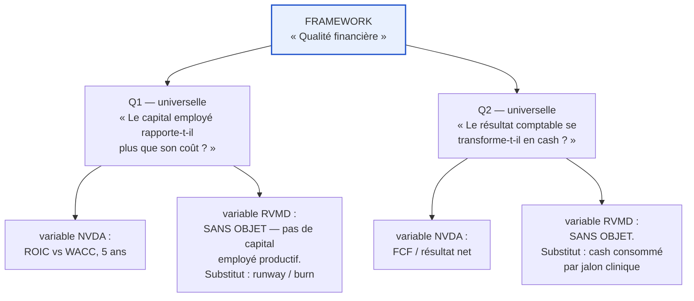

**Le hors-sujet est un signal, pas une panne.** Quand une question universelle sort `sans_objet`
sur un émetteur, c'est une information sur l'émetteur — et souvent la réponse d'un vrai fonds est
« alors ce n'est pas dans notre cercle de compétence ». Le système doit **le dire**, jamais
fabriquer un ROIC pour une société sans revenus (entry #190, §0.2).

### 2.2 Anatomie — les 6 parties d'un framework

| Partie | Rôle | Exemple (Qualité financière) |
|---|---|---|
| `id` / `libelle` | identité stable | `qualite_financiere` |
| `etape_benchmark` | rattachement au processus canonique (Partie B du benchmark) | étape 5 |
| `methodologie` | l'autorité dont il dérive | Greenwald — *earnings quality*, EPV |
| `questions[]` | les questions **universelles** | cf. §4.1 |
| `variables_par_archetype` | comment la question s'instancie selon l'archétype | cf. §4.1.3 |
| `sortie` | le contrat JSON de la réponse (`FrameworkAnswer`, §2.4) | — |

⚠️ **`natures_admises` retiré du niveau framework le 2026-09-10 (écart V3).** Cette ligne plaçait la
nature admise sur le **framework** alors que §2.3, le contrat de définition et le référentiel livré
la portent sur la **question** (`nature_attendue`). Deux détenteurs pour une même règle : elle
re-diverge au correctif suivant (convention #46, `feedback_correctif_regle_jumeaux`). **La question
tranche**, parce que c'est elle que le contrat Pydantic et le pont valident déjà — et parce que
`qf_4.clauses_de_sauvegarde` (un `evenement` contractuel) et `qf_1.capital_employe` (une `mesure`)
vivent dans le même framework.

### 2.3 Anatomie d'une question

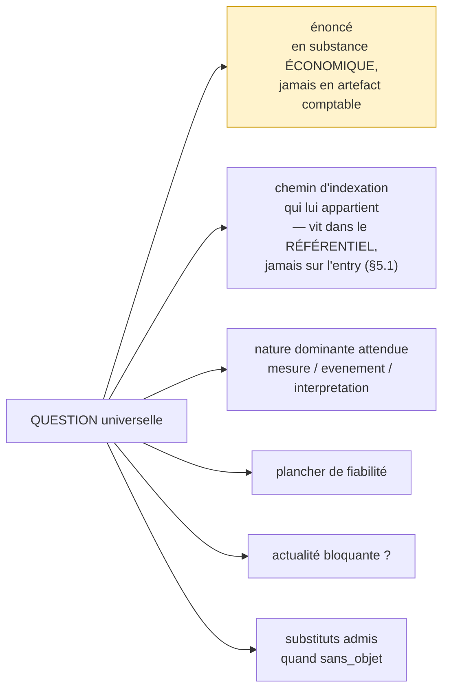

**Règle d'énoncé** — une question se pose au niveau de la **substance économique**, jamais de
l'**artefact comptable**. « Le capital employé rapporte-t-il plus que son coût ? » traverse les
secteurs ; « quel est le ROIC ? » ne traverse pas une biotech. C'est cette règle qui rend une
question réellement universelle, et c'est elle que la grille de 19 avait violée en nommant ses
champs d'après leurs formules (`roic_pct`, `fcf_conversion_pct`, `intensite_capex_pct`).

### 2.4 Contrat de sortie — `FrameworkAnswer`

Un objet par (ticker × framework × question). C'est **le** nouveau contrat de la v3.

```json
{
  "framework_id": "qualite_financiere",
  "framework_version": 1,
  "question_id": "qf_1",
  "ticker_id": "NVDA",

  "statut": "repondu | approxime | sans_objet | non_fondable",

  "reponse": {
    "verbatim": "Le capital employé rend ~ 4× son coût estimé…",
    "valeur": 91.2,
    "unite": "pct",
    "sens": "eleve"
  },

  "fondation": {
    "cited_entry_ids": [41, 42, 55],
    "rang_derive": "A-",
    "nature_effective": "mesure",
    "actualite": "courante | perimee | indeterminable",
    "motif_actualite": "…"
  },

  "approximation": {
    "methode": "…",
    "ingredients_entry_ids": [33, 47],
    "hypotheses_explicites": ["…"],
    "sensibilite": "…"
  },

  "sans_objet": {
    "motif": "société pré-revenus : aucun capital employé productif",
    "substitut_applique": "runway_de_tresorerie",
    "substitut_answer_id": 812
  },

  "manager": {
    "verdict": "acquitte | renvoye",
    "controles": {
      "completude": "ok|ko",
      "fondation": "ok|ko",
      "honnetete_approximation": "ok|ko",
      "non_substitution": "ok|ko"
    },
    "motif": "…",
    "mandat_de_recherche_id": null
  }
}
```

**Invariants du contrat** (vérifiés en Python, pas seulement en Pydantic — convention #37) :

- `statut = approxime` ⇒ le bloc `approximation` est **complet** et `rang_derive` est
  **strictement inférieur** au rang de la plus faible pièce citée (règle de rang, §1.5).
- `statut = sans_objet` ⇒ `sans_objet.motif` non vide **et** un substitut désigné **ou** une
  déclaration explicite qu'il n'y en a pas.
- `statut = non_fondable` ⇒ un `GapItem` est **émis**, avec son `remede`
  (`collecte` | `rafraichissement`, convention #54).
- `manager.verdict = renvoye` ⇒ `mandat_de_recherche_id` **non nul**. Un renvoi sans mandat est
  un renvoi qui ne produit rien (Écart B, §0.5).
- `fondation.actualite` est **calculée à la lecture**, jamais lue depuis un stockage
  (convention #53). Corollaire : **le GET recalcule**, comme
  `_apply_deterministic_overrides` le fait déjà pour la readiness (convention #54).
- `framework_version` est **obligatoire** : une réponse sans la version de la question à laquelle
  elle répond n'est plus interprétable dès le premier correctif d'énoncé (§5.2).

⚠️ **CORRIGÉ le 2026-09-10 (écart V4).** Cet exemple écrivait
`"question_id": "qf_1_rendement_du_capital"` là où le référentiel livré dit `qf_1` — et le contrat
de définition impose `pattern = ^[a-z]{2}_[0-9]+$`, qui **refuse** la forme longue. L'exemple JSON
d'un prompt est un morceau du contrat (convention #39) : le modèle recopie l'exemple, donc un
exemple faux produit un sortant refusé par le contrat, à chaque appel. Le test négatif du lot 2a
avait déjà buté sur ce même `pattern` en tentant d'injecter `qf_7_bis`.

---

## 3. Le manager et ses quatre contrôles

### 3.1 Position dans le flux

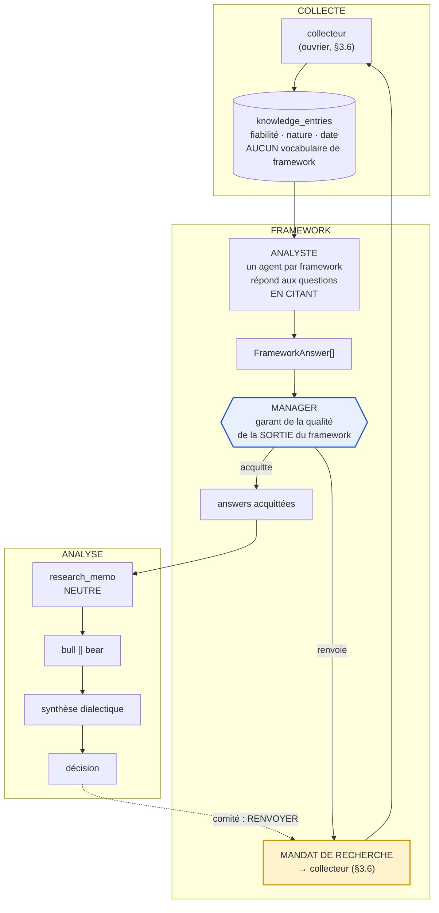

Le manager **ferme la boucle** de l'Écart B : son renvoi **est** un mandat de recherche exécutable,
et l'action « renvoyer » du comité (§7) emprunte exactement le même canal.

### 3.2 D'où vient son autorité

Le manager **n'a pas d'opinion sur l'entreprise**. Son autorité dérive du **framework**, et elle
s'exerce par **quatre contrôles vérifiables** — chacun a une réponse `ok`/`ko` motivée, aucun ne
demande un jugement d'investissement.

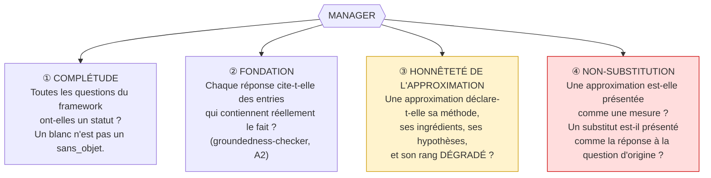

- **① Complétude** — le contrôle le plus bête et le plus utile. Une question sans statut est un
  trou ; une question à `sans_objet` sans motif est un trou déguisé.
- **② Fondation** — réutilise le `groundedness-checker` (A2) déjà spécifié. La citation est
  **vérifiée**, jamais déclarée (conventions #24/#28).
- **③ Honnêteté de l'approximation** — **c'est ici que se joue le rôle décrit par l'utilisateur** :
  « le manager challenge les hypothèses prises, par exemple lorsque l'analyste doit faire une
  approximation d'une donnée non publiée ». Le contrôle est mécanique : la méthode est-elle écrite,
  les ingrédients cités, le rang effectivement dégradé ?
- **④ Non-substitution** — le contrôle qui aurait attrapé l'entry #190 (ROIC fabriqué pour une
  société sans revenus) et l'entry #191 (« conversion FCF **non définie** » publiée comme réponse).

### 3.3 Ce que le manager ne fait pas

- Il ne **cherche pas** (séparation recherche/analyse, préservée).
- Il ne **réécrit pas** la réponse de l'analyste — il acquitte ou il renvoie.
- Il n'**arbitre pas** entre bull et bear : ce n'est pas son étage.
- Il ne **promeut jamais** un rang. Il peut faire dégrader, jamais monter (symétrique de la
  convention #50 : pas de promotion automatique).

### 3.4 Un ou plusieurs analystes

Le framework autorise **N analystes** sur les mêmes questions (c'est le « plusieurs conseils sur
chaque axe » d'un vrai fonds). Le manager voit alors **N** `FrameworkAnswer` par question. Deux
réponses divergentes sur une même question ne se moyennent **jamais** : le manager acquitte l'une
en motivant, ou renvoie les deux. *(Un score composite reproduirait la cause n°1 de la
convention #50.)* **N = 1 au démarrage** ; le contrat est écrit pour N > 1 dès maintenant afin que
la montée ne casse rien.

### 3.5 Règle transverse n°7 (ajout v3)

> **Toute réponse de framework déclare son rang. Une réponse approximée déclare en outre sa
> méthode, ses ingrédients cités, et ses hypothèses. Un rang ne se déclare pas : il se dérive.**

Elle s'ajoute aux 6 règles de §1.3 et s'applique aux mêmes 3 points de synchronisation
(contrat Pydantic / prompt et son exemple JSON / frontend — convention #19 + #39).

### 3.6 La chaîne de collecte — deux agents, jamais un

⚠️ **AJOUTÉ le 2026-09-10, à l'issue de l'audit des deux principes.** L'audit a trouvé que la
collecte précédait la question (écart V1) : le socle EDGAR ramène **8 postes choisis à la main**
qu'aucune question n'a demandés, et §8.3 gravait cet ordre dans le flux. La mesure, faite le même
jour :

| | |
|---|---|
| ingrédients requis par les 13 questions | **49**, dont **33 essentiels** |
| postes ramenés par le socle EDGAR | **8** |
| ingrédients essentiels qu'un poste sert | **4** (`qf_2.resultat_net`, `qf_2.tresorerie_generee_par_exploitation`, `qf_7.tresorerie_disponible`, `qf_3.croissance_activite_par_exercice` par dérivation) |
| postes que personne n'a demandés | **3** (`gross_profit`, `total_assets`, `stockholders_equity`) |
| ingrédients essentiels des 6 questions `mo_*` | **12**, aucun poste, et **rien dans le flux ne le dit** |

**La question est posée sans connaître l'entreprise. Deux agents la relient au monde.**

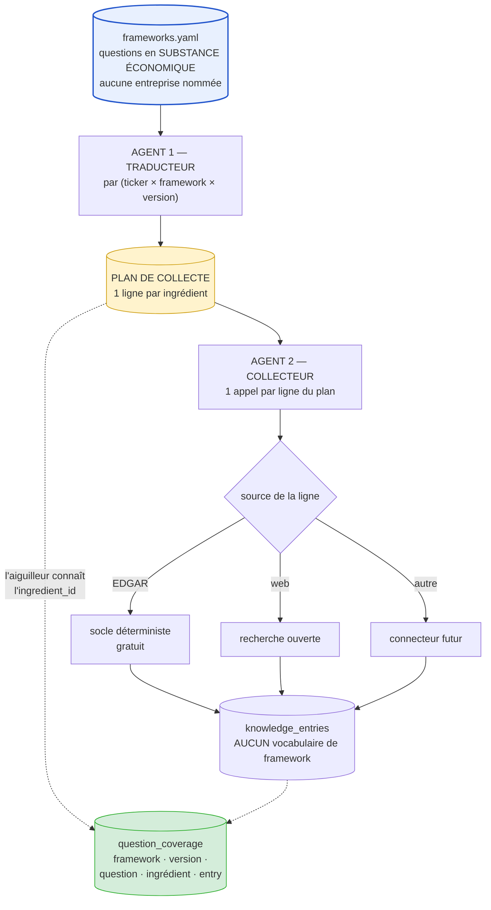

**Agent 1 — le traducteur.** Il reçoit les questions **applicables** (archétype, §4.1.3) et le
ticker. Il produit une ligne par ingrédient requis :

| Champ de la ligne | Ce qu'il porte | Exemple contrasté |
|---|---|---|
| `ingredient_id` | ce qu'on cherche, dans le vocabulaire du framework | `qf_7.consommation_de_tresorerie_recente` |
| `metrique` | comment **cette entreprise-là** le nomme | RVMD : *cash burn trimestriel hors milestone* — MSFT : *free cash flow* |
| `source_pressentie` | où le chercher **d'abord** | RVMD : communiqués + call trimestriel — MSFT : 10-Q |
| `ancre` | l'événement par rapport auquel le fait sera daté | RVMD : dernière lecture clinique — MSFT : clôture du trimestre |
| `statut` | `traduit` \| `inobtenable` + motif | — |

**Ce que le traducteur ne fait PAS.** Il n'a **aucun levier sur `plancher_tier`, `nature_attendue`
ni `essentiel`** — ces trois-là viennent du framework et de lui seul. C'est l'écart V2 de l'audit,
qui vise aujourd'hui `curator.py` : le modèle y peut **RESSERRER** `champs_requis` / `tier_plancher`,
commenté dans le code comme « le DERNIER levier du modèle sur le verdict ». Sous le principe 1, un
resserrement discrétionnaire est **une question posée par le modèle**, pas par le framework. Le
traducteur dit **où chercher**, jamais **combien de preuve suffit**.

> ⚠️ **La valeur inégale d'un 10-K est de l'ACTUALITÉ, pas de la fiabilité.** Le 10-K de RVMD n'est
> pas une source moins fiable que celui de MSFT — il est plus **périmé relativement à son ancre**,
> parce que RVMD a des actualités récentes qui déplacent l'ancre. La doctrine des trois axes (§1.5,
> #50/#51/#53) traite déjà ce cas exactement : la fiabilité est une propriété de la **source** et se
> stocke ; l'actualité est une propriété de la **relation** fait ↔ ancre et se **calcule à la
> lecture**. C'est pourquoi le traducteur **nomme l'ancre** au lieu de dégrader un tier : dégrader
> le tier de RVMD aurait inscrit une propriété d'émetteur dans un axe de source, et l'aurait rendue
> invisible au recalcul (`feedback_controle_au_point_de_lecture`).

**Le plan est un objet contrôlé, pas une suggestion.** Trois états, jamais deux (#44/#53/#54) :

1. **traduit** — l'ingrédient a une métrique, une source et une ancre ;
2. **inobtenable, motivé** — aucune source connue ne le produit ; la ligne devient un **mandat
   ouvert qui nomme l'ingrédient** (`framework_mandates`), pas un trou ;
3. **omis** — l'ingrédient n'apparaît pas dans le plan : **le plan est REFUSÉ**. Un ingrédient
   essentiel qui disparaît en silence est le mode de panne que toute cette v3 combat.

C'est le cas de `qf_1.cout_du_capital`, `essentiel: true`, qu'aucun poste EDGAR ne contient : il
doit sortir en **inobtenable motivé** ou en **traduit vers une source web**, jamais en rien. C'est
aussi ce que T1bis (§9.2) exige de trouver.

**Agent 2 — le collecteur.** Il reçoit **une ligne de plan** : une métrique, une source, une ancre.
**Il ne connaît pas la question.** Deux conséquences, et ce sont les deux qu'on cherchait :

- l'entry qu'il écrit **ne peut pas porter de vocabulaire de framework**, puisqu'il n'en a jamais
  vu — le principe 2 devient vrai par construction du flux, pas par discipline d'écriture ;
- le lien de couverture est écrit par **l'aiguilleur**, qui a dispatché la ligne et connaît donc
  l'`ingredient_id`. **La couverture devient un sous-produit déterministe du dispatch, pas une
  prétention de modèle** — un modèle ne peut plus déclarer couvrir ce qu'il ne couvre pas.

> Une entry qui se trouve servir un ingrédient que personne n'avait demandé (sérendipité) reste
> possible, mais par une **passe de curation ultérieure** qui écrit dans `question_coverage`. Ce
> n'est jamais le chemin nominal : sinon la couverture redevient un jugement.

**Pourquoi deux agents et pas un.** Parce qu'une question sans réponse doit rester diagnosticable :
« mauvais plan, ou mauvaise collecte ? ». La question n'a de sens que si le plan est un objet
**persisté et relisable**. Un agent unique fusionne les deux défauts en un seul verdict opaque —
c'est exactement la panne de `curator.py` aujourd'hui, où l'on ne sait pas distinguer un champ
absent d'un champ que le modèle a décidé de ne plus exiger.

**Ce que devient le socle EDGAR.** Il reste **déterministe, gratuit et prioritaire dans le temps** —
`feedback_frontiere_gratuite_avant_depense_modele` est intact, parce que le traducteur ne collecte
rien : il planifie. Ce qui change, c'est que `POSTES` cesse d'être une liste écrite à la main. Un
poste devient la **recette déterministe d'une métrique nommée par un plan**. Un poste que nul plan
ne réclame ne se collecte plus ; une métrique qu'aucun poste ne sait produire part au collecteur
web ou devient un mandat. Les 3 postes orphelins et les 12 ingrédients `mo_*` muets disparaissent
par le même mécanisme.

| Persisté | Grain | Motif |
|---|---|---|
| `collection_plans` | `(ticker_id, framework_id, framework_version)` | le plan est relisable et versionné — sans quoi « mauvais plan ou mauvaise collecte ? » est indécidable |
| `collection_plan_items` | une ligne par ingrédient | porte `metrique`, `source_pressentie`, `ancre`, `statut`, `motif` |

⚠️ Le plan est **daté et versionné comme tout le reste** : le corpus EDGAR de RVMD ne vaut pas la
même chose en janvier et après une lecture clinique. Un plan est une photo, pas une constante —
même raison qui interdit de persister l'actualité.

---

## 4. Les deux pilotes

Un quantitatif, un qualitatif. Choisis pour un **contraste maximal de matière disponible** :

| | Qualité financière | Défendabilité (moat) |
|---|---|---|
| Étape benchmark | 5 | 4 |
| Méthodologie | Greenwald | Porter / Morningstar |
| Nature dominante | `mesure` | `interpretation` |
| Matière en base **aujourd'hui** | **les 26 orphelines de NVDA en sont littéralement la matière** | **ses 4 champs de sortie sont 100 % orphelins d'indexation** |
| Ce que le pilote prouve | qu'on sait **ranger** ce qui existe déjà | qu'on sait **faire chercher** ce qui n'existe pas |

---

### 4.1 Framework « Qualité financière » — quantitatif

**Thèse méthodologique** (Greenwald) : la qualité d'un business se lit à la relation entre le
capital qu'il immobilise, le rendement qu'il en tire, et la part de ce rendement qui devient du
cash disponible. Les niveaux comptables ne disent rien seuls ; ce sont les **relations** et leur
**persistance** qui informent.

#### 4.1.1 Les questions universelles

| id | Question — **en substance économique** | Nature attendue | Plancher | Actualité bloquante |
|---|---|---|---|---|
| `qf_1` | Le capital employé rapporte-t-il **durablement plus que son coût** ? | `mesure` | A | oui |
| `qf_2` | Le résultat comptable **se transforme-t-il en cash** ? | `mesure` | A | oui |
| `qf_3` | La croissance **coûte-t-elle** du capital, et combien par point de croissance ? | `mesure` | A | oui |
| `qf_4` | La structure de financement **contraint-elle** les décisions d'exploitation ? | `mesure` | A | oui |
| `qf_5` | Le **rendement** observé est-il stable, en amélioration, ou en érosion sur ≥ 5 ans ? | `mesure` | A | oui |
| `qf_6` | Quelle est la part du résultat qui est **discrétionnaire** (choix comptables, provisions, capitalisations) ? | `interpretation` | B+ | non |
| `qf_7` | Combien de temps l'entreprise peut-elle **tenir sans accès au marché des capitaux** ? | `mesure` | A | **oui** |

> `qf_6` est `financials.earnings_quality`, aujourd'hui **sans chemin d'indexation** (§0.3).
> `qf_7` est ce qui manquait totalement à RVMD (le *runway*) et qui est **aussi** pertinent sur
> NVIDIA — c'est la démonstration qu'une question bien posée en substance économique est
> universelle. Elle n'existait dans la grille de 19 sous aucune forme.

#### 4.1.2 Ingrédients dictés par le framework

Le framework **prescrit** ce qu'il faut collecter. Les 8 postes du socle EDGAR
(`edgar_feed.POSTES`) couvrent `qf_1` à `qf_5`. `qf_6` et `qf_7` exigent en outre :

- notes annexes sur provisions et dépréciations d'inventaire (→ l'entry orpheline **#33** trouve
  enfin son chemin) ;
- échéancier de la dette et clauses (`covenants`) ;
- lignes de crédit non tirées ;
- consommation de trésorerie sur les 4 derniers trimestres.

Ces prescriptions descendent au **collecteur** (§3.6) par le **plan de collecte**, puis par des
**mandats** pour ce que le plan déclare inobtenable — jamais par des mots-clefs codés en dur :
c'est ce qui remplace `SYNTHESIS_TARGETS`.

#### 4.1.3 Variables par archétype

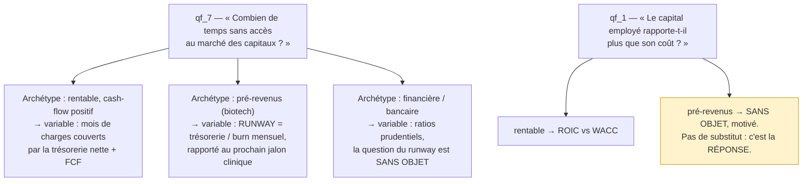

Les archétypes sont une **variable de la question**, jamais un framework séparé. On commence
universel ; on ne fabriquera de framework par archétype que si l'usage montre que les variables ne
suffisent plus (cf. §9.3, critère de déclenchement).

---

### 4.2 Framework « Défendabilité / moat » — qualitatif

**Thèse méthodologique** (Porter / Morningstar) : un avantage concurrentiel n'existe que s'il a une
**source nommée**, une **preuve observable** et une **trajectoire**. Un moat affirmé sans preuve
est une opinion.

#### 4.2.1 Les questions universelles

| id | Question — **en substance économique** | Nature attendue | Plancher | Actualité bloquante |
|---|---|---|---|---|
| `mo_1` | Qu'est-ce qui **empêche** concrètement un concurrent de capter ce profit ? | `interpretation` | B | non |
| `mo_2` | Quelle **preuve observable** soutient cette barrière — prix, parts, rétention, marges relatives ? | `mesure` | B+ | non |
| `mo_3` | La barrière **s'élargit-elle ou s'érode-t-elle** ? Sur quel signal le voit-on ? | `interpretation` | B | **oui** |
| `mo_4` | Combien de temps tient-elle **si rien ne change** ? Quelle classe de référence l'ancre ? | `interpretation` | B | non |
| `mo_5` | **Qu'est-ce qui la détruirait ?** Ce vecteur est-il déjà en mouvement ? | `interpretation` | B | **oui** |
| `mo_6` | Le **pouvoir de fixation des prix** est-il exercé, et supporté par le client ? | `mesure` | B+ | non |

> `mo_1`/`mo_3`/`mo_4` sont respectivement `moat.type`, `moat.trend`, `moat.durabilite_ans` —
> **les trois sans chemin d'indexation** aujourd'hui (§0.3). `mo_4` porte l'ancre base-rate
> obligatoire (règle transverse 2, amendement 2026-08-19 finding #2).
> `mo_5` est la **pré-mortem** de Klein appliquée au moat, et c'est aussi ce que le bear consommera.

#### 4.2.2 Le plancher est desserré, et c'est délibéré

`mo_1`, `mo_3`, `mo_4`, `mo_5` sont à plancher **B**, pas B+ : sur un champ d'**interprétation**,
un dépôt réglementaire est du boilerplate juridique malgré son tier A (convention #50). Ce
desserrage **n'admet personne de nouveau sans le registre nominatif** (`source_registry`,
convention #52) — il est **déclaré**, jamais tacite (`feedback_optional_schema_gate`).

#### 4.2.3 Variables par archétype

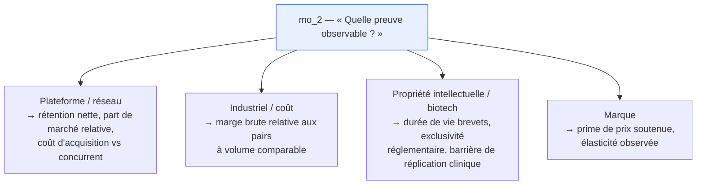

**L'archétype ne change pas la question.** Il change ce qu'on va chercher pour y répondre — donc
le **mandat de recherche**, pas le contrat.

---

## 5. Le modèle de stockage — ce qui remplace la grille de 19

### 5.1 Le principe

⚠️ **RÉÉCRIT le 2026-09-10 (écart V5 de l'audit).** Une première version de cette section gardait
`covers` sur l'entry en changeant seulement son vocabulaire — de `business_model.description` vers
`qf_1.capital_employe`. **C'était la même maladie avec un vocabulaire neuf** : une colonne de
`knowledge_entries` qui nomme des concepts appartenant à un framework signifie qu'**ajouter ou
changer un framework invalide le corpus**. Le principe 2 l'interdit.

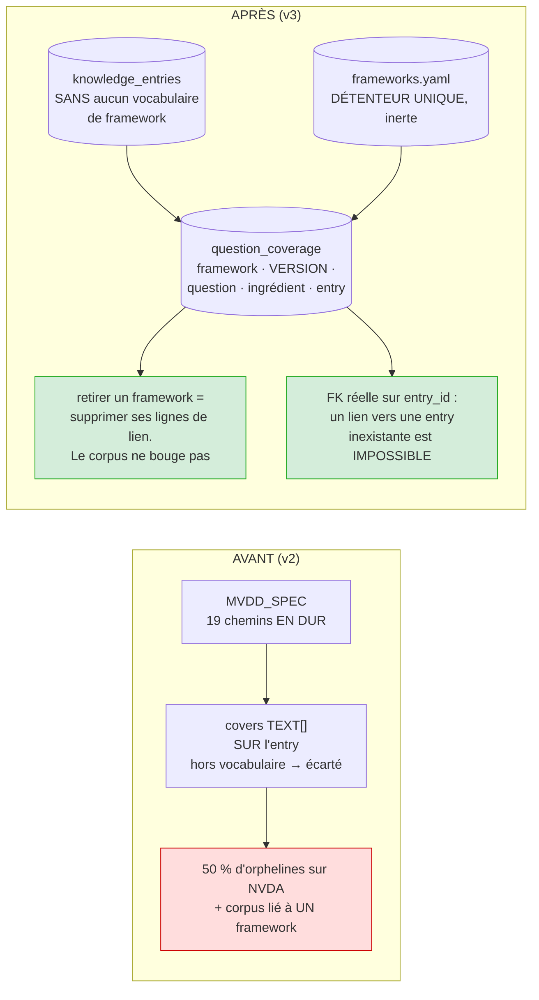

**La couverture est une propriété de la RELATION entry ↔ question, donc elle ne se stocke pas sur
l'entry.** L'argument est déjà dans la maison — c'est la doctrine des trois axes (§1.5,
#50/#51/#53) appliquée à un quatrième :

| Axe | Propriété de | Où il vit |
|---|---|---|
| fiabilité | la **source** | stockée sur l'entry |
| nature | l'**assertion** | stockée sur l'entry (migration 034) |
| actualité | la **relation** fait ↔ ancre | **calculée à la lecture, jamais persistée** |
| **couverture** | la **relation** entry ↔ question | **table de liaison portée par le framework ET sa version** |

L'actualité et la couverture sont du même type : toutes deux dépendent d'un second terme que
l'entry ne connaît pas. L'actualité dépend de l'ancre, la couverture dépend du framework en
vigueur. Les stocker sur l'entry, c'est figer un verdict qui a changé depuis
(`feedback_controle_au_point_de_lecture`).

```sql
question_coverage(framework_id, framework_version, question_id, ingredient_id, entry_id)
```

Quatre conséquences, et la deuxième est celle qui apporte la latitude demandée le 2026-09-10 :

1. **`covers TEXT[]` disparaît de `knowledge_entries`.** L'entry redevient sans vocabulaire :
   un fait, sa source, sa nature, sa date. Rien qui appartienne à une méthodologie. C'est ce que
   le flux §3.6 rend vrai par construction — le collecteur ne connaît pas la question.
2. **Une entry sans aucun lien est un état LICITE et de première classe.** Elle est stockée,
   embeddée, retrouvée par la recherche et citable par un agent — elle ne compte simplement pas
   comme **fondation**. C'est là qu'est la latitude « ticker par ticker » : une entry n'a plus
   besoin d'une case pour exister, et elle n'a plus de case du tout. Aujourd'hui **34 % du corpus
   courant est dans cet état** (§0.6) : stocké et mort. La v3 ne crée pas une capacité, elle **rend
   légitime et lisible** ce que le système fait déjà en le jetant. Et avec la table de liaison,
   c'est trivialement vrai : « pas de ligne » n'est pas un cas particulier, c'est le défaut.
3. **Un lien invalide devient IMPOSSIBLE, et non plus « refusé bruyamment ».** C'est l'écart de
   §0.1 (« un tag hors vocabulaire est écarté silencieusement »). Côté `entry_id`, c'est une vraie
   **clef étrangère** — ce que `covers TEXT[]` ne pouvait pas avoir. Côté `question_id` /
   `ingredient_id`, le détenteur reste un fichier (§5.2), donc la validation reste en Python au
   **site d'écriture unique** de la liaison ; mais ce site n'est plus les 8 producteurs, c'est le
   seul aiguilleur du §3.6. Un `if` qui **lève** vaut une contrainte ; c'est le silence qui était le
   défaut.
4. **Changer de framework ne touche pas une ligne du corpus.** Retirer `qualite_financiere` v1,
   c'est supprimer ses lignes de `question_coverage`. Le faire coexister avec sa v2, c'est deux jeux
   de lignes sur le **même** corpus. C'est la formulation exacte du principe 2 : la base accepte
   n'importe quel framework parce qu'elle n'en connaît aucun.

> ⚠️ **`framework_version` n'est pas décoratif.** Sans lui, réécrire l'énoncé de `qf_1` rendrait
> rétroactivement « couvertes » des entries collectées pour une autre question. Une couverture non
> versionnée est un verdict d'avant le correctif servi comme s'il était d'aujourd'hui — le mode de
> panne nommé par `feedback_controle_au_point_de_lecture`.

Et deux disparitions qui ne changent pas :

- `DECLARED_NONBLOCKING_GAPS` (dispense écrite à la main dans `curator.py:69`, pour
  `NVDA / business_model.recurrence_pct`) devient une **ligne clefée sur `(ticker_id, question_id)`**
  — convention #31, ce qui décrit un émetteur ne vit jamais dans une constante globale. C'est une
  **dispense**, donc elle va en base : elle décrit un émetteur, pas la méthodologie.
- `SYNTHESIS_TARGETS` et ses sacs de mots-clefs français codés en dur **disparaissent** : la requête
  de synthèse d'une question **est** le mandat de la question.

> ⚠️ **Ce que la v3 ne construit PAS maintenant : des questions propres à un ticker.** La latitude
> par émetteur passe par trois mécanismes qui suffisent : (a) une entry sans lien est licite,
> (b) `variables_par_archetype` (livré), et (c) le **plan de collecte** du §3.6, qui est l'endroit
> prévu pour que RVMD et MSFT ne cherchent pas les mêmes métriques aux mêmes sources — c'est lui qui
> porte la latitude « ticker par ticker », pas la question. La question reste universelle : c'est ce
> qui rend deux dossiers comparables (§7). Un mécanisme de questions ajoutées ticker par ticker
> rouvrirait la porte au test
> inperdable (chaque émetteur définirait les questions auxquelles il sait répondre). Il ne s'écrit
> que si une **mesure** montre que les 13 questions × variables laissent un trou réel sur un 4ᵉ
> émetteur — même règle que §9.3 impose déjà aux frameworks par archétype
> (`feedback_decision_figee_a_remesurer` : une capacité écrite avant son symptôme est du code
> jamais appelé).

### 5.2 Tables (migration **036**, à écrire juste avant son lot — jamais en avance)

⚠️ **CORRIGÉ le 2026-09-10 — la définition des frameworks NE VA PAS en base.** Cette section
prévoyait `frameworks` / `framework_questions` / `framework_variables` comme tables. Le lot 2a a
livré l'inverse, et délibérément : le référentiel est **`app/frameworks/frameworks.yaml`**, données
inertes, détenteur unique. Le motif est le **4ᵉ faux vert** — en base comme en Python, une question
peut être dérivée du corpus (un `INSERT … SELECT DISTINCT` sur les postes EDGAR, une compréhension
sur `MVDD_SPEC`), et le test de couverture mesurerait alors sa propre constante. En YAML, les
questions sont du texte inerte qu'aucune requête ne peut fabriquer. Ce que §5.1 promettait de la
table — « ajouter une question ne demande pas un déploiement » — reste **faux dans les deux cas** et
n'était pas un bon motif : le référentiel est un artefact **méthodologique**, il se relit et se
versionne comme du code, il ne s'édite pas à chaud.

**Partage retenu — la méthodologie est un fichier, l'émetteur est une ligne :**

| Où | Quoi | Motif |
|---|---|---|
| **`frameworks.yaml`** (versionné) | frameworks, questions, ingrédients, variables par archétype, planchers | méthodologie — vraie pour tous, ne décrit aucun émetteur |
| **base** | `framework_answers`, `framework_mandates`, `framework_dispenses` | ce qui décrit **un émetteur** ou **un moment** — convention #31 |

| Table (migration **036**) | Grain | Notes |
|---|---|---|
| `question_coverage` | un lien entry ↔ ingrédient | `(framework_id, framework_version, question_id, ingredient_id, entry_id)` — **FK réelle sur `entry_id`** ; remplace `covers TEXT[]` (§5.1, écart V5) |
| `collection_plans` | `(ticker_id, framework_id, framework_version)` | sortant du **traducteur** (§3.6), daté et versionné |
| `collection_plan_items` | une ligne par ingrédient | `metrique`, `source_pressentie`, `ancre`, `statut` (`traduit`/`inobtenable`), `motif` |
| `framework_answers` | une réponse | contrat §2.4, **append-only + versionné** (A1), `superseded_by` |
| `framework_mandates` | un mandat de recherche | émis par un renvoi manager, par le comité, **ou par une ligne de plan `inobtenable`** ; consommé par le **collecteur** ; état `ouvert`/`servi`/`abandonne` |
| `framework_dispenses` | une dispense | clefée `(ticker_id, framework_id, framework_version, question_id)` + **motif obligatoire** — remplace `DECLARED_NONBLOCKING_GAPS` |

**Contraintes structurantes** :

- **`covers TEXT[]` est SUPPRIMÉE de `knowledge_entries`.** L'entry ne porte plus aucun vocabulaire
  de framework (§5.1). Le lien vit dans `question_coverage`, écrit au **site unique** de l'aiguilleur
  du §3.6 — qui valide `question_id.ingredient_id` contre le référentiel et **lève** sur un inconnu.
  Corollaire à ne pas manquer : **l'absence de ligne n'est pas une erreur**, c'est le cas par défaut.
- **Toute table qui nomme une question porte `framework_id` + `framework_version`** —
  `question_coverage`, `collection_plans`, `framework_dispenses`. Sans la version, une dispense
  survit à la question qu'elle dispensait et une couverture survit à la question qu'elle couvrait
  (écart V10 de l'audit ; `feedback_controle_au_point_de_lecture`).
- `framework_answers` est **append-only** : une réponse corrigée ne se met pas à jour, elle
  supersede (A1, comme `knowledge_entries`).
- `framework_mandates` porte un **état** : un mandat qui reste ouvert est visible, un renvoi ne peut
  pas se perdre. Une ligne de plan `inobtenable` **produit un mandat** — c'est ce qui interdit qu'un
  ingrédient essentiel disparaisse en silence (§3.6, et c'est ce que T1bis mesure).
- **`knowledge_entries` se réduit avant de s'étendre** — les 7 colonnes à zéro écriture (§0.6) sont
  supprimées par la même migration, plus `covers` : **8 colonnes en moins**. Une colonne que
  personne n'écrit n'est pas une option ouverte, c'est une garantie apparente : elle se lit comme un
  dispositif en place (#50).
- **`entry_type` et `report_type` se dévocabularisent aussi** (écarts V6/V7 de l'audit) :
  `entry_type` admet `base_rate` (7 lignes) et `risk` (1 ligne) — or le *Base Rate Book* est une
  **méthodologie**, pas une nature d'assertion ; `knowledge_curator_reports.report_type` admet
  `mvdd` (0 ligne, mais le nom d'un framework est dans la contrainte `CHECK`). Même famille que V5,
  plus bénigne : ce sont des étiquettes descriptives, pas des chemins d'indexation. Elles se
  nettoient dans la 036 puisque l'archivage vide les tables de toute façon.

> ⚠️ La migration 036 sera écrite **juste avant** son lot, avec son générateur Python qui **importe
> la règle** au lieu de la ré-implémenter en SQL (conventions #46, #51, #55). Elle ne sera pas
> rédigée en avance dans cette spec.

### 5.3 Le corpus existant s'ARCHIVE — il ne se backfille pas

⚠️ **RÉÉCRIT le 2026-09-10.** Cette section décrivait un backfill des `covers` existants vers les
`question_id`, par « table de traduction explicite, relue ». **Cette manœuvre est interdite par
§0.6** : une correspondance relue à la main est une correspondance construite pour tomber juste sur
les données d'hier. Elle aurait rendu T1 et la couverture bons **par construction**, et le défaut
aurait été indétectable — le backfill étant précisément l'endroit où l'on aurait ajusté jusqu'à ce
que ça tombe juste.

**Ce qui remplace le backfill :**

1. **Archiver, ne rien détruire.** `CREATE SCHEMA archive_v2` puis `ALTER TABLE … SET SCHEMA` sur la
   grappe V2 entière. Le graphe de clefs étrangères se déplace **en bloc**, aucune ligne n'est
   supprimée, le retour est une commande. Le corpus reste interrogeable comme **fixture de test** —
   ce que §0.6 autorise explicitement.
2. **Repartir de zéro sur les 3 mêmes émetteurs** (NVDA, MSFT, RVMD — arbitrage du 2026-09-10). Ce
   sont les trois archétypes, et c'est ce que T4 éprouve. Repartir sur eux donne une comparaison
   directe avec la ligne de base du 2026-09-09 **sans** que l'ancien corpus serve de cible.
3. **La collecte est pilotée par les questions — et le socle déterministe n'y échappe pas.**

   ⚠️ **CORRIGÉ le 2026-09-10 (écart V1).** Ce point disait que le socle déterministe « se rejoue
   **tel quel** ». *Tel quel* voulait dire *tel qu'il était avant que les questions existent* :
   la section qui interdit de repartir du corpus rouvrait la porte par les postes. Le socle **ne se
   rejoue pas tel quel** : il se rejoue **contre le plan de collecte** du §3.6. Un poste que nul
   plan ne réclame ne se collecte plus ; une métrique qu'aucun poste ne produit part au collecteur
   web ou devient un mandat. L'ordre est : **questions → traducteur → plan → collecteurs →
   couverture**, et jamais l'inverse.
4. **Ce qui se compte après**, comme toujours : **le nombre de lignes actives par question**, pas le
   diff (convention #43, `feedback_correctif_omet_de_retirer`).

> ⚠️ **La grappe V2 touche des « faits du monde » (#34) — et c'est sans objet ici.** Une position
> `portfolio_positions` (MSFT, 1 action à 464,79 $, 2026-08-31) et 2 `calendar_events` pointent sur
> `theses_v2`. Ce sont des artefacts de recette du lot 7 : le système n'est en usage réel sur aucun
> périmètre (§0.6), donc il n'y a aucun fait à préserver. Ils partent à l'archive avec le reste.
> La convention #34 reste vraie et redeviendra contraignante le jour où une position réelle
> existera.
>
> ⚠️ **V0 / V1 ne sont PAS archivées par ce lot, et ne contraignent plus la conception.** Les
> archiver supposerait de couper les schedulers de 7h05 / 7h30 / 8h00 — corvée distincte, sans
> rapport avec la v3. Elles restent en place et **hors périmètre** : aucune décision de modèle v3
> ne se prend pour leur rester compatible.

---

## 6. Réconciliation des deux vocabulaires

Le `research_memo` a 36 feuilles, l'index en a 19, 14 feuilles n'ont pas d'index et 3 chemins ne
sont consommés par personne (§0.3). La v3 impose **un seul vocabulaire**.

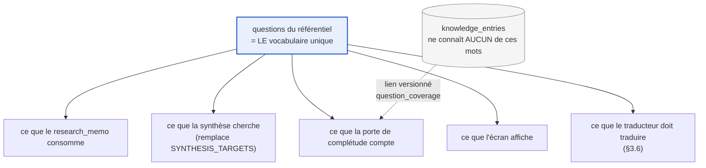

⚠️ **Une flèche a été retirée le 2026-09-10 (écart V8).** Ce graphe portait
`FQ --> IDX["ce que covers peut désigner"]` : c'était la seule flèche illégitime, celle qui faisait
descendre le vocabulaire des questions **dans une colonne du corpus**. Les cinq autres sont des
**consommateurs** — un framework a le droit de piloter la lecture (mémo, synthèse, porte, écran) et
la planification (§3.6), jamais le stockage. C'est toute la différence entre les deux principes :
le framework dicte ce qu'on cherche et ce qu'on affiche ; il ne dicte rien de ce qu'on garde.

**Test de non-régression permanent** : `tools/reconcilier_vocabulaires.py` (à versionner depuis
`/tmp/vocab.py`) devient un **check** qui exige **zéro** feuille de mémo sans question et **zéro**
question jamais consommée. Il est écrit pour **rougir aujourd'hui** (14 + 3) et virer au vert au
lot 3 — c'est un test négatif qui a déjà rougi, donc éprouvé (`feedback_test_negatif_obligatoire`).

**Le `research_memo` n'est pas réécrit à la main** : ses blocs deviennent la **projection** des
frameworks acquittés. Un bloc du mémo = un framework ; un champ = une question. C'est ce qui garantit
qu'aucun champ du mémo ne peut exister sans preuve indexable — la cause racine du §0.3.

⚠️ Ce chantier **touche les 6 blocs du `ResearchMemo`**, donc les 3 points de synchronisation
(convention #19) **et** l'exemple JSON du prompt en DB (convention #39).

---

## 7. Comparabilité entre dossiers

Question posée : la comparabilité vit-elle au niveau de la matrice de risques, des métriques
financières, ou d'une matrice co-construite ? **Réponse : les trois, à trois étages, et c'est déjà
en partie implémenté.**

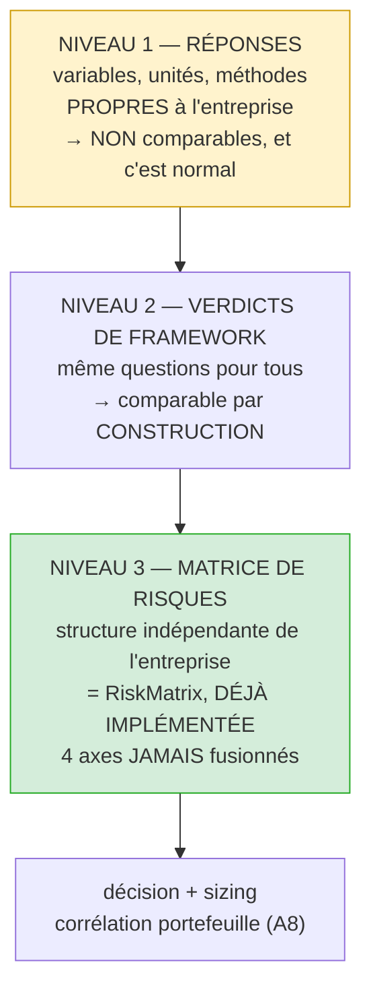

`RiskMatrix` (`analysis_v2_schemas.py:411`, benchmark Partie D3) porte déjà exactement la structure
demandée : **4 axes jamais fusionnés** (`qualite_business`, `qualite_info`, `conviction`,
`marge_securite`) + risques (probabilité / impact / réversibilité / base rate) + sizing avec
corrélation portefeuille + `sources_summary` par tier.

**Ce que la v3 y ajoute** : `qualite_info` cesse d'être un jugement du modèle et devient une
**dérivée mécanique** des `framework_answers` — part de questions `repondu` vs `approxime` vs
`non_fondable`, rang moyen, part de réponses périmées. C'est une mesure, plus une appréciation.

> ⚠️ **`qualite_info` devient donc relative au framework, et doit le dire (écart V9).** `RiskMatrix`
> est stockée dans `investment_analyses` ; si `qualite_info` en dérive, un axe de matrice de risques
> devient fonction du framework en vigueur **au moment du calcul**. Deux remèdes, un seul à retenir :
> soit `qualite_info` est **recalculée à la lecture** comme l'actualité (#53/#54), soit elle est
> stockée **avec `framework_id` + `framework_version`**. Le stockage nu est le mode de panne connu —
> un verdict d'avant le correctif servi comme s'il était d'aujourd'hui
> (`feedback_controle_au_point_de_lecture`). **Retenu : recalcul à la lecture**, cohérent avec
> `_apply_deterministic_overrides`. La comparabilité de niveau 3 n'est valable **qu'entre dossiers
> évalués sous le même framework et la même version** — deux dossiers évalués sous des versions
> différentes se comparent au niveau 2, pas au niveau 3.

> ⚠️ **Interdit** : agréger les verdicts de framework en un score unique de « qualité du dossier ».
> Trois nombres recombinés redeviennent un scalaire et reproduisent le défaut au premier arrondi
> (convention #50).

---

## 8. Parcours utilisateur — trois niveaux et deux actions

### 8.1 Le drill-down

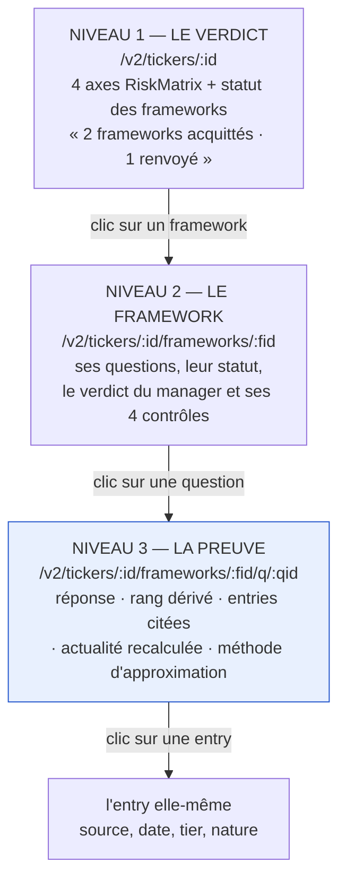

**Le niveau 3 est le point de lecture qui compte.** Un `remede`, un rang dégradé, une méthode
d'approximation qui n'apparaissent que dans un blob JSON ne sont pas lus
(`feedback_controle_au_point_de_lecture` — c'est exactement ce qui a coûté une journée à la
capacité 4). Chaque champ du contrat §2.4 a **son pixel**.

### 8.2 Les deux actions du comité

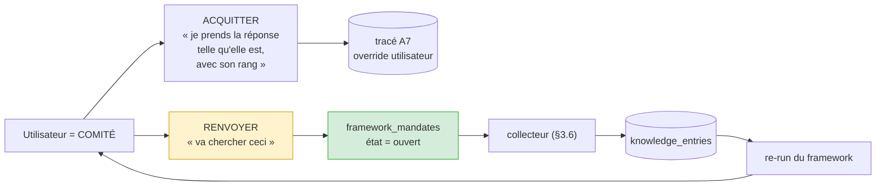

**« Renvoyer » est la fermeture de l'Écart B.** C'est le seul endroit où le système gagne une boucle
comité → collecte, et elle emprunte le même canal que le renvoi du manager — un seul détenteur de
la règle (convention #46).

Les deux actions sont **tracées** (A7 : overrides utilisateur tracés).

### 8.3 Parcours de bout en bout

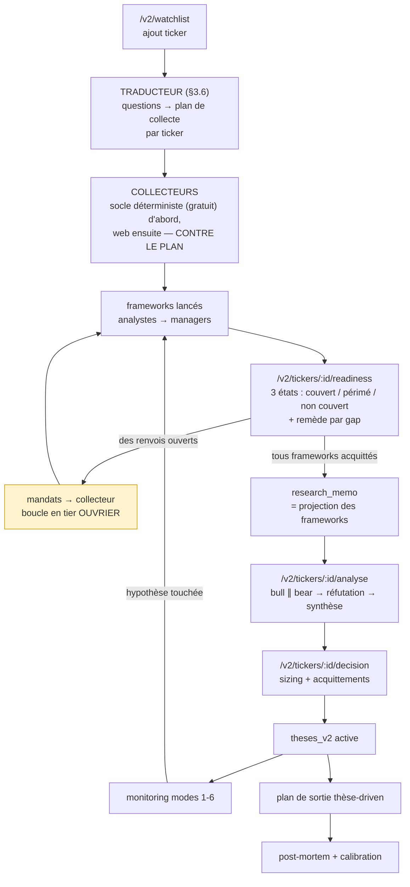

La boucle d'approfondissement reste **en tier ouvrier, avant tout appel cher** — principe de coût
inchangé (spec v2 §5.3, §7).

⚠️ **CORRIGÉ le 2026-09-10 (écart V1).** Ce parcours commençait par
`ingestion + feeds déterministes (gratuit, avant toute dépense modèle)` **puis** `frameworks
lancés` : la collecte précédait la question, gravée dans le flux. Le traducteur passe devant. La
**frontière gratuite est intacte** (`feedback_frontiere_gratuite_avant_depense_modele`) — le
traducteur ne collecte rien, il planifie, et les collecteurs déterministes restent premiers et
gratuits **à l'intérieur** du plan. Ce qui change n'est pas l'ordre du coût, c'est l'ordre de
l'**autorité** : le socle ne décide plus de ce qu'il ramène.

---

## 9. Test d'acceptation

### 9.1 Ce qu'on mesure AVANT le lot

> ⚠️ **Statut changé le 2026-09-10.** Cette ligne de base reste **le constat du défaut qui motive la
> v3** — elle ne devient à aucun moment une **cible**. Les six valeurs ci-dessous décrivent ce que
> le système a produit en se trompant ; ramener ces chiffres à zéro n'est pas le succès, et les
> retrouver après une collecte neuve serait une **coïncidence suspecte** plutôt qu'une preuve
> (§0.6). Les seuls critères de §9.2 qui s'y adossent encore sont **T6** et **T7**, qui portent sur
> la cohérence interne du vocabulaire — pas sur le corpus.

**La ligne de base est une mesure, pas un souvenir** (`feedback_ligne_de_base_est_une_mesure`).
Elle se **requête** — outil versionné `tools/ligne_de_base_frameworks.py` (+ son `.sh`), qui parse
la matrice de traçabilité du benchmark (Partie E) au lieu de la recopier, et sort en **2** si la
base ou le montage `/roadmap` manque, jamais en saut de section.

**Mesurée le 2026-09-09** (`bash tools/ligne_de_base_frameworks.sh` — 2 vérifications OK, 0 échec) :

| Mesure | Attendu spec | **Mesuré 2026-09-09** |
|---|---|---|
| Orphelines par ticker | MSFT 20 % · **NVDA 50 %** · RVMD 26 % | NVDA 26/52 = **50 %** (dont 16 tier A) · MSFT 11/54 = **20 %** (8 tier A) · RVMD 7/27 = **26 %** (7 tier A) |
| Feuilles de mémo sans chemin d'indexation | **14** | **14** |
| Chemins jamais consommés | **3** | **3** |
| Synthèses grounded sur RVMD | **0** | **0** |
| Entries sur `produits.unit_economics` | **2**, toute base confondue | **2**, dont **0 primaires** |
| Étapes benchmark 4/5/6/8 avec preuve indexable | **0** | **0** strict · **1** permissif |

**Les six valeurs de la spec sont confirmées.** Trois constats que la mesure ajoute, et qu'aucun
n'était dans la spec :

1. **L'étape 8 a un champ indexable** — `valuation.base_rate_anchor`, omis par le mermaid §0.3.
   D'où les deux comptes (strict 0 / permissif 1) : le champ séparateur est **nommé** plutôt
   qu'absorbé dans l'un des deux chiffres.
2. **`produits.unit_economics` n'a aucune entry primaire.** Ses 2 entries (#53 NVDA, #112 MSFT)
   sont des `analysis`/`agent_synthesis` — le champ n'est alimenté que par des synthèses **de
   lui-même**. C'est strictement pire que « 2 entries ».
3. **NVDA a produit 4 synthèses grounded sur 4 cibles dont la matière indexée est insuffisante**
   (0/2, 0/2, 1/2, 1/3) ; MSFT 2 sur 4. Elles ne sont pas inventées : elles sont fondées sur des
   entries que l'index n'attache pas au champ synthétisé — le mécanisme de l'orpheline #33 (§0.4)
   généralisé. **Ce que le lot 3 doit rendre reproductible, le système le fait aujourd'hui par
   accident**, via le rattrapage sémantique de la recherche vectorielle.

### 9.2 Le test d'acceptation, falsifiable

Outil **versionné** (`tools/acceptation_frameworks.py` + `tools/acceptation_frameworks.sh`),
jamais dans `/tmp`, jamais exécuté **dans** `portfolio-backend` (il porte le code déployé, qui peut
précéder ce qu'on mesure). Il rejoue les **fonctions de production**, jamais une seconde porte.

Il rend un **bilan reconnaissable à sa forme** (`grep -E` sur le motif, jamais `tail -1` ;
absence de bilan = **échec** — `feedback_bilan_par_sa_forme`).

**Critères de succès, sur les trois tickers :**

| # | Critère | Seuil |
|---|---|---|
| T1 | Tout ingrédient **essentiel** d'une question **applicable** est soit **servi**, soit couvert par un **mandat ouvert qui le nomme** | **0** ingrédient ni servi ni mandaté |
| T1bis | **Au moins un** ingrédient essentiel sort **non servi et mandaté**, dont `qf_1.cout_du_capital` | **≥ 1** — une couverture à 100 % **fait échouer** le pilote |
| T2 | Toute question `repondu` a au moins un ingrédient servi par une source **primaire** — jamais fondée uniquement par des `agent_synthesis` / `analysis` | **0** question auto-fondée |
| T3 | Aucune réponse `approxime` sans méthode, ingrédients et rang **dégradé** | **0 violation** |
| T4 | RVMD : `qf_1` sort `sans_objet` **motivé**, jamais un ROIC fabriqué | **exigé** |
| T5 | RVMD : `qf_7` (runway) sort `repondu` | **exigé** |
| T6 | Feuilles de mémo sans question | **0** |
| T7 | Questions jamais consommées | **0** |
| T8 | Un renvoi manager crée un mandat consommable, et le re-run change le statut | **≥ 1 cas de bout en bout** |

⚠️ **L'arbitrage ouvert sur T1 le 2026-09-09 est CLOS le 2026-09-10 — non pas tranché, DISSOUS.**
Il portait sur un seuil : « toutes les tier A (16/16) » contre « ≥ 24/26 toutes natures » contre un
composite. Aucune des trois options n'était bonne, parce que **l'énoncé lui-même était illégitime**.
« Les orphelines de NVDA sont rattachées à une question » fait du corpus de test l'**objectif de
conception** : le framework serait déclaré bon parce qu'il absorbe ce que les recettes d'hier ont
ramassé, et le seuil serait **inperdable** — il suffirait d'élargir une question jusqu'à ce que les
16 entrent. La question posée était « quel seuil ? » alors que la bonne était « de quel droit le
corpus est-il la cible ? ». Voir §0.6.

L'ancien T1 avait aussi le défaut nommé par `feedback_ligne_de_base_est_une_mesure` (fusion de deux
ensembles : 26 orphelines totales contre 16 tier A, un seuil applicable ni à l'un ni à l'autre).
**Ce défaut-là est réel et reste instructif** — mais il est désormais secondaire : le critère ne
compte plus d'orphelines du tout.

**Ce qui ferait échouer le pilote** (à écrire pour pouvoir perdre) — **trois** clauses, pas une :

1. **T4 échoue** — le système continue de fabriquer une réponse plausible là où la question n'a pas
   de sens. Alors les questions universelles ne sont pas la bonne granularité, et il faut passer aux
   frameworks par archétype **avant** d'aller plus loin.
2. **T1bis échoue** — la couverture sort **complète**, sans aucun ingrédient manquant. C'est le
   signe que le référentiel a été rétro-conçu depuis ce que la collecte sait produire (§0.6). Un
   framework qui ne réclame jamais rien qu'on n'ait pas ne challenge rien.
3. **T2 échoue** — les questions sont fondées par des synthèses d'elles-mêmes. C'est le défaut
   mesuré le 2026-09-09 sur `produits.unit_economics` (2 entries, **0 primaire**), généralisé.

⚠️ **T1bis se lit dans les deux sens, et c'est délibéré** (`feedback_acceptation_rouge_bidirectionnelle`) :
avant la capacité, il doit être prouvé **satisfiable** — il PEUT virer au vert — puis
**discriminant** — une mutation par critère le fait rougir. Un critère qui exige qu'il MANQUE
quelque chose est le plus facile à satisfaire par accident : il faut donc qu'il nomme
**lequel** (`qf_1.cout_du_capital`), sans quoi n'importe quelle collecte incomplète le satisferait.

### 9.3 Critère de déclenchement des frameworks par archétype

On ne construit un framework par archétype **que si** : sur ≥ 5 tickers, plus de **⅓** des
questions d'un framework sortent `sans_objet` pour le même archétype. En dessous, les variables
suffisent, et un framework de plus serait un jumeau qui divergera au premier correctif
(convention #46, `feedback_correctif_regle_jumeaux`).

---

## 10. Découpage en lots

**Ordre imposé, inchangé : UX (contrat) → agent → données.** Jamais commencer par la table.

| Lot | Contenu | Migration |
|---|---|---|
| **0 — Ligne de base** ✅ **2026-09-09** | Versionner `tools/reconcilier_vocabulaires.py` (5 ok / 2 FAIL, test négatif 2/2) · mesurer et consigner les 6 valeurs de §9.1 (`tools/ligne_de_base_frameworks.py`, 2 ok / 0 FAIL, +3 constats) · écrire `tools/acceptation_frameworks.py` **qui rougit sur les 8** (1 ok / 8 FAIL, satisfiabilité 5/5 et discrimination 4/4 éprouvées sur base scratch) | — |
| **1 — Contrat** | `FrameworkAnswer` + `FrameworkMandate` en Pydantic strict · carte de provenance · les invariants relationnels **en Python** (#37) · l'écran niveau 3 en maquette | — |
| **2a — Le référentiel** ✅ **2026-09-10** | Les 2 pilotes et leurs 13 questions en **données inertes** (`app/frameworks/frameworks.yaml`) · contrat strict `framework_definition_schema.py` · invariants relationnels G–M dans le pont (#37) · `check_frameworks_definitions.py` **39/0**, dont **§5 la garde de l'ordre questions → données** · test négatif **22/22** · suite **1 988 / 0** | — |
| **2b — Archivage et dévocabularisation** | `archive_v2` (grappe V2 entière, rien de détruit) · `knowledge_entries` amaigrie de **8 colonnes** (les 7 à zéro écriture **+ `covers`**) · `question_coverage` créée, portée par `framework_id` + `framework_version` (**écart V5**) · `entry_type` / `report_type` dévocabularisés (V6/V7) · réécriture de `tools/acceptation_frameworks.py` sur les T1/T1bis/T2 de §9.2 | **036** |
| **2c — La chaîne de collecte** | **Traducteur** puis **collecteur** (§3.6) · `collection_plans` / `collection_plan_items` · `POSTES` devient **dérivé du plan** au lieu d'être écrit à la main (**écart V1**) · le contrat qui **refuse** un plan omettant un ingrédient essentiel · retrait du levier `RESSERRER` de `curator.py` (**écart V2**) | **036bis** |
| **3 — Le vocabulaire unique** | Analyste + manager sur `qualite_financiere` · `framework_answers` / `framework_mandates` / `framework_dispenses` en base · **suppression** de `MVDD_SPEC`, `SYNTHESIS_TARGETS`, `DECLARED_NONBLOCKING_GAPS` · **collecte neuve pilotée par le plan** sur NVDA / MSFT / RVMD | **037** |
| **4 — Le manager** | Les 4 contrôles · le renvoi qui produit un mandat · consommation par le **collecteur** (**ferme l'Écart B**) | 038 |
| **5 — Le mémo projeté** | `research_memo` devient la projection des frameworks acquittés · réconciliation à 0/0 · 3 points de synchro + exemple JSON du prompt en DB (#39) | 039 |
| **6 — Le parcours** | Les 3 niveaux de drill-down · acquitter / renvoyer tracés (A7) · `qualite_info` dérivée mécaniquement | — |
| **7 — Le second pilote** | `defendabilite` de bout en bout · test d'acceptation complet T1-T8 | — |

**Test de conformité par lot** (constitution §6) : part d'un contrat JSON ? schéma versionné
synchronisé sur 3 points ? décision indépendante de l'UX et conforme aux invariants ? donnée
versionnée + scorée + figée ? agent déclare tier/modèle/batch/cache ? passe par l'abstraction
provider ? — un « non » = lot non prêt.

---

## 11. Ce que cette spec ferme

| Sujet | Décision | Motif |
|---|---|---|
| **Capacité 5, barreau 4** (l'agent propose une méthode d'approximation à partir du dossier) | **Hors périmètre** | Réfuté **4 fois** par sa propre ligne de base. Le contre-test montre que la formulation n'est pas en cause. Cause réelle : l'ingrédient (#33) est orphelin — **le défaut est en dessous**, c'est un défaut de rangement, corrigé par les lots 3 et 5. À rouvrir **seulement** si, une fois le rangement fait, une approximation reste bloquée faute de méthode. |
| **Grille MVDD de 19 champs** | **Supprimée** au lot 3 | Fermée, identique pour tous les émetteurs, 50 % d'orphelines sur NVDA, incapable de décrire RVMD. |
| **`SYNTHESIS_TARGETS`** | **Supprimé** au lot 3 | Sacs de mots-clefs français codés en dur ; le mandat de la question les remplace. |
| **`DECLARED_NONBLOCKING_GAPS`** | **Devient une table** au lot 3 | Dispense écrite en source Python, exigeant un redéploiement pour adapter la grille à une entreprise (violation #31). |
| **Hybridation RRF de la recherche** | **Reste interdite** | Mesurée dégradante (MRR 0,905 → 0,655). Ne pas « améliorer » sans re-mesurer. |
| **Le corpus en base comme point de départ** | **Interdit** (§0.6) | Historique de recette d'un système inachevé. Utilisable pour **éprouver**, jamais pour **concevoir**. Gardé en code par `check_frameworks_definitions.py` §5 + 4 mutations de données. |
| **Backfill des `covers` vers les questions** | **Supprimé** (§5.3) | Une table de traduction relue à la main est ajustée jusqu'à tomber juste : elle rend la couverture bonne par construction. Remplacé par archivage + collecte neuve. |
| **`frameworks` / `framework_questions` en base** | **Refusé** (§5.2) | Une question dérivable par requête depuis le corpus fait mesurer au test de couverture sa propre constante (4ᵉ faux vert). Le référentiel est un fichier inerte versionné. |
| **Questions propres à un ticker** | **Ajourné**, pas rejeté (§5.1) | Rouvrirait le test inperdable. À rouvrir **seulement** si une mesure sur un 4ᵉ émetteur montre un trou réel — même règle que §9.3. |
| **T1 « rattacher les orphelines »** | **Dissous**, pas tranché (§9.2) | L'arbitrage portait sur un seuil ; c'est l'énoncé qui était illégitime. Remplacé par T1 (aucun ingrédient essentiel muet) + T1bis (il DOIT en manquer au moins un, nommé). |
| **`covers` sur `knowledge_entries`** | **Supprimée** (§5.1, écart **V5**) | Re-vocabulariser la colonne (`business_model.description` → `qf_1.capital_employe`) était la même maladie avec un vocabulaire neuf : changer de framework invalidait le corpus. La couverture est une propriété de la **relation** entry ↔ question, comme l'actualité — elle va dans `question_coverage`, portée par framework **et version**. |
| **Le socle EDGAR collecte avant la question** | **Corrigé** (§3.6, §8.3, écart **V1**) | 8 postes écrits à la main servaient **4** des 33 ingrédients essentiels ; 3 postes ne répondaient à rien ; les 12 ingrédients `mo_*` n'avaient aucune source et rien ne le disait. `POSTES` devient **dérivé d'un plan de collecte**. |
| **Une collecte pilotée par un seul agent** | **Refusé** (§3.6) | Un agent unique fusionne « mauvais plan » et « mauvaise collecte » en un verdict opaque. Deux agents, et le **plan est persisté** — sinon la question « lequel des deux a échoué ? » est indécidable. |
| **Le modèle a un levier sur l'exigence** (`curator.py` peut RESSERRER `champs_requis` / `tier_plancher`) | **Retiré** au lot 2c (écart **V2**) | Sous le principe 1, un resserrement discrétionnaire est une question posée par le **modèle**, pas par le framework. Le traducteur dit **où chercher**, jamais **combien de preuve suffit**. |
| **Dégrader le tier d'une source selon l'émetteur** (le 10-K de RVMD « vaut moins ») | **Refusé** (§3.6) | C'est de l'**actualité**, pas de la fiabilité : l'ancre de RVMD bouge, la source ne devient pas moins fiable. Le traducteur nomme l'**ancre** ; l'actualité reste calculée à la lecture (#53). |
| **`natures_admises` au niveau framework** | **Retiré** (§2.2, écart **V3**) | Deux détenteurs pour une même règle (#46). La **question** tranche : `qf_4.clauses_de_sauvegarde` et `qf_1.capital_employe` n'ont pas la même nature dans le même framework. |

---

## 12. Pièges à ne pas re-découvrir sur ce chantier

Chacun a déjà coûté, sur ce projet ou un voisin.

1. **Ne pas induire les frameworks de la base.** La base est le **banc d'essai**, pas le plan.
   Les questions viennent du benchmark méthodologique (Partie B/E) ; la base sert à vérifier
   qu'elles fonctionnent.
2. **Une fixture se copie du réel** (`COPY` de la prod vers une base scratch), jamais écrite à la
   main — une fixture plus favorable que la prod est un check aveugle au vert, et elle neutralise
   aussi le test négatif.
3. **Un check neuf n'est éprouvé qu'après avoir viré au rouge une fois**, et sur l'**assert nommé**
   qu'on attendait. Se méfier des 4 faux verts : fixture non discriminante · script mort avant ses
   asserts · assert à côté du point de lecture · assert écrit en fonction de sa propre constante.
4. **Un grep d'interdit lit sa propre énonciation** : dépouiller les docstrings avant de chercher,
   et asserter aussi en **positif** (le détenteur unique est bien consulté).
5. **Un correctif omet de retirer.** Après la collecte neuve du lot 2b : compter les **lignes
   actives par question**, pas relire le diff. *(Cette ligne disait « après le backfill du lot 3 »
   — le backfill a été supprimé par §5.3 le 2026-09-10, et la référence lui avait survécu : le
   piège n°5 s'était appliqué à lui-même.)*
6. **Le point de lecture fait partie de la capacité.** Un rang dégradé calculé et non affiché est
   un rang qui n'existe pas. Et un GET qui sert une valeur stockée dépendant d'un ingrédient non
   stocké (l'actualité) sert le verdict d'avant le correctif.
7. **La frontière gratuite avant toute dépense modèle** : exécuter les producteurs déterministes en
   dry-run et **lire leur sortie en texte**. F15 et F16 ont été trouvés comme ça, à coût nul.
8. **Un `__pycache__` périmé fabrique un faux vert** : patch en conteneur, invalidation aveugle à
   une édition même-seconde/même-taille.
9. **Ne jamais exécuter les mesureurs dans `portfolio-backend`** — il porte le code déployé, qui
   peut précéder ce qu'on mesure.
10. **Les mesureurs se versionnent**, jamais `/tmp`. Un bilan se reconnaît à sa **forme**.
11. **Migration 036 écrite juste avant son lot**, jamais en avance ; générateur qui **importe** la
    règle au lieu de la ré-implémenter en SQL ; garde `RAISE EXCEPTION` **éprouvée en négatif avant
    application**.
12. **`get_db_session()` n'ouvre aucune transaction** (convention #35) : toute écriture multi-table
    du lot 4 doit être explicitement `async with conn.transaction():`.

---

## 13. Ce qui reste ouvert et n'est pas tranché ici

- **24 entries RVMD suspectes** à arbitrer à la main (dont #186, #190, #191). Le lot 3 les rendra
  visibles comme orphelines nommées ; l'arbitrage reste humain.
- **FDA / EMA** à admettre comme `regulator_filing_us` tier A- (0,85) dans `source_registry` —
  prérequis de fait pour le pilote biotech.
- **File de propositions de sources** (l'admission reste un acte humain, convention #52).
- **7 mandats qualitatifs RVMD** restants.
- **`ingestion-agent`** jamais construit (spec v2 §18 lot 3).
- **4ᵉ ticker**, pour éprouver l'universalité sur un archétype non représenté.
- **Nombre d'analystes par framework** : N = 1 au démarrage, contrat écrit pour N > 1.

---

## 14. Fichiers à supprimer une fois cette spec validée

- `roadmap/ARBITRAGES-EN-DISCUSSION.md` — support de discussion temporaire, entièrement replié
  ici (arbitrages 1 à 5) et dans `02-spec-autorite-vs-actualite.md` (quatrième réfutation).
