# Arbitrages en discussion — capacité 5 « la dégradation déclarée »

> ⚠️ **Fichier temporaire de travail.** Support de discussion, pas une spécification.
> À supprimer une fois les arbitrages tranchés et reportés dans
> `roadmap/02-spec-autorite-vs-actualite.md` + `roadmap/provenance-cards/00-REPRISE.md`.
>
> Ouvert le 2026-09-09, après la 4ᵉ réfutation du barreau 4 par la ligne de base.

---

## 0. Les faits mesurés qui ouvrent ces arbitrages

Mesureur : `backend/tools/mesure_ingredients_capacite5.py` (versionné, rejouable, aucune écriture,
aucun appel de modèle de génération, corpus assemblé par le `query_knowledge` **de production**).

- **23 questions déclarées ouvertes**, dans la prose de 6 synthèses grounded persistées
  (NVDA #53/#55/#56/#59, MSFT #112/#113). RVMD : **0 synthèse persistée**.
- Chiffre brut flatteur et **non discriminant** : 15/23 questions ramènent une entry citable hors du
  corpus de leur champ dans le top-5.
- **L'étalon réfute le critère.** #102 (tier A, `edgar_official`, « >450 M de sièges payants ») est
  l'ingrédient CONNU des 5 questions de MSFT/`produits.unit_economics` :

  | formulation de la requête | rangs de #102 | top-5 |
  |---|---|---|
  | la question **en prose**, telle qu'elle vit | `[6, 10, —, 9, —]` | **0 / 5** |
  | la même, **négation retirée** (contre-épreuve) | `[5, 15, —, 9, 16]` | **1 / 5** |

  → l'hypothèse « c'est la formulation qui pollue l'embedding » est **écartée**. Le défaut est la
  **méthode**.
- **Ce que la recherche ramène à la place** : sur 33 entries remontées en top-5, **16 ne peuvent
  structurellement pas être l'ingrédient d'une approximation chiffrée** (9 gouvernance :
  `skin_in_game_pct` ×5, `incitations` ×4 ; 7 narratif de risque : `risques_cles`). La rémunération
  du CEO arrive **r3** sur « coût par GPU ». Les tables de détention d'Amy Hood arrivent **r3** sur
  « menace de nouveaux entrants ».
- **La classe où ça marche** : NVDA/`moat_preuves`, « l'ampleur des dépenses R&D n'est pas
  documentée » → r1 *Chiffre d'affaires FY2026*, r4 *capital return* ; « investissements R&D
  massifs » → r2 *Flux de trésorerie op.*, r3 *Total actif*. Point commun : `covers=[]`, ce sont les
  **agrégats financiers de base**.

---

## 1. L'échelle, et le barreau qui casse

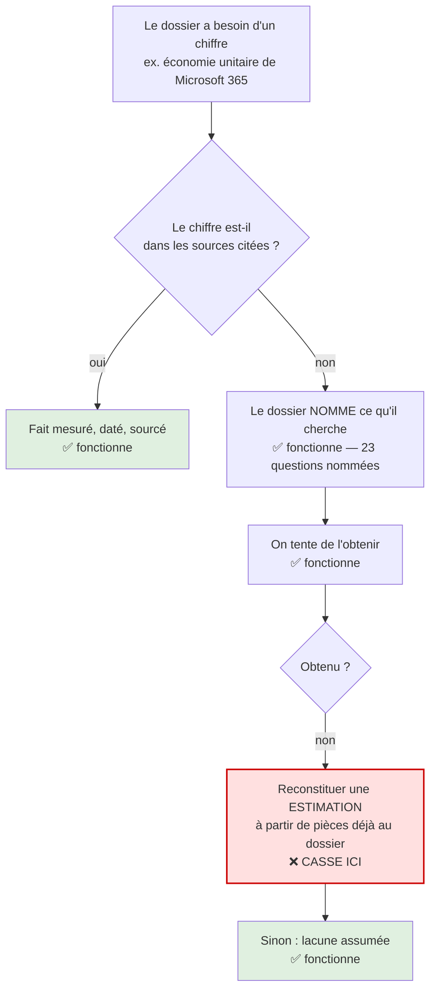

## 2. Ce que la mesure révèle en creux : deux natures de trou

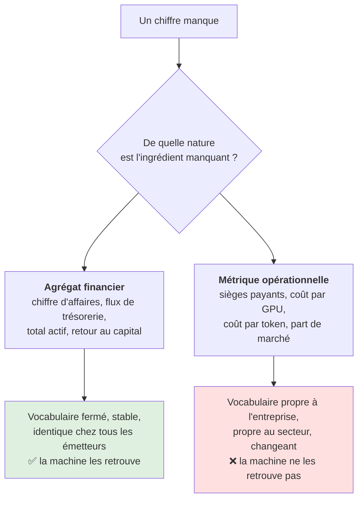

**Le paradoxe** : les agrégats financiers sont publiés et comparables, ils n'ont pas besoin d'être
estimés. Les métriques opérationnelles sont ce qui différencie réellement une entreprise et ce qui
n'est pas publié — donc ce qui vaut d'être approché. La machine sait faire ce qui ne sert pas.

---

## Arbitrage 1 — Que le dossier a-t-il le droit de faire face à un trou ?

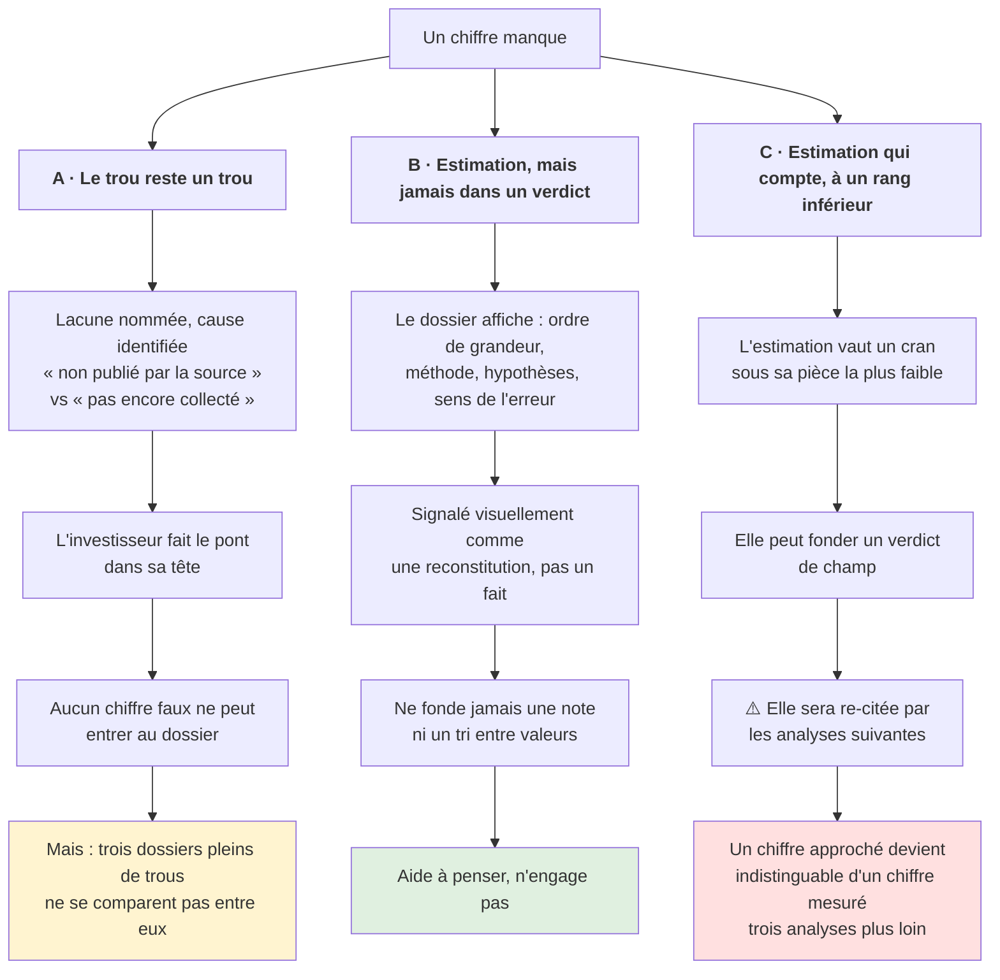

**L'asymétrie propre au long terme** : une estimation fausse qui a l'air fondée survit dans le
dossier et se fait re-citer ; un trou assumé reste inoffensif. Un dossier se relit à cinq ans, le
souvenir de « ce chiffre était une reconstitution » ne dure pas cinq ans.

---

## Arbitrage 2 — Qui nomme les ingrédients d'une estimation ?

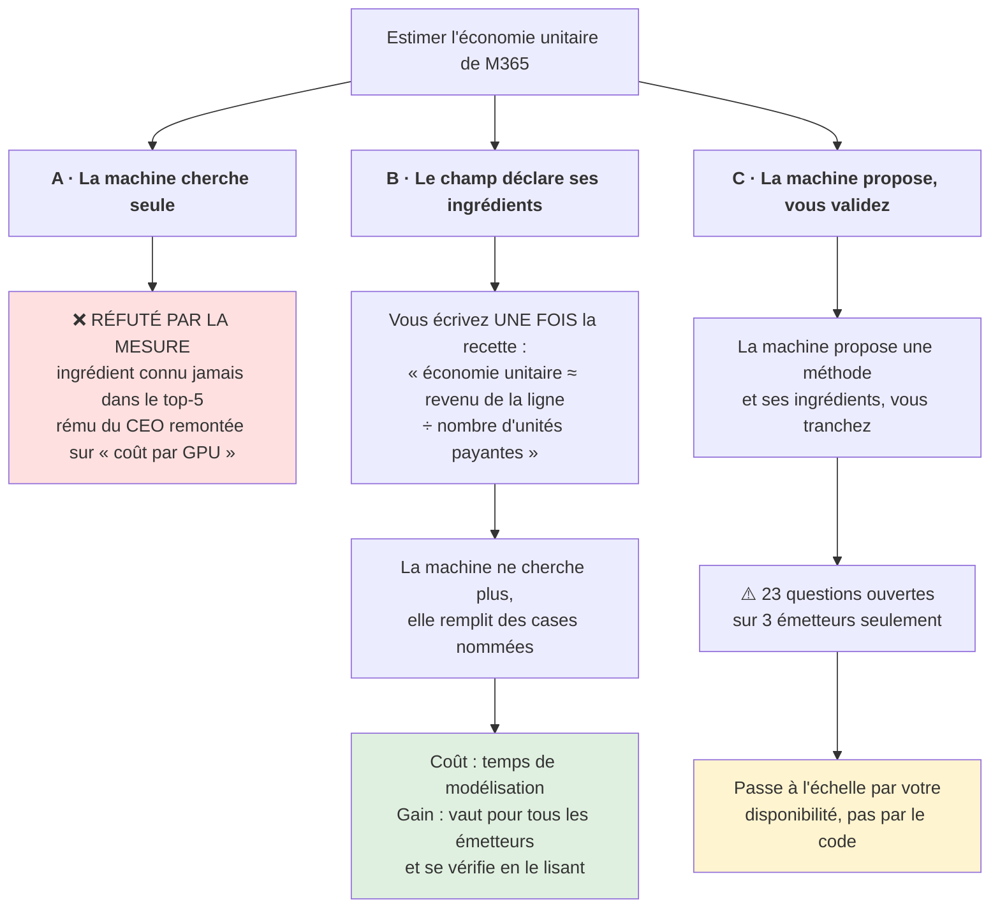

**Le pivot** : la machine échoue à **découvrir** un ingrédient, mais n'a aucune difficulté à en
**utiliser** un qu'on lui a nommé.

⚠️ *Objection ouverte par l'utilisateur le 2026-09-09* : une recette écrite une fois pour tous les
émetteurs peut être trop rigide — chaque entreprise appelle des métriques ad hoc dépendantes de son
business. Voir la question du graphe de connaissance par ticker.

---

## Arbitrage 3 — Une estimation peut-elle jamais relever une conviction ?

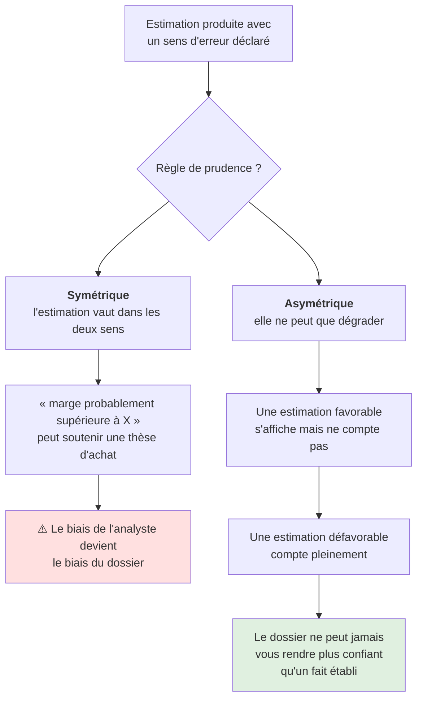

**Coût réel de l'asymétrie** : elle rend le dossier structurellement pessimiste sur les entreprises
qui publient peu — et certaines des meilleures publient peu.

---

## Arbitrage 4 — Le silence doit-il se lire comme une couverture ?

*Non prévu. Apparu dans la mesure.*

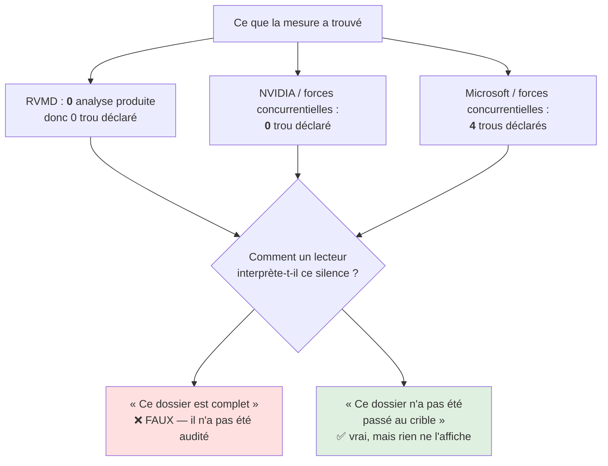

**Le pire mode de panne pour une comparaison** : NVIDIA paraît mieux documenté que Microsoft sur les
forces concurrentielles alors que c'est l'inverse — Microsoft a été examiné et a déclaré ses trous,
NVIDIA ne l'a pas été. Faut-il un troisième état visible, **« non audité »** ?

---

## Recommandation initiale (2026-09-09, avant la discussion)

1 → **B** · 2 → **B** · 3 → **asymétrique** · 4 → **oui**.

Combinaison la plus cohérente avec la mesure, et la seule où le code à écrire est du code dont on
sait déjà qu'il fonctionnera.

⚠️ Cette recommandation est **antérieure** à la question de fond posée par l'utilisateur (graphe de
connaissance par ticker + reproduction de la logique d'un fonds d'investissement). Elle est
susceptible d'être caduque : l'arbitrage 2 option B présuppose un référentiel de champs commun à
tous les émetteurs, qui est précisément ce qui est remis en question.

---
---

# Arbitrage 5 — Le référentiel : formulaire fermé ou graphe par entreprise ?

*Ouvert le 2026-09-09 par l'utilisateur. **Il subsume les arbitrages 1 à 4** : ceux-ci présupposent
un référentiel de champs commun à tous les émetteurs, qui est précisément ce qui est remis en cause.*

## 5.0 Ce que le code dit, vérifié

- `backend/app/agents/v2/common.py:16` — `MVDD_SPEC` : **8 dimensions, 19 champs**, identiques pour
  tout émetteur.
- `common.py:40` — `MVDD_FIELD_PATHS : frozenset` : **vocabulaire FERMÉ**. Commentaire du code :
  *« Un tag hors vocabulaire ne fonde rien — il est écarté, pas inventé. »*
- `worker.py:141` — `_resolve_covers` : un fait trouvé par la recherche dont le `covers` n'est pas
  dans les 19 chemins est **stocké mais rattaché à rien**.
- `synthesis_feed.py:145` — `SYNTHESIS_TARGETS` : **4 cibles**, chacune avec une **requête française
  en dur** identique pour toutes les entreprises (`{company}` substitué).
- `curator.py:69` — `DECLARED_NONBLOCKING_GAPS` : l'unique échappatoire quand la grille ne va pas à
  une entreprise est une **dispense écrite à la main dans le source Python**, par couple
  (ticker, champ), suivie d'un redéploiement. Une seule dispense existe à ce jour.

## 5.1 Ce que la base dit (2026-09-09, 180 entries)

| émetteur | entries | rattachées à rien | part |
|---|---|---|---|
| MSFT | 54 | 11 | 20 % |
| NVDA | 52 | **26** | **50 %** |
| RVMD | 27 | 7 | 26 % |

**Les 26 orphelines de NVIDIA** : chiffre d'affaires ×3, résultat net ×2, marge brute, flux de
trésorerie, capitaux propres, total actif, trésorerie et dette, capex, retour au capital ×2,
trajectoire de marge brute trimestrielle (#32), **coûts de revient et provisions d'inventaire
(#33)**, marge opérationnelle par segment (#34) — **16 faits tier A, source SEC**. Plus 5 mémoires
LLM tier C et 5 context packs.

**Le champ `produits.unit_economics` compte 2 entries dans toute la base.** Les faits d'économie
unitaire de NVIDIA sont dans #32, #33, #34 — **orphelins**.

## 5.2 Le cas RVMD — la grille appliquée à une biotech clinique

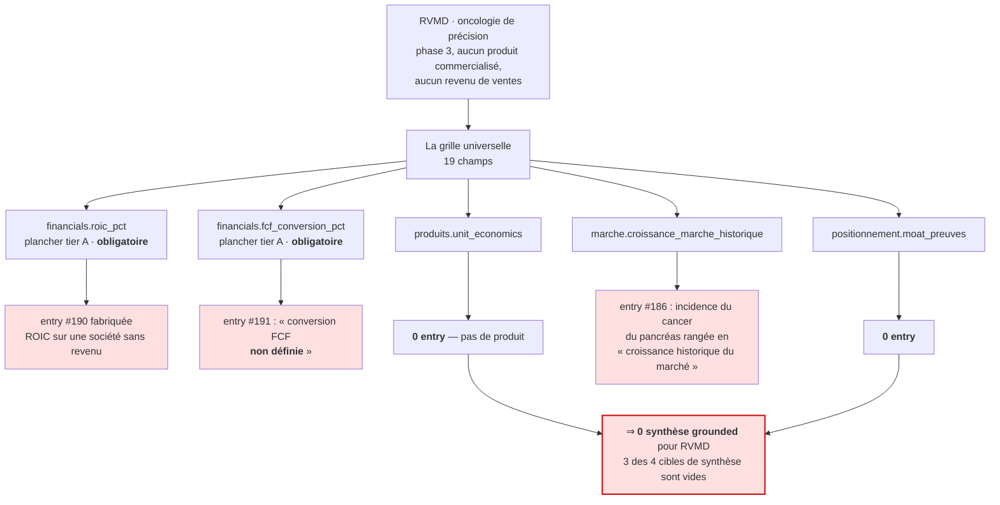

**Et ce que le dossier RVMD contient vraiment** — entassé dans `business_model.description` (4) et
`business_model.drivers_revenus` (3), faute de champ propre : la plateforme RAS(ON), le pipeline et
le stade de développement, la NDA acceptée par la FDA, l'accord Royalty Pharma (2 Md$).

**Ce qui n'a aucun champ où exister** : durée de trésorerie (*cash runway*), calendrier des
lectures d'essais, probabilité de succès technique et réglementaire, population de patients
adressable, mécanismes concurrents. Pour une biotech clinique, **c'est toute la thèse
d'investissement**. L'entry #167 « Trésorerie et dette long terme » est orpheline.

## 5.3 Ce que cela fait à la capacité 5

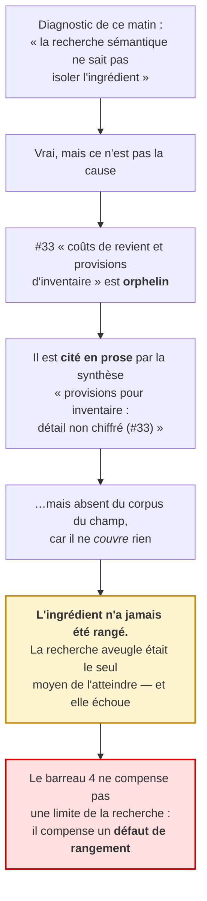

## 5.4 Les trois modèles de référentiel

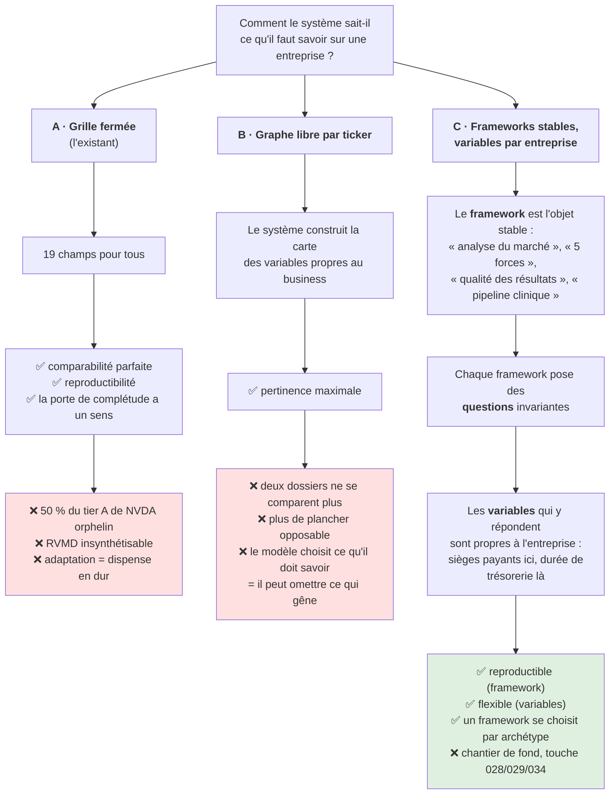

**C est la formulation littérale de l'énoncé utilisateur** : *« chaque framework est à la fois
suffisamment spécifié pour être reproductible et suffisamment flexible pour s'adapter à chaque
entreprise »*. Ce n'est pas un compromis entre A et B, c'est un axe différent : A fige les
*variables*, C fige les *questions*.

## 5.5 Ce qui manque au processus de fonds — écart par écart

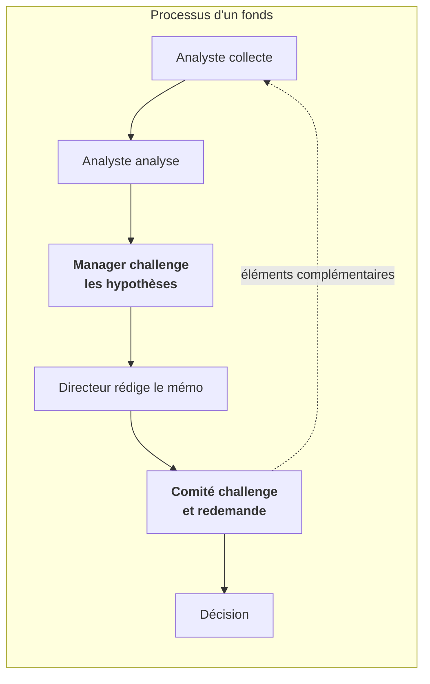

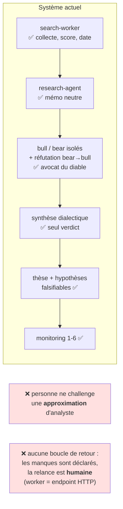

**Écart A — le manager qui challenge une hypothèse n'existe pas.** Le curator contrôle la
*suffisance des données* (le champ est-il fondé à son plancher ?) ; le debate-agent challenge la
*conviction au maintien*. Personne ne challenge **l'approximation que fait l'analyste pour bâtir son
modèle** — c'est exactement le barreau 4, et il a échoué 4 fois. Il a peut-être échoué parce qu'il a
été conçu comme une **capacité automatique** au lieu d'un **rôle** qui accepte ou refuse une
hypothèse nommée.

**Écart B — pas de boucle comité → collecte.** `reconcile_gaps` déclare les manques ; rien ne les
transforme en mandat de recherche. Le worker ne se déclenche que par `POST /knowledge/worker`
(`api/knowledge_v2.py:72`). L'humain **est** la boucle.

**Écart C — le framework n'est pas un objet du système.** « Les 5 forces » n'existent que comme un
nom de champ + un sac de mots-clés en dur + un bout de prompt. Rien qui se versionne, s'adapte à un
secteur ou se remplace par « pipeline clinique » quand l'entreprise est une biotech.
