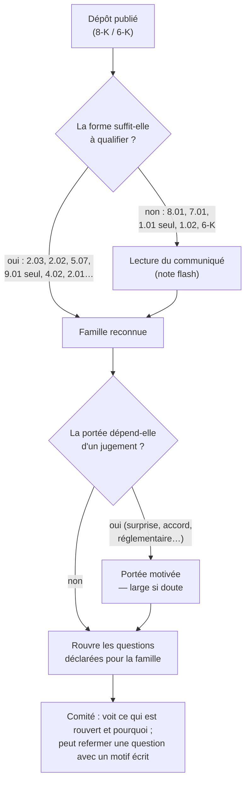
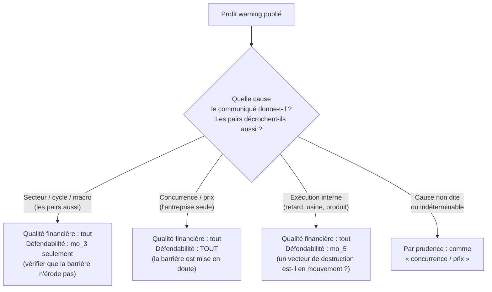

# Taxonomie des événements — ce qui rouvre quoi

## 0. Point de départ

**Arbitrage rendu (2026-09-26)** : un événement de **financement** ne remet en question, a priori,
que les questions de **financement** (`qf_4` « la structure de financement contraint-elle
l'exploitation ? », `qf_7` « combien de temps tenir sans le marché ? »). Il ne rouvre pas la
barrière brevetaire de Revolution Medicines.

**Demande de l'utilisateur** : généraliser. Certains événements rouvrent plus large — un profit
warning peut révéler une vulnérabilité fondamentale et imposer de réévaluer la défendabilité — et
certains demandent du **jugement** pour savoir quelles méthodologies reprendre, que la position soit
en cours d'analyse ou détenue.

**Ce que ferait un vrai fonds.** Le jour d'une publication, l'analyste qui couvre le titre la lit et
écrit une **note flash** : « événement X ; incidence sur la thèse : aucune / à revoir sur tel et tel
point ». Il ne refait pas tout le dossier à chaque communiqué, mais il ne laisse jamais un point
touché affiché comme à jour. Quand il hésite, il **rouvre** le point et le referme ensuite par une
note écrite — l'erreur coûteuse est le point faussement à jour, pas le point revu pour rien.

## 1. Une découverte sur le cas réel, avant la taxonomie

Appliquer l'arbitrage « financement ⟹ financement seulement » **tel quel** au mécanisme actuel
produirait une **fausse fraîcheur** sur RVMD.

Aujourd'hui le système ne regarde que **le dernier** événement important. Chez RVMD :

| Date | Dépôt | Ce que c'est |
|---|---|---|
| 2026-08-05 | 2.02 | Résultats du T2 |
| **2026-08-26** | 8.01 | **La FDA approuve RASONQUE** — premier médicament commercialisé |
| **2026-08-27** | 1.01 + 2.03 | Accord de financement (le « dernier événement ») |

Les six réponses de défendabilité s'appuient toutes sur des pièces du **5 août ou avant** (vérifié en
base : mo_1…mo_5 citent le 10-K 2025 et le communiqué du T2). Si l'on dit seulement « le dernier
événement est un financement, donc il ne périme pas le moat », mo_1…mo_5 redeviennent **à jour**.
Or la veille, l'entreprise a changé de nature : elle a un produit approuvé, donc une exclusivité
réglementaire (nouvelle barrière), un prix, des volumes à venir. L'analyse de défendabilité **doit**
être reprise — pas à cause du financement, à cause de l'approbation.

> **Conséquence** : la bonne question n'est pas « le dernier événement périme-t-il cette
> réponse ? » mais « **y a-t-il eu, depuis les pièces de cette réponse, un événement d'une famille
> qui la concerne ?** ». Chaque question a sa propre horloge.

*Analogie* : un gestionnaire d'immeuble ne refait pas l'expertise de la toiture parce que le syndic a
renégocié le prêt ; mais il la refait si une tempête est passée la semaine d'avant — même si le prêt
est la dernière nouvelle en date.

## 2. La taxonomie — familles d'événements et ce qu'elles rouvrent

Les formulaires SEC (items 8-K) décrivent la **forme** d'un dépôt, pas sa **substance** : l'item
8.01 « autre événement important » a porté chez RVMD une approbation FDA, et un profit warning n'a
pas d'item à lui (il arrive en 2.02, 7.01 ou 8.01). La taxonomie se construit donc sur la
substance, et la forme sert seulement à la reconnaître quand elle suffit.

### Tableau des familles

Colonnes : **QF** = Qualité financière, **Déf.** = Défendabilité. « Tout » = toutes les questions du
framework. Les exemples sont les dépôts réels des trois titres du portefeuille.

| # | Famille | Reconnaissance | Rouvre | Jugement ? | Exemple réel |
|---|---|---|---|---|---|
| 1 | **Routine** (pièces jointes seules, vote ordinaire d'AG, présentation investisseurs sans chiffre neuf) | forme | **rien** | non | MSFT 02/09/2026 (7.01+9.01) |
| 2 | **Financement** (dette, convertible, émission d'actions, ligne de crédit) | forme (2.03, 3.02) ou lecture | QF : qf_4, qf_7 | non — ✅ arbitré | RVMD 27/08 et 14/04 ; NVDA 17/08 |
| 3 | **Publication de résultats** conforme aux attentes | forme (2.02) | QF : tout · Déf. : les questions de **trajectoire** lisibles dans les chiffres (mo_2 marges et parts, mo_3 élargissement/érosion, mo_6 prix et volumes) | non | NVDA 26/08, MSFT 29/07 |
| 4 | **Surprise / profit warning** (écart à la guidance ou au consensus, annonce préliminaire) | **lecture** (pas d'item propre) | QF : tout · Déf. : **selon la cause** — voir §3 | **oui** | — (aucun sur les 3 titres, à éprouver sur un cas historique) |
| 5 | **Réglementaire / produit** (approbation, refus, résultat d'essai, rappel, retrait) | **lecture** (8.01) | Approbation : Déf. tout + **reclassement** de l'entreprise (§4) · Échec / refus : mo_1, mo_4, mo_5 + qf_7 | oui (poids de l'actif) | **RVMD 26/08 — FDA** |
| 6 | **Changement de périmètre** (acquisition, cession, fusion, scission) | forme (2.01) ou lecture | **tout** (les deux frameworks) : l'entreprise analysée n'est plus la même | non | RVMD 2.01 (historique) |
| 7 | **Accord commercial / stratégique** (licence, partenariat, gros client, résiliation) | lecture (1.01 sans 2.03, 1.02) | Déf. : mo_1, mo_2, mo_5 selon l'accord · QF : qf_3 | **oui** | — (les 1.01 récents des 3 titres accompagnent tous un 2.03 : financements) |
| 8 | **Intégrité de l'information** (comptes antérieurs non fiables, changement d'auditeur, enquête) | forme (4.02, 4.01) | QF : qf_6 ; si comptes retraités : **toutes** les mesures des périodes visées — voir §6 | oui (4.01) | — |
| 9 | **Dirigeants / gouvernance** (départ ou nomination, activisme) | forme (5.02) | **aucun framework** aujourd'hui ; affiché au comité | oui — voir §6 | NVDA / MSFT 5.02 fréquents |
| 10 | **Existentiel** (faillite, changement de contrôle / OPA, radiation, dette exigible) | forme (1.03, 5.01, 3.01, 2.04) | **tout**, et au-delà des frameworks : la **thèse elle-même** (revue de décision) | non | — |
| 11 | **Incident** (cybersécurité, accident, litige majeur) | forme (1.05) ou lecture | selon le cas : mo_3, mo_5 si la barrière repose sur la **confiance** du client | **oui** | MSFT 1.05 ×2 |
| 12 | **Hors émetteur** (approbation d'un concurrent, arrivée de génériques, résultats d'un pair, régulation des prix) | ⚠️ **n'apparaît pas dans les dépôts de l'émetteur** | Déf. : mo_3, mo_5 (et mo_1 si la barrière est contournée) | oui | — (limite du périmètre actuel, §6) |

**Lecture du tableau.** Les familles 1, 2, 3, 6, 10 se reconnaissent et s'appliquent sans jugement.
Les familles 4, 5, 7, 8, 11 exigent de **lire** l'événement pour en fixer la portée — c'est la note
flash de l'analyste. La famille 9 n'a pas encore de méthodologie à rouvrir, et la 12 n'est pas vue
par le système aujourd'hui.

## 3. Le cas du profit warning — l'exemple de l'utilisateur

**Ce que ferait un vrai fonds.** Devant un avertissement sur résultats, la première question de
l'analyste est : **« est-ce l'entreprise, ou tout le secteur ? »**. Si tous les concurrents
annoncent la même baisse (demande en recul, cycle, change), la barrière n'est pas en cause : c'est
une question de chiffres. Si l'entreprise est seule à décrocher — parts de marché perdues, prix
cassés, client qui internalise —, c'est le signe que sa barrière était **moins solide qu'on ne le
croyait**, et c'est toute l'analyse de défendabilité qui repasse devant le comité.

*Exemple concret* : un fabricant de semi-conducteurs qui abaisse sa prévision parce que tout le
marché des PC recule garde sa barrière ; le même abaissement expliqué par « un client majeur a
conçu sa propre puce » est exactement le vecteur que mo_5 demande de surveiller (« intégration
verticale d'un client »), et il rouvre aussi mo_1 (« qu'est-ce qui empêche de capter ce profit ? »).

## 4. Le cas de la première approbation — l'entreprise change de catégorie

Le référentiel classe RVMD « pré-revenus » depuis le 24/09, et ce classement dit déjà lui-même :
*« L'approbation FDA d'août 2026 fera apparaître ces postes : ce classement est daté et destiné à
être revu. »* Tant qu'elle est « pré-revenus », cinq questions sont **sans objet** (rendement du
capital, conversion en cash, coût de la croissance, stabilité du rendement, pouvoir de prix).

**Ce que ferait un vrai fonds.** Quand une biotech passe de la clinique au commercial, le fonds
**réinitie la couverture** : nouveau modèle fondé sur les ventes, nouvelles questions. C'est une
décision du gérant, pas une mise à jour de routine, parce qu'elle change **la grille de lecture**
elle-même.

Un tel événement ne rouvre donc pas seulement des réponses : il rend **applicables** des questions
qui ne l'étaient pas. C'est une conséquence d'une autre nature que les onze autres familles.

## 5. Position en cours d'analyse ou position détenue

| | En cours d'analyse | Position détenue |
|---|---|---|
| **Ce que fait un fonds** | Le dossier n'est pas encore présenté : on reprend simplement les points touchés avant le comité | L'analyste doit une note flash sous 24-48 h ; si un point touché porte une hypothèse de la thèse, la position est mise **sous revue** (liste de surveillance), parfois avec une limite de risque |
| **Dans le système** | Les questions rouvertes repartent dans la chaîne de collecte et d'analyse (le système va chercher lui-même, arbitrage du 25/09) | En plus : rapprocher les questions rouvertes des **hypothèses figées** de la thèse et de leurs seuils ; si l'une est concernée → revue de décision (mode 3 du suivi) |

## 6. Limites nommées (pas à arbitrer aujourd'hui)

- **Comptes retraités (famille 8)** : ce n'est pas seulement de l'actualité, c'est la **fiabilité**
  des anciens dépôts qui tombe (un 10-K déclaré non fiable n'est plus une source de premier rang
  pour ces périodes). La doctrine sépare les deux axes ; ce cas touche l'axe fiabilité et sera
  instruit à part.
- **Gouvernance (famille 9)** : aucune méthodologie ne la porte. Le départ inopiné d'un directeur
  financier juste avant des résultats est un signal réel, mais il n'a pas de question à rouvrir.
  Il s'affiche ; il ne rouvre rien tant qu'un framework « management / gouvernance » n'existe pas.
- **Hors émetteur (famille 12)** : l'approbation d'un concurrent ou l'arrivée d'un générique
  n'apparaissent pas dans les dépôts de l'émetteur. Le périmètre est EDGAR seul (arbitrage du
  22/09) ; le suivi des pairs existe pour les résultats (mode 4), pas pour le reste. Un dossier
  peut donc être « à jour » au sens du système alors qu'un concurrent vient d'être approuvé — à
  afficher comme limite, pas à taire.

## 7. Arbitrages demandés

**Q1 — Résultats trimestriels conformes.** Rouvrent-ils les chiffres **et** les questions de
trajectoire de la barrière (marges comparées, parts de marché, prix pratiqués), ou toute l'analyse de
défendabilité ?
- *Recommandation* : chiffres + trajectoire. Un trimestre conforme ne dit rien du **mécanisme** de
  la barrière ni de sa durée ; la revue complète de la thèse décidée le 22/09 reste le rendez-vous du
  gérant, pas une réouverture de toutes les questions.

**Q2 — Profit warning.** La réouverture de la défendabilité dépend-elle de la **cause** (secteur,
concurrence, exécution — §3), au prix de comparer aux pairs, ou rouvre-t-on systématiquement toute
la défendabilité ?
- *Recommandation* : selon la cause, avec « cause non dite = cause concurrentielle ». C'est la
  question que pose tout analyste ; la réponse systématique rouvrirait le moat de NVDA sur une
  baisse du marché des PC.

**Q3 — Dans le doute sur la portée.** Quand la lecture d'un communiqué ne permet pas de trancher, le
système rouvre-t-il **large** (et le comité referme une question avec un motif écrit) ou **étroit**
(et le comité élargit) ?
- *Recommandation* : large. L'erreur d'un point faussement à jour est invisible jusqu'au comité ;
  celle d'un point revu pour rien coûte une analyse. Le comité sait déjà refermer avec un motif
  écrit (procès-verbal du 25/09).

**Q4 — Première approbation (RVMD, 26/08).** Le reclassement de l'entreprise de « pré-revenus » à
« commerciale » — qui rend applicables cinq questions jusque-là sans objet — est-il fait par le
système dès qu'il détecte l'approbation, ou **proposé** par le système et **validé** par le comité ?
- *Recommandation* : proposé puis validé. Le fonds réinitie la couverture sur décision du gérant ;
  et tant que les ventes n'apparaissent pas dans les comptes, les questions nouvellement applicables
  n'auraient pas encore de matière (elles s'afficheraient toutes « sans réponse »).

**Q5 — Position détenue.** Un événement qui rouvre une question sous-jacente à une hypothèse de la
thèse met-il la position **automatiquement sous revue** (avec un délai de traitement), ou est-il
seulement signalé ?
- *Recommandation* : sous revue automatique. C'est le rôle du contrôle des risques : une position
  dont un pilier est rouvert ne peut pas rester affichée « thèse intacte ».

## 8. Esquisse de mise en œuvre (après arbitrage — ordre contrat → agent → données)

1. **Données** : le catalogue des familles et, **sur chaque question** de `frameworks.yaml`, la liste
   des familles qui la rouvrent — remplace le booléen `actualite_bloquante`. Ajouter une
   méthodologie reste une opération de données (arbitrage du 24/09) : elle déclare ses propres
   familles.
2. **Reconnaissance par la forme** : table item → famille pour les cas non ambigus (détenteur
   unique à côté de `ITEM_LABELS`, `material_events.py`).
3. **Horloge par question** : l'ancre d'une question = le dernier événement d'une famille qui la
   rouvre (§1), recalculée à la lecture (#53). Consommateurs : `qualite_info`, `parcours._manque`,
   note de comité, validité d'une acceptation du comité (qui tombe aujourd'hui sur « le dernier
   fait important » quel qu'il soit).
4. **Lecture (note flash)** : un agent qualifie les dépôts ambigus (famille, cause pour la famille
   4, passage cité), en l'absence de qualification : portée large (si Q3 = large). Qualification
   persistée une fois par dépôt (un dépôt ne change pas), la portée recalculée à la lecture.
5. **Test d'acceptation sur le réel** : RVMD — le financement du 27/08 ne rouvre ni mo_1 ni mo_2 ;
   l'approbation du 26/08 les rouvre ; qf_4/qf_7 rouverts par le 27/08. Test négatif : retirer
   l'approbation du flux doit rendre mo_1…mo_5 à jour — sinon la garde ne lit pas la famille.
