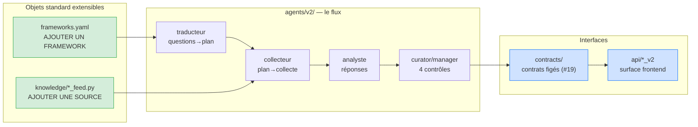

# Architecture V3 — cible

> **Ce document décrit l'architecture CIBLE**, dérivée de `03-spec-frameworks.md` et de
> `doctrine-trois-axes.md`. Il est le point d'entrée pour comprendre les modules et leurs contrats
> d'extension.
>
> **L'architecture RÉALISÉE n'est pas décrite en prose** — elle dérive vite du réel et fabrique des
> faux verts. Elle est **prouvée par la suite `backend/checks/`** (rejouée par `bash checks/run_all.sh`,
> ligne de base **2172 assertions / 0 échec**). Chaque module a son `ARCHITECTURE.md` qui mappe
> *invariant cible → `check_*.py` garant*. Un invariant sans check est une **dette**, marquée ⚠️.
>
> Pour connaître l'état réalisé d'un module : lire son `ARCHITECTURE.md`, puis **exécuter** ses checks.
>
> **Cette organisation est elle-même gardée** par `check_architecture.py` (+ `negatif_architecture.sh`) :
> bijection registre ↔ docs, pointeurs de checks vivants, aucune garde orpheline, discipline de
> dossier, autonomie de /V3. Ajouter un module = ajouter sa ligne au registre ci-dessous **et** son
> `ARCHITECTURE.md` — le check refuse l'un sans l'autre.

## Le modèle-objet V3, en une phrase

Le système répond à des **frameworks** (questions d'investissement stables) en collectant des
**faits** rangés dans une **base de connaissance** ; deux de ces objets sont conçus pour être
**standard et extensibles** — un framework, une source de données.

## Carte des modules backend

| Module | Rôle (cible) | Point d'extension | `ARCHITECTURE.md` |
|---|---|---|---|
| `app/knowledge/` | Base de connaissance + 8 feeds déterministes + recherche | **Ajouter une source** | `app/knowledge/ARCHITECTURE.md` |
| `app/frameworks/` | Référentiel des frameworks (`frameworks.yaml`, inerte versionné) | **Ajouter un framework** | `app/frameworks/ARCHITECTURE.md` |
| `app/agents/v2/` | Le flux V2/V3 (Option C, chaîne de collecte, manager) | Ajouter un maillon du flux | `app/agents/v2/ARCHITECTURE.md` |
| `app/contracts/` | Copies runtime des cartes figées (`provenance-cards/`) | Faire évoluer un contrat (#19) | `app/contracts/ARCHITECTURE.md` |
| `app/api/` | Surface backend → frontend (routers `_v2`) | Exposer une info au frontend | `app/api/ARCHITECTURE.md` |
| `app/data_collection/` | ⚠️ **LEGACY V0/V1** — DataService marché | (pas d'extension V3) | `app/data_collection/ARCHITECTURE.md` |

## Les trois garde-fous (constitution — `principe-directeur.md`)

- **G1** — le contrat JSON encode la méthodologie : l'agent ne peut pas sauter une étape.
- **G2** — un contrat de décision ne vaut que par ce que le corps HTTP **n'expose pas** (#36).
- **G3** — la décision est indépendante de l'UX.
- **Ordre des lots : UX (contrat) → agent → données.** Jamais commencer par le schéma de table.

## La doctrine des trois axes (`doctrine-trois-axes.md`) — jamais recombinés en scalaire (#50)

- **fiabilité** — propriété de la **source**, stockée.
- **nature** (`mesure`|`evenement`|`interpretation`) — propriété de l'**assertion**, stockée (#51).
- **actualité** — propriété de la **relation** fait ↔ ancre, **calculée à la lecture, jamais persistée** (#53).
- Porte de complétude à **trois états** (`couvert`/`couvert_perime`/`non_couvert`), deux remèdes (#54).
