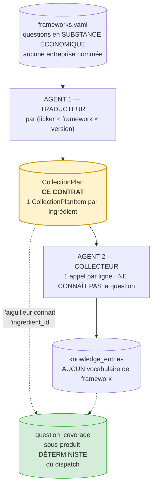
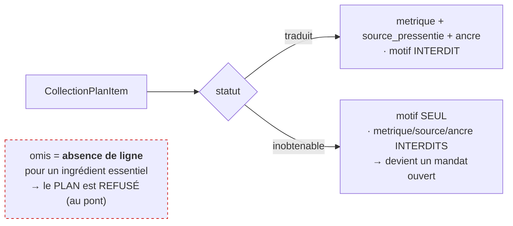

# Carte de provenance — `CollectionPlan` (contrat v3.0.0, lot 2c)

> **Le contrat vit dans le code, pas ici.** Détenteur unique :
> `backend/app/contracts/collection_plan_schema.py`. Cette carte **pointe** le contrat et documente
> la provenance de chaque champ ; elle n'en republie pas la définition (deux nomenclatures d'accord
> restent deux nomenclatures, #46).
>
> Gardé par `checks/check_collection_plan_contract.py` (**31 assertions** — §1-5 le contrat, §6 le
> pont) et son test négatif bidirectionnel `checks/negatif_collection_plan_contract.sh`
> (**satisfiabilité + 16 mutations, 16 détectées** — 9 sur le contrat, 7 sur le pont).

---

## Où ce contrat se place dans la chaîne (§3.6)

La question est posée **sans connaître l'entreprise**. Deux agents la relient au monde, et ce
contrat est **la frontière entre les deux** : la sortie du traducteur, l'entrée du collecteur.

**Pourquoi deux agents, et pourquoi le plan est PERSISTÉ.** Une question sans réponse doit rester
diagnosticable : « mauvais plan, ou mauvaise collecte ? ». La question n'a de sens que si le plan
est un objet relisable — d'où ce contrat. Un agent unique fusionnerait les deux défauts en un
verdict opaque, la panne de `curator.py` aujourd'hui.

---

## Le statut d'une ligne commande ses champs — et le 3ᵉ état n'est pas un statut

`traduit` et `inobtenable` sont les deux valeurs de `statut`. **`omis` n'en est pas une** (#44/#54) :
une valeur `omis` serait une ligne, donc l'ingrédient ne serait pas omis. L'omission d'un ingrédient
**essentiel** est le mode de panne que toute la v3 combat (elle produit un VERT : 100 % de couverture
sur ce qui reste) ; elle se constate en confrontant le plan au **référentiel**, donc dans le pont
(`valider_pont_collection_plan`, lot 2c à venir), jamais dans ce contrat d'objet (#37).

---

## Provenance des champs

| Champ | Porté par | Provenance / raison |
|---|---|---|
| `ticker_id` | `CollectionPlan` | l'émetteur pour qui on planifie ; l'univers de tickers est le seul partagé V1/V2/V3 |
| `framework_id` · `framework_version` | `CollectionPlan` | quel framework, à quelle version — le plan est **versionné** : le corpus de RVMD ne vaut pas la même chose avant et après une lecture clinique |
| `archetype` | `CollectionPlan` | l'archétype applicable (§4.1.3). **Pas** un `Literal` figé : le référentiel détient la liste (#46/#31), le pont vérifie l'appartenance |
| `question_id` · `ingredient_id` | `CollectionPlanItem` | le couple du référentiel — exactement les deux colonnes de `question_coverage` (§6). Non fondus : un `ingredient_id` nu peut exister sous deux questions |
| `statut` | `CollectionPlanItem` | `traduit` \| `inobtenable` — décide des champs présents |
| `metrique` | `CollectionPlanItem` | comment **cette entreprise-là** nomme l'ingrédient (RVMD : *cash burn* ; MSFT : *free cash flow*). Présent ssi `traduit` |
| `source_pressentie` | `CollectionPlanItem` | où chercher **d'abord**. Présent ssi `traduit` |
| `ancre` | `CollectionPlanItem` | l'**événement** par rapport auquel le fait sera daté. Présent ssi `traduit` |
| `motif` | `CollectionPlanItem` | pourquoi aucune source connue ne produit l'ingrédient ; ce que portera le mandat. Présent ssi `inobtenable` |

---

## Ce que le traducteur NE PEUT PAS porter — et c'est une absence de champ (#59, §3.6)

Le traducteur dit **où chercher**, jamais **combien de preuve suffit**. `plancher_tier`,
`nature_attendue` et `essentiel` viennent du framework et de lui seul (écart V2 de l'audit, qui vise
le levier `RESSERRER` de `curator.py`). Ils sont **absents du contrat** : `Strict` (`extra='forbid'`)
les rejette à la construction — la doctrine est impossible à violer, pas gardée par un `if`. Même
forme que l'actualité absente de `FrameworkAnswer` (#53).

Un plan ne **dégrade** jamais un tier de source selon l'émetteur non plus : l'inégalité d'un 10-K
entre RVMD et MSFT est de l'**actualité**, pas de la fiabilité (#59). Le traducteur **nomme l'ancre**
(`ancre`) ; l'actualité reste calculée à la lecture. Aucun champ de tier ni de score ici.

---

## Ce que ce contrat NE vérifie PAS (#37) — et qui le vérifie

Un contrat valide un **objet**, jamais la cohérence entre deux. Les invariants qui exigent de
connaître le référentiel vivent dans le **pont** `valider_pont_collection_plan`
(`agents/v2/frameworks.py`, **livré**), qui lève `CollectionPlanRefused` :

| Invariant | Repère | Où il vit |
|---|---|---|
| le framework existe, à la version du plan | `[N]` | pont ✅ |
| `archetype` est l'un des archétypes déclarés | `[O]` | pont ✅ |
| chaque `(question_id, ingredient_id)` résout au référentiel | `[P]` | pont ✅ |
| une ligne ne planifie pas une question **sans objet** pour cet archétype | `[Q]` | pont ✅ |
| **chaque ingrédient essentiel d'une question applicable a une ligne** (omission → plan REFUSÉ) | `[R]` | pont ✅ — c'est **T1bis** (§9.2) |
| une ligne `inobtenable` produit un mandat ouvert | — | flux traducteur → `framework_mandates` (à venir) |
| l'aiguilleur écrit `question_coverage` | — | flux collecteur (à venir) |

Ce que le contrat d'objet garantit, lui : qu'une ligne **présente** est complète et cohérente avec
son statut.
