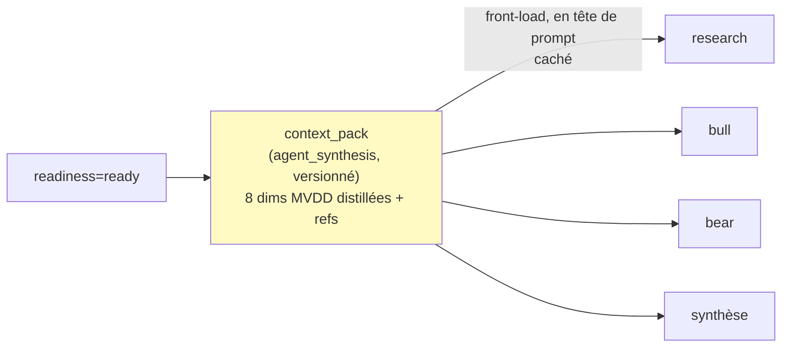

# Carte de provenance — `context_pack` (curator → chaîne aval)

## Ce qui distingue cette carte

Le `readiness_report_json` répond **« peut-on décider ? »** (le gate GO/NO-GO). Le `context_pack`
répond **« avec quoi décide-t-on ? »** : c'est l'état des connaissances **distillé** par dimension
MVDD, avec ses `source_entry_refs`. Les deux sortent du curator ; le pack n'existe que si `ready`.

Son rôle est économique autant que méthodologique. C'est le mécanisme de **réutilisation durable**
(§5.3) : au lieu de jeter l'assessment du curator, on le persiste comme `knowledge_entry`
`source_type='agent_synthesis'` (versionné). Research/bull/bear/synthèse le rechargent **en tête**
de leur prompt → le prompt caching l'amortit sur toute la rafale d'analyse. D'où la contrainte
inhabituelle de cette carte : **la discipline de cache est un invariant du contrat**, pas une
optimisation d'implémentation.

## Twin table — distillation (A) & réutilisation/traçabilité (B)

| Champ | nature | grounding | Vérification (A2) | Provisioning |
|---|---|---|---|---|
| `dimensions[].synthese` | **judgment** | délégué (refs) | non vide ; jamais hors-sol | distillé par le curator depuis les entries |
| `dimensions[].source_entry_refs` | **ref** | — | **NON VIDE** (A2 : agent_synthesis cite ses sources) ; triées (entry_id, version) | entries distillées de la dimension |
| `dimensions[].tier_atteint` | **derived** | hérité | meilleur tier des sources | KB |
| `dimensions[].incertitudes[]` | **judgment** | — | résiduelles investissables (les bloquantes ont empêché `ready`) | curator |
| `dimensions[]` (ensemble) | **derived** | — | EXACTEMENT les 8 dims MVDD, ordre canonique | projection Coverage (ready ⇒ tout couvert) |
| `readiness_verdict` | **contrôle** | — | `Literal['ready']` — front-load ready-only | readiness amont |
| `readiness_report_id` | **ref** | — | de quel readiness ce pack est le fruit | `knowledge_curator_reports` |
| `base_rates_reutilisables[]` | **ref** | — | corpus sectoriel cumulatif (§6.6) — vide au 1ᵉʳ ticker | pattern_library / autres tickers du secteur |

## Garde-fous encodés (context_pack_schema.py — 10/10 vérifiés)

- **A2 — pas de synthèse hors-sol.** Chaque `DimensionDigest` porte des `source_entry_refs` **non
  vides**. `agent_synthesis` est « dérivé de sources, non originale » (§6.3, B- 0.60) — il **doit**
  citer, la réutilisation aval hérite donc d'un grounding traçable.
- **Ready-only.** `readiness_verdict='ready'` en dur : le front-load est le fruit du gate, pas un
  contournement. Cohérent avec `readiness_report_card` (`ready ⇒ context_pack_entry_id`).
- **Complétude MVDD.** Exactement les 8 dimensions (3 struct + 5 qual), mêmes noms que la Coverage
  du readiness — aucun trou, aucune dimension fantôme. `ready` garantit que toutes sont couvertes.
- **Discipline de cache (§5.3) — invariant du contrat.** `extra='forbid'` interdit tout champ
  volatil (`generated_at`/`session_id`) ; dimensions en **ordre canonique** ; refs **triées** par
  (entry_id, version). La sérialisation est donc déterministe → cacheable en tête de prompt. Les
  « interdits en tête » du §5.3 sont réglés structurellement, pas par convention.

## Stockage — double écriture (A1/A2)

1. **Le pack lui-même** → `knowledge_entries` (source_type='agent_synthesis', versionné A1) ;
   son `id` est le `context_pack_entry_id` renseigné dans le `readiness_report_json` (ready).
2. **Ses refs** → `analysis_knowledge_refs` (snapshot figé A1/A2 : `entry_version`,
   `content_snapshot`, `reliability_at_use`, `field_path`) au moment de la persistance — mêmes
   colonnes que pour une analyse. Le JSON ne porte que `(entry_id, version)` ; le figement est au store.

## Les 3 points de synchronisation (G1, règle #19)

1. **Prompt curator** — le schéma de sortie du pack (en plus du readiness) = ce contrat.
2. **Frontend / aval** — research/bull/bear/synthèse chargent le pack en tête ; l'UX Readiness peut
   afficher le résumé par dimension.
3. **Import / validation** — `context_pack_schema.py` à l'écriture de l'entry agent_synthesis.

## Ancrage

- Pydantic vérifié (2.13.4, container backend) : `context_pack_schema.py` — 10 cas (A2, complétude,
  ordre/refs cache, ready-only, champ volatil, base_rates).
- Réutilise `SourceEntryRef`/`NonEmptyRefs`/`BaseRatePct`/`Tier` d'`analysis_v2_schemas.py`.
- Amont : `readiness_report_card.md` (le pack est le fruit de `ready`). Aval : les 4 cartes d'analyse
  (research/bull/bear/synthèse) chargent ce pack. Réutilisation durable + cache : §5.3.
