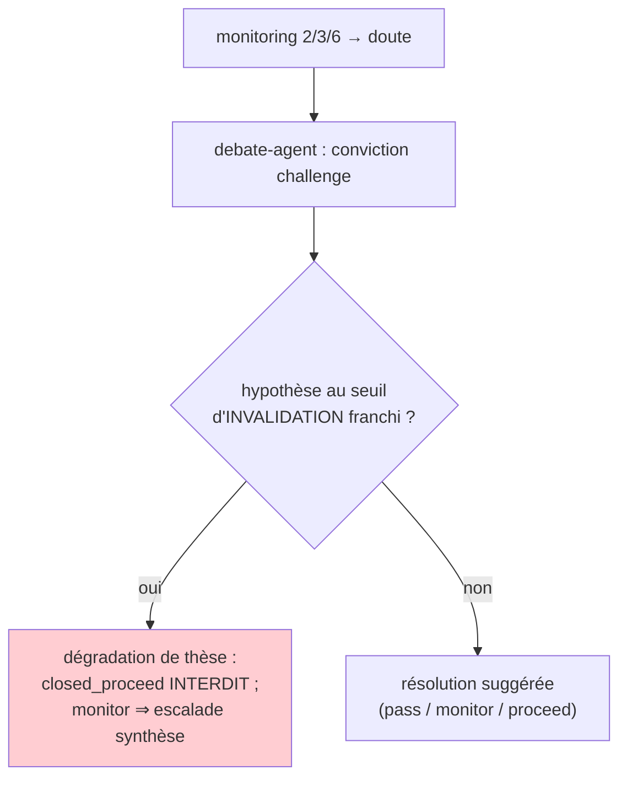

# Carte de provenance — Conviction challenge (debate-agent)

## Ce qui distingue cette carte

Le debate-agent (renommage de l'opportunity-agent V1) n'est ni un analyste (bull/bear) ni l'arbitre
(synthèse). Il intervient **après** qu'un monitoring (mode 2/3/6) a soulevé un doute et que
l'investisseur envisage de **MAINTENIR**. Son objet est un **méta-risque comportemental** : le biais
de statu quo. Maintenir une position par **inertie** (ancrage sur le prix d'entrée, coût
irrécupérable, aversion à matérialiser une perte, confirmation) est l'erreur silencieuse que ce
contrat rend impossible à commettre sans l'avoir *défendue*.

D'où sa spécificité : sa sortie n'est **pas** un verdict d'exécution (Q2 reste à la synthèse ; l'acte
d'entrée/sortie aux contrats `validate`/`exit`). C'est un **challenge structuré + une résolution
SUGGÉRÉE** non contraignante, alignée sur les statuts de `conviction_debates`
(`closed_pass`/`closed_monitor`/`closed_proceed`). Le contrat vérifie que le maintien est **mérité**,
pas confié à l'UX — pendant décisionnel du `ready` forcé rejeté au readiness (G2).

## Twin table — challenge (A) & résolution/traçabilité (B)

| Champ | nature | grounding | Vérification (G2) | Provisioning |
|---|---|---|---|---|
| `hypotheses_sous_tension[].seuil_franchi` | **contrôle** | — | `Literal[aucun, alerte, invalidation]` (direction non recomputable → déclaré) | monitoring |
| `hypotheses_sous_tension[].source_entry_refs` | **ref** | direct | **non vide** (A2 : le franchissement est étayé) | entries de la période |
| `hypotheses_sous_tension[].hypothese_id` | **ref** | — | pont vers H1-Hn figées | thèse |
| `cas_contre_maintien[]` | **factual/judgment** | direct | **≥ 1** (débat non décoratif) ; chaque item sourcé | l'agent (meilleur cas CONTRE) |
| `cas_contre_maintien[].base_rate` | **factual** | direct | règle 2 : proba ancrée (`reference_class` + taux) | ancre |
| `biais_a_surveiller[]` | **judgment** | — | **≥ 1** (nommer les biais de statu quo) | l'agent |
| `cout_opportunite` | **judgment** | — | non vide (maintien jugé vs alternatives) | portefeuille |
| `resolution_suggeree` | **contrôle** | — | `Literal` aligné `conviction_debates` — **SUGGÉRÉE**, l'utilisateur tranche | l'agent |
| `resolution_rationale` | **judgment** | — | non vide (explicabilité — pas de résolution muette) | l'agent |
| `escalade_recommandee` | **contrôle** | — | route mode 5 → synthèse si vrai | l'agent |

## Garde-fous encodés (debate_conviction_schema.py — 12/12 vérifiés)

- **G2 — anti-complaisance (le maintien se mérite).** Une hypothèse au seuil d'**invalidation** franchi
  est une **dégradation de thèse** : `resolution_suggeree='closed_proceed'` (maintenir avec conviction)
  est **rejetée** ; « monitorer » à travers (`closed_monitor`) exige `escalade_recommandee=True`
  (re-synthèse complète, jamais un monitoring silencieux). `closed_pass` (sortir) reste permis.
- **Débat non décoratif.** `cas_contre_maintien` ≥ 1 : un débat sans le meilleur cas CONTRE est du
  théâtre. Chaque contre-argument est **sourcé** (A2, `source_entry_refs` non vides) et **ancré**
  (`base_rate`, règle 2).
- **Biais nommés.** `biais_a_surveiller` ≥ 1 — le contrat force à expliciter le statu quo qu'on teste.
- **Explicabilité.** `resolution_rationale` non vide — pendant du NO-GO muet interdit au readiness.
- **Pas de verdict d'exécution.** `resolution_suggeree` est un `Literal` de **suggestion** (contrôle) ;
  aucun PROCEED/PASSER de synthèse, aucun sizing — le contrat ne peut pas court-circuiter la décision.
- **G1.** `extra='forbid'` + `SCHEMA_VERSION='v2.0.0'` (importé avec les 9 autres sans conflit).

## Statut / stockage

Ferme le trou signalé au lot prompts (`prompts/60-debate-agent.md`) : la sortie du debate-agent est
désormais figée. Alimente `conviction_debates` (statuts `open`/`closed_pass`/`closed_monitor`/
`closed_proceed`, déjà en DB, migration 013) ; les `source_entry_refs` se figent en
`analysis_knowledge_refs` (snapshot A1/A2) comme pour toute analyse.

## Les 3 points de synchronisation (G1, règle #19)

1. **Prompt debate-agent** (`prompts/60-debate-agent.md`) — schéma de sortie = ce contrat.
2. **Frontend** — Page DÉBAT : hypothèses sous tension (seuils vs observation), cas contre le maintien,
   biais, résolution suggérée + bouton d'escalade.
3. **Import / validation** — `debate_conviction_schema.py`.

## Ancrage

- Pydantic vérifié (2.13.4, container backend) : `debate_conviction_schema.py` — 12 cas (anti-complaisance
  invalidation×résolution, débat non décoratif, biais, refs A2, extra, résolution close).
- Réutilise `Strict`/`NonEmptyRefs`/`BaseRate` d'`analysis_v2_schemas.py` (G1).
- Amont : monitoring (modes 2/3/6) qui route l'option C (carte C8 + monitoring_mode6). Aval : escalade →
  synthèse (`risk_matrix`) ou décision utilisateur (`conviction_debates`).
