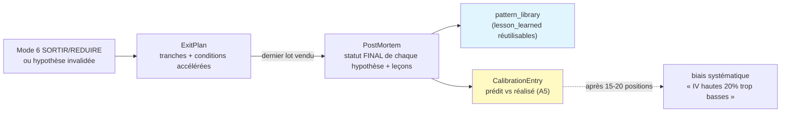

# Carte de provenance — Sortie / post-mortem / calibration

## Ce qui distingue cette carte

C'est le maillon qui **referme la boucle d'auditabilité sur l'apprentissage** (A5). Trois contrats
liés, dans l'ordre du cycle de vie d'une position :

La particularité méthodologique : la sortie reste **thèse-driven** (l'`origine` est une cause de
thèse, jamais un ratio de prix — §11), le post-mortem **ne peut oublier aucune hypothèse** figée, et
la calibration **enregistre ce qui avait été prédit à l'entrée** face au réalisé — c'est ce couplage
qui rend l'apprentissage mesurable plutôt qu'anecdotique.

## Twin tables

### `ExitPlan` (§11)

| Champ | nature | Vérification | Provisioning |
|---|---|---|---|
| `origine` | **contrôle** | `Literal` thèse-driven (thesis_degradation/rendement_insuffisant/hypothese_invalidee/reallocation) — jamais un seuil de prix | déclencheur mode 6 / hypothèse |
| `tranches[].pct_a_vendre` | **contrôle** | Σ ≤ 100 ; ordres 1..n consécutifs | plan d'exécution |
| `tranches[].declencheur` | **ref** | seuil/condition d'exécution de la tranche | wizard de vente |
| `conditions_accelerees[]` | **contrôle** | requis si `accelerated_exit` ; type ∈ {hypothese_invalidee, iv_revisee_baisse} → Mode 3 auto | §11 |
| `exit_status` | **contrôle** | plan_created/partially_exited/closed/accelerated_exit | `portfolio_positions.exit_status` |

### `PostMortem` (§12) & `CalibrationEntry` (A5)

| Champ | nature | Vérification | Provisioning |
|---|---|---|---|
| `hypotheses_finales[]` | **judgment** | **bijection** avec les hypothèses figées de la thèse (`valider_postmortem_couvre`) | statut final de chaque H |
| `lecons[]` | **judgment** | ≥1 ; chaque leçon **taguée** (sinon irrécupérable) | → `lesson_learned` (pattern_library) |
| `performance_pct` · `duree_jours` | **factual** | — | réalisé |
| `paires[]` (calibration) | **derived** | ≥1 couple {metric, predite, realisee} | prédit (thèse) vs réalisé (sortie) |

## Garde-fous encodés (exit_calibration_schema.py — 15/15 vérifiés)

- **Sortie thèse-driven (§11).** `origine` typée obligatoire : la sortie a une **cause de thèse**,
  pas un ratio de prix. Les tranches portent des seuils d'exécution, mais le **plan** est justifié
  par un déclencheur de thèse. `accelerated_exit` ⇒ `conditions_accelerees` non vides.
- **Tranches déterministes.** Σ `pct_a_vendre` ≤ 100 ; ordres = 1..n consécutifs.
- **Post-mortem complet (bijection).** `hypotheses_finales` couvre **exactement** les hypothèses
  figées (aucune oubliée, aucune inventée) — pendant de la bijection `risk_acks` du validate (C4).
  On ne clôt pas une position sans juger chaque hypothèse.
- **Leçons réutilisables.** ≥1 leçon, chacune **taguée** → indexable dans `pattern_library`
  (`lesson_learned`), réutilisable par les futurs bull-agents sur comparables (§6.1, corpus cumulatif).
- **Calibration A5.** ≥1 paire prédit/réalisé — le grain de l'apprentissage LT ; le registre
  s'accumule (biais systématique révélé après 15-20 positions, `CalibrationPanel`).

## Stockage — migration 027

`exit_plans`, `exit_executions` ; `price_alerts += exit_plan_id, alert_type` (exécution par tranches
via `_check_price_alerts_v1` étendu) ; `calibration_registry` (prédit vs réalisé, A5). Leçons →
`knowledge_entries` type=`lesson_learned` (append-only). **Ne pas écrire la migration avant ce contrat.**

## Les 3 points de synchronisation (G1, règle #19)

1. **Prompt postmortem-agent** — schéma de sortie = `PostMortem` (+ dérivation `CalibrationEntry`).
2. **Frontend** — `ExitPlanBuilder` (tranches + conditions accélérées), `CalibrationPanel` (biais).
3. **Import / validation** — `exit_calibration_schema.py`. Stubs existants à compléter :
   `portfolio/post_mortem.py`, `learning/pattern_library.py`, `learning/thesis_versioning.py`.

## Ancrage

- Pydantic vérifié (2.13.4, container backend) : `exit_calibration_schema.py` — 15 cas (thèse-driven,
  tranches, bijection post-mortem, leçons taguées, calibration).
- Réutilise `Strict` d'`analysis_v2_schemas.py`. `valider_postmortem_couvre` = pendant de
  `valider_pont_risques_hypotheses` (§8.5).
- Amont : mode 6 SORTIR/REDUIRE (C5), hypothèses figées au validate (C4).
