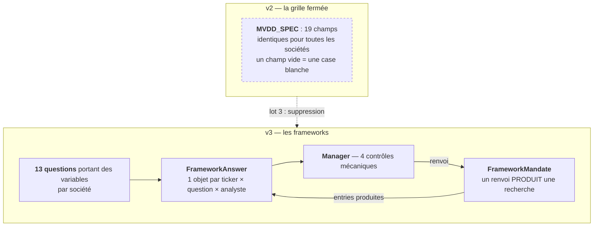
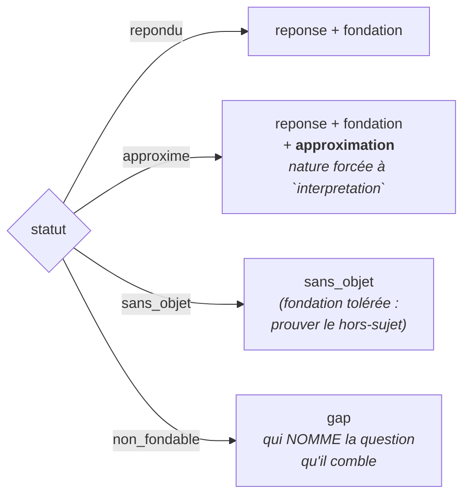

# Carte de provenance — `FrameworkAnswer` (contrat v3.0.0)

> **Le contrat vit dans le code, pas ici.** Détenteur unique :
> `backend/app/contracts/framework_answer_schema.py`. Les cartes historiques de ce dossier portent
> une *copie* du schéma, et ces copies ont dérivé de leur original — deux nomenclatures d'accord
> restent deux nomenclatures (#46). Cette carte **pointe** le contrat et documente la provenance de
> chaque champ ; elle n'en republie pas la définition. `check_framework_contract.py` §7 fait rougir
> un assert nommé si un jumeau `*framework*schema*.py` réapparaît dans ce dossier.
>
> Gardé par `checks/check_framework_contract.py` (91 assertions, 20 mutations en test négatif) et
> par `checks/negatif_framework_contract.sh`.

---

## Ce qui remplace quoi

La boucle `M → R → A` est la fermeture de l'**Écart B** : en v2, un refus du manager ne produisait
rien — il constatait. Le mandat est ce qui rend le refus **exécutable**.

---

## Le statut commande les blocs

Le cœur du contrat. Chaque statut **exige** ses blocs et **interdit** les autres ; l'interdiction est
la moitié qui attrape l'entry #190 (un ROIC publié pour une société sans revenus).

---

## Champ par champ

Colonnes : **D** = qui le produit · **V** = qui le garantit (`P` = Pydantic, objet seul ·
`B` = pont Python, cohérence relationnelle · `L` = point de lecture).

### Identité

| Champ | D | V | Provenance et raison d'être |
|---|---|---|---|
| `schema_version` | code | P | Figé `v3.0.0`. Contrat NEUF : il ne bouscule pas `SCHEMA_VERSION` v2 des 4 JSON d'analyse, ce qui forcerait les 3 points de synchro (#19) et l'exemple JSON des 12 prompts (#39). |
| `framework_id` | routeur | P·B | Le framework interrogé. |
| `question_id` | routeur | P·B | **Contrôle A du pont** : doit exister dans le framework chargé, sinon la réponse s'indexe sur une question voisine et T4/T5 valideraient la mauvaise. |
| `ticker_id` | routeur | P | L'émetteur. |
| `analyste` | routeur | P | **Écart assumé n°2 avec la spec §2.4.** §3.4 écrit le contrat pour N > 1 analystes ; sans porteur de l'identité, deux réponses divergentes sont indiscernables et le correctif naturel serait de les **moyenner** — ce que §3.4 interdit. |
| `statut` | analyste | P | Vocabulaire fermé à 4, sans défaut et sans 5ᵉ état « partiel ». |

### `reponse` — ce qu'un lecteur lit

| Champ | D | V | Provenance et raison d'être |
|---|---|---|---|
| `verbatim` | analyste | P | Non vide. C'est la réponse en toutes lettres, jamais reconstruite depuis les champs structurés. |
| `valeur` | analyste | P | Optionnelle — toute question n'a pas de nombre. |
| `unite` | analyste | P | **Obligatoire dès que `valeur` est présente.** Un montant sans unité n'est pas imprécis, il est illisible : 15,99 lus « 0,0 » ont coûté la convention #46. |
| `sens` | analyste | P | Vocabulaire **délibérément ouvert au lot 1**. Le fermer maintenant induirait le contrat de ce que le code fera ; il se ferme au lot 2, quand les 13 questions diront ce que « sens » veut dire pour chacune. |

### `fondation` — deux axes stockés, jamais trois

| Champ | D | V | Provenance et raison d'être |
|---|---|---|---|
| `cited_entry_ids` | analyste | P·B | ≥ 1. **Contrôle B du pont** : chaque id doit appartenir au corpus réellement fourni (A2) — un id hors corpus, c'est le modèle qui apporte une source que personne n'a lue. |
| `rang_derive` | **dérivé** | B | **Jamais déclaré** (règle transverse 7, §3.5). `repondu` → le rang de la plus faible entry citée ; `approxime` → **un cran sous**, via `synthesis_feed.derive_synthesis_reliability`, seul détenteur de la table des crans. **Contrôle D** : il doit atteindre le plancher de la question, sinon la réponse est un `non_fondable`, pas une réponse faible — la nuance déclenche une collecte au lieu d'un affichage. |
| `nature_effective` | analyste | P·B | Axe `nature` des entries (migration 034, #51). **Contrôle E** : la nature attendue par la question doit être **portée par une entry citée** — elle se lit sur la source, elle ne se déduit pas du statut. Forcée à `interpretation` si `approxime`. |
| `actualite` | **lecture** | L | ⚠️ **Absent de `Fondation`, présent seulement sur `FondationServie`.** Écart de forme assumé avec le JSON de §2.4, qui le montre dans `fondation`. L'actualité est une propriété de la **relation** fait ↔ ancre (#53) : la persister reproduirait la cause n°2 du diagnostic #50 (un corpus dont le score est arrêté à l'écriture ne vieillit jamais, donc ne peut pas signaler qu'il a vieilli). `extra='forbid'` rend l'écriture **impossible par construction**, plutôt que gardée par un `if`. |
| `motif_actualite` | **lecture** | L | Un état sans sa cause est un verdict inattaquable. |

### `approximation` — les quatre champs, ou aucun

| Champ | D | V | Provenance et raison d'être |
|---|---|---|---|
| `methode` · `ingredients_entry_ids` · `hypotheses_explicites` · `sensibilite` | analyste | P | **Tous requis.** Une estimation dont la méthode, les ingrédients, les hypothèses ou le sens d'erreur manquent se lit exactement comme une mesure. C'est déjà ce que `synthesis_feed._CONSIGNE_LACUNES` demandait poliment ; le contrat cesse de demander. Ce bloc **EST** le contrôle ③ du manager. |

### `sans_objet` — le hors-sujet est un signal, pas une panne

| Champ | D | V | Provenance et raison d'être |
|---|---|---|---|
| `motif` | analyste | P | Un `sans_objet` sans motif est un trou déguisé (contrôle ①). |
| `substitut_applique` · `substitut_answer_id` | analyste | P·B | **Contrôle F du pont** : le substitut doit pointer la réponse d'une **autre** question. Un hors-sujet qui se cite lui-même republie la question qu'il vient de déclarer sans objet. |
| `aucun_substitut` | analyste | P | **Requis, sans défaut.** « qf_1 sur une pré-revenus n'a pas de substitut, c'est LA réponse » (§4.1.3) doit s'**écrire**, pas s'obtenir en omettant un champ. XOR strict avec `substitut_applique`. |

### `gap` — importé de `readiness_report_schema`, jamais redéfini

`GapItem` est le **détenteur unique** du couple manque ↔ remède (#54). Les deux remèdes ne se
confondent jamais : un champ **périmé se rafraîchit** (il a des entries, il leur manque une date
postérieure), un champ **vide se collecte**. Les fusionner ferait payer une recherche complète là où
une date suffisait. **Invariant du contrat** : `question_id ∈ gap.champs_cibles` — un manque qui ne
dit pas ce qu'il comble ne produit aucun mandat exécutable.

### `manager` — il acquitte ou il renvoie, il ne réécrit pas

| Champ | D | V | Provenance et raison d'être |
|---|---|---|---|
| `controles.completude` · `fondation` · `non_substitution` | manager | P | `ok\|ko`. Aucun ne demande un jugement d'investissement : chacun a une réponse mécanique. |
| `controles.honnetete_approximation` | manager | P | **Écart assumé n°1 : trois valeurs (`ok\|ko\|sans_objet`)** là où la spec en écrit deux. Sur une réponse qui n'approxime pas, la question n'a pas d'objet : répondre `ok` serait un vert vrai sur zéro ligne. L'indécidable est un **troisième état nommé**, jamais un repli sur l'un des deux autres (#44/#53/#55). L'**équivalence** `sans_objet ⟺ statut ≠ approxime` est un invariant, donc le troisième état ne peut pas servir d'échappatoire. |
| `verdict` · `motif` | manager | P | `renvoye` ⇒ mandat non nul **ET** ≥ 1 contrôle `ko` : le motif d'un renvoi est un contrôle rouge, pas une opinion sur l'entreprise. `acquitte` ⇒ aucun `ko` et aucun mandat. |
| `mandat_de_recherche_id` | manager | P | Ce qu'un renvoi **produit**. Sans lui, le renvoi ne produit rien : c'est l'Écart B. |

> **Garde structurelle, en plus de la garde par instance :** `ManagerVerdict` ne porte *aucun* champ
> de réponse ni de rang. Il ne peut pas promouvoir un rang ni réécrire une réponse **faute d'endroit
> où l'écrire**. Un `extra='forbid'` se desserre d'une ligne ; un champ absent doit être ajouté.

---

## `FrameworkMandate` — l'état porte exactement sa trace

| État | Ce qu'il porte | Ce qu'il ne peut pas porter |
|---|---|---|
| `ouvert` | le mandat exécutable, son origine, son motif | aucune trace de consommation |
| `servi` | `statut_avant` **et** `statut_apres` **et** `consomme_at` | — |
| `abandonne` | le motif de l'abandon | `statut_apres` : un abandon ne conclut rien |

⚠️ **`statut_apres == statut_avant` est LICITE.** Une recherche qui ne trouve rien laisse la question
`non_fondable`, et c'est une information — pas une violation. C'est **T8**, en face, qui exige qu'au
moins un mandat ait fait bouger un statut ; l'exiger ici transformerait chaque recherche
infructueuse en erreur, et pousserait à fabriquer du mouvement.

`mandat` est une **consigne exécutable**, pas un mot-clef : c'est ce qui remplace les sacs de
mots-clefs français de `SYNTHESIS_TARGETS` (§5.1).

---

## `COLONNES_DENORMALISEES` — pourquoi cette table existe

Le test d'acceptation a été écrit au **lot 0**, avant le contrat, avec sa propre nomenclature
devinée (`framework`, `rang_degrade`, `methode_approximation`, `ingredients`, `motif`). Le contrat
niche ces champs (`fondation.rang_derive`, `approximation.methode`, …).

Laissées côte à côte, ces deux nomenclatures auraient produit le pire des deux mondes au lot 3 :
T3/T4 lisant `None` **pour toujours**, donc rouges pour la **mauvaise raison** — ou pire, T3 virant
au vert sur zéro ligne. La table est le **détenteur unique** de la correspondance ; l'outil
d'acceptation l'importe (vérifié par AST, pas par grep de token), et §6 du check vérifie que chaque
chemin résout réellement dans le contrat.
