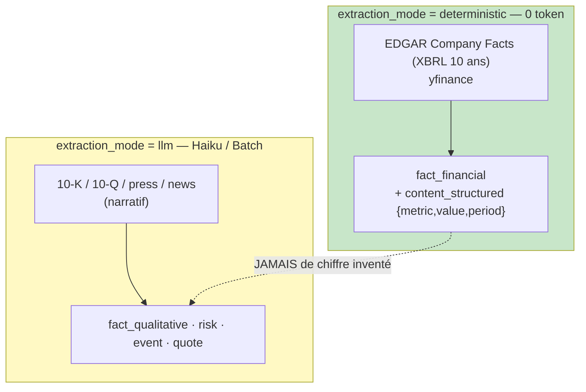

# Carte de provenance — Extraction d'ingestion (document → entries)

## Ce qui distingue cette carte

C1 décrit la délégation *à la demande* (un agent métier réclame une entry). C2 décrit la
**production de masse** : à l'onboarding et aux mises à jour périodiques, l'ingestion-agent parse
les documents et remplit le corpus. Le curator/research/bull/bear ne lisent **jamais** les documents
bruts — seulement les entries distillées (§5.3 : le coût lourd est ici, payé **une fois** en Haiku/batch).

Le pivot du contrat est `extraction_mode`, qui sépare **deux chaînes de provenance disjointes** :

**Le nombre financier ne traverse jamais le LLM.** C'est le garde-fou central : les chiffres
viennent de XBRL/yfinance en déterministe ; l'Opus (aval) n'est payé que pour le *jugement*, jamais
pour lire un bilan (§6.6). Anti-hallucination **et** anti-coût, d'un seul invariant.

## Twin table — job (entrée) & result (provisioning)

### `IngestionJob` (descripteur de tâche)

| Champ | nature | rôle | Vérification |
|---|---|---|---|
| `document_id` | **ref** | FK `knowledge_documents` ; None si source directe (XBRL/yfinance) | — |
| `doc_type` | **contrôle** | 10-K/10-Q/8-K/earnings_call/… | `Literal` (table migration 024) |
| `doc_source_type` | **contrôle** | edgar/ir_scrape/web_search/user_upload/rss | mappe les source_types d'entry autorisés |
| `content_hash` | **contrôle** | SHA256 — dédup document (skip si déjà ingéré) | non vide |
| `fiscal_period` | **ref** | période couverte | propagée aux `fact_financial` |
| `is_confidential` | **contrôle** | upload confidentiel | ⇒ `user_provided_confidential` |
| `extraction_mode` | **contrôle** | deterministic \| llm | pilote tous les invariants ci-dessous |
| `segment` | **ref** | sous-segment d'un gros doc (10-K → Item 1A…) | sous-segmentation §6.6 |

### `IngestionResult` (sortie scorée)

| Champ | nature | grounding | Vérification | Provisioning |
|---|---|---|---|---|
| `entries[]` | **factual** | source_type + refs | `ProducedEntry` (invariants C1 hérités) | extraites du doc/source |
| `entries[].source_type` | **contrôle** | — | ∈ `DOC_TO_ENTRY_SOURCES[doc_source_type]` (jamais llm_memory/agent_synthesis) | origine du document |
| `entries[].content_structured` | **factual** | — | obligatoire si `fact_financial` déterministe | {metric, value, period} XBRL |
| `dropped_immaterial` | **derived** | — | compte des candidats < 0.3 matérialité (§4.4) | filtre anti-bruit |
| `supersedes_period` | **contrôle** | — | A1 : période financière rendue obsolète (jamais mutée) | mise à jour trimestrielle/annuelle |
| `execution.tier` | **contrôle** | — | `deterministe`⇒tokens=0/cost=0 ; sinon `ouvrier` | §5.3 / §6.6 |

## Garde-fous encodés (ingestion_extraction_schema.py — 14/14 vérifiés)

- **Anti-hallucination financière.** `deterministic` ⇒ **tout** entry_type=`fact_financial` +
  `content_structured` présent. `llm` ⇒ entry_type **≠** `fact_financial`. Un chiffre financier
  produit par le LLM est rejeté à la construction.
- **Déterministe = gratuit (§6.6).** `tier='deterministe'` exige tokens=0 et cost=0 — sinon c'est
  un LLM déguisé. Cohérence `extraction_mode ↔ execution.tier` verrouillée.
- **Source cohérente au document.** Le `source_type` d'une entry appartient à l'ensemble autorisé
  pour son `doc_source_type`. Un **document** ne peut produire ni `llm_memory` (mémoire modèle) ni
  `agent_synthesis` (dérivé d'agent) — ils ne viennent jamais d'un document.
- **Confidentiel tracé.** `is_confidential` ⇒ `user_provided_confidential` (données primaires, B+ 0.80).
- **Matérialité (§4.4).** Candidats < 0.3 ignorés (non stockés) ; `dropped_immaterial` les compte.
- **A1 append-only.** Nouvelle période ⇒ `supersedes_period` marque l'ancienne obsolète, jamais de
  mutation. Alimente le vieillissement −0.05/an (§6.3) via `fiscal_period` propagé.
- **Hérités de C1 (`ProducedEntry`).** P2 (llm_memory review+cutoff), plafond de source, score jamais muet.

## Stockage

`entries[]` → `knowledge_entries` (append-only A1, migration 024), avec `document_id`, `ticker_id`,
`version`, `embedding` posés au store (hors contrat d'extraction). `IngestionJob` trace vers
`knowledge_documents` (`content_hash`, `processing_status`). Ligne `log.md` append-only par ingestion
(LLM Wiki Pattern §6.1 : `INGEST | source | n entrées | ingestion-agent`).

## Les 3 points de synchronisation (G1, règle #19)

1. **Prompt ingestion-agent** (mode llm) — schéma de sortie = `ProducedEntry` qualitatif ; le mode
   deterministic n'a pas de prompt (parseur XBRL/yfinance).
2. **Backend** — `ingestion/` (parseur Company Facts déterministe + ingestion-agent Haiku via la
   factory provider du lot 2) ; valide `IngestionResult` avant `store_knowledge`.
3. **Import / validation** — `ingestion_extraction_schema.py`.

## Ancrage

- Pydantic vérifié (2.13.4, container backend) : `ingestion_extraction_schema.py` — 14 cas
  (anti-hallucination, déterministe gratuit, source cohérente, confidentiel, matérialité, A1, tier/mode).
- Pipeline & modes A/B/C : roadmap KP §4 ; sources EDGAR/yfinance/EU : §6.5, §17.
- Amont : `worker_delegation_schema.py` (C1, `ProducedEntry` partagé). Aval : curator (readiness)
  consomme le corpus produit ici.
