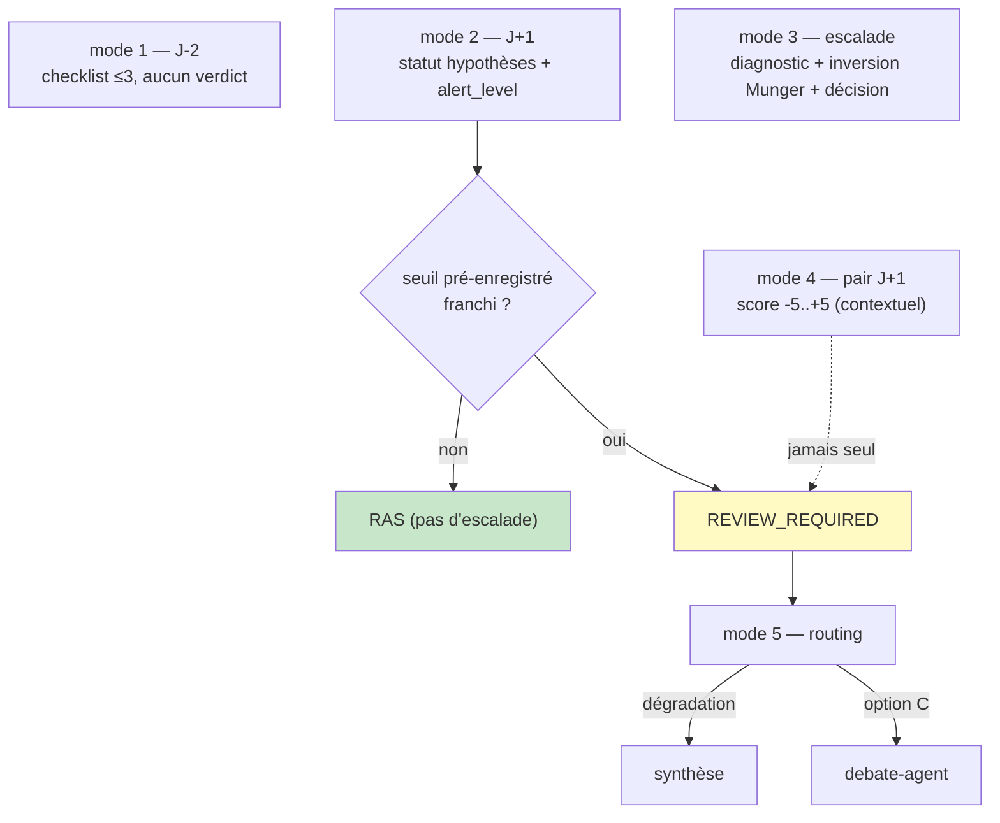

# Carte de provenance — Monitoring modes 1-5

> ## ⚠ Amendement 2026-09-01 — support de persistance, PAS le contrat
>
> Carte figée le **2026-08-21**, soit un jour avant l'acte des **deux espaces disjoints V1/V2**
> (2026-08-22). La mention « `monitoring_sessions` (migration existante) » est devenue fausse :
> `monitoring_sessions.thesis_id` est une FK vers `theses`, la table V1 — une session V2 n'a pas de
> place où pointer. Lire désormais **`monitoring_sessions_v2` (migration 031)**, avec
> `thesis_v2_id`. Le déclenchement calendaire passe par **`EventRouterV2`** (job scheduler séparé),
> pas par `EventRouterV1`.
>
> **Ce qui ne change pas : les contrats.** `Mode1PreEvent` … `Mode5Routing`, l'union discriminée sur
> `mode`, `extra='forbid'` et surtout l'**anti-churn** (escalade seulement sur franchissement d'un
> seuil pré-enregistré) sont **strictement identiques**.
>
> **Ce que l'implémentation du lot 8 a ajouté, et que le contrat ne pouvait pas porter** — le **pont
> inter-objets**. Mesuré : `Mode2QuarterlyReview` accepte parfaitement une escalade motivée par une
> hypothèse `H7` **qui n'existe pas dans la thèse**. Le contrat est satisfait, l'anti-churn est
> contourné — parce qu'un schéma valide un objet isolé, jamais sa cohérence avec un autre objet. D'où
> trois vérifications en code, hors contrat :
>
> 1. **Référentiel** (tous modes citant des hypothèses) — les ids cités ⊆ ids figés de la thèse.
> 2. **Exhaustivité** (mode 6 seul) — les ids figés ⊆ ids cités, comme l'exige la carte C5.
> 3. **Citations** — tout `entry_id` cité doit appartenir aux entries réellement envoyées.
>
> Un refus lève `MonitoringRefused` → **HTTP 422** (la requête est valide, c'est la *sortie du
> modèle* qui est incohérente) et persiste une session `failed` : un refus reste visible, il ne
> disparaît pas en silence. Test : `checks/check_monitoring_v2.py` §3.

## Ce qui distingue cette carte

Le mode 6 (revue annuelle) est la **colonne vertébrale** de la revue LT et produit toujours un
verdict (carte C5). Les modes 1-5, eux, sont **tactiques** et gouvernés par un invariant unique
issu de l'audit §1.3 — l'**anti-churn cognitif** : les modes trimestriels (1, 2, 4) **n'escaladent
que sur franchissement d'un seuil d'invalidation PRÉ-ENREGISTRÉ** (figé au validate, carte C4). Ils
ne re-jugent pas la thèse à chaque passage. Seuls les modes 3 (décision review, escalade) et 6
produisent un verdict de plein droit.

## Twin table — par mode (entrée → sortie), nature × vérification

| Mode | Champ clé | nature | Vérification (anti-churn / explicabilité) |
|---|---|---|---|
| **1 Pré-event** | `checklist` | **judgment** | `1 ≤ len ≤ 3` ; **aucun verdict** (pré-lecture) |
| **2 Revue trim.** | `hypotheses_reviewed[].statut` | **judgment** | refs A2 non vides ; statut ∈ active/alerte/invalidee/confirmee |
| | `seuils_franchis` | **derived** | = ids des hypothèses au statut {alerte, invalidee} (le statut EST le franchissement) |
| | `alert_level` | **contrôle** | `{REVIEW_REQUIRED, CRITICAL} ⇔ seuils_franchis ≠ ∅` ; `RAS ⇒ ∅` (ANTI-CHURN) |
| | `valuation_status` | **judgment** | contextuel — **non contraignant** (jamais un ordre de vente) |
| **3 Décision review** | `munger_inversion` | **judgment** | non vide (test d'inversion obligatoire) |
| | `decision` | **contrôle** | `Literal[MAINTENIR, REDUIRE, SORTIR, RE_SYNTHESE]` |
| | `exit_trigger` | **contrôle** | REDUIRE/SORTIR ⇒ renseigné ; MAINTENIR/RE_SYNTHESE ⇒ absent ; `hypothese_invalidee` ⇒ ≥1 invalidee |
| **4 Sector pulse** | `sector_score` | **judgment** | `-5 ≤ s ≤ 5` ; **n'escalade jamais seul** (pas d'alert_level) |
| **5 Routing** | `route` | **contrôle** | `Literal[synthese, debate]` — routing PUR, aucune donnée neuve |

## Garde-fous encodés (monitoring_modes_1_5_schema.py — 20/20 vérifiés)

- **ANTI-CHURN (§10, cœur de la carte).** Mode 2 : `alert_level` escalade ⇔ `seuils_franchis` non
  vide, **et** `seuils_franchis` ⇔ l'ensemble des hypothèses au statut {alerte, invalidee}. On
  n'escalade jamais « au feeling » ; on ne reste jamais RAS avec un seuil franchi. Le statut EST le
  franchissement, pas une déclaration parallèle.
- **Mode 1 — pré-lecture, pas de verdict.** `checklist` ≤ 3 points ; aucun champ de décision.
- **Mode 3 — explicabilité de sortie.** REDUIRE/SORTIR ⇒ `exit_trigger` (pas de sortie muette, comme
  au mode 6 et au readiness) ; MAINTENIR/RE_SYNTHESE ⇒ pas de trigger ; `hypothese_invalidee` ⇒ au
  moins une hypothèse `invalidee`. Test d'inversion (Munger) obligatoire.
- **Mode 4 — contextuel.** Le sector pulse informe (score borné, hypothèses impactées) mais **ne
  contraint pas** : pas d'`alert_level` — l'escalade repasse par un mode 2/3 sur seuil franchi. Même
  esprit que le `ValuationThermometer` contraignant=False.
- **Mode 5 — routing pur.** Aiguille vers `synthese` (dégradation matérielle) ou `debate` (option C) ;
  ne produit aucune connaissance nouvelle.
- **G1.** `extra='forbid'` ; union discriminée sur `mode` (parse robuste) ; `SCHEMA_VERSION='v2.0.0'`.

## Stockage

`monitoring_sessions_v2` (**migration 031** — cf. amendement en tête : `mode`, `alert_level`,
`verdict`, `routing_suggestion`, `calendar_event_id`, `thesis_v2_id`) ; `result_json` = le contrat
du mode. Les colonnes de routage sont **dérivées en code**, avec des domaines que la migration
contraint par CHECK : `alert_level` n'existe qu'au **mode 2**, `verdict` qu'aux modes **3 et 6**
(vocabulaires distincts — `RE_SYNTHESE` n'existe qu'au mode 3). Les statuts d'hypothèses des modes 2/3 alimentent
`hypotheses_reviewed[]` (frontend Page 5 — champ enrichi). Toute donnée nouvelle (résultats,
commentaires management) est **stockée en `knowledge_entries` scorées**, jamais gardée en prose.

## Les 3 points de synchronisation (G1, règle #19)

1. **Prompt monitoring-agent** (`prompts/70-monitoring-agent.md`, injection `[mode: N]`) — schéma de
   sortie par mode = ce contrat.
2. **Frontend** — Page 5 (monitoring) : checklist, statuts d'hypothèses, alert_level, sector pulse,
   diagnostic/décision, routing.
3. **Import / validation** — `monitoring_modes_1_5_schema.py`.

## Ancrage

- Pydantic vérifié (2.13.4, container backend) : `monitoring_modes_1_5_schema.py` — 20 cas (anti-churn
  mode 2 dans les deux sens, explicabilité mode 3, bornes score mode 4, checklist mode 1, routing,
  union discriminée).
- Réutilise `HypothesisReview`/`HypStatut`/`ExitTrigger` de `monitoring_mode6_schema.py` et `Strict`
  d'`analysis_v2_schemas.py` (source unique — G1).
- Amont : hypothèses figées au validate (C4). Aval : mode 3 SORTIR/REDUIRE → exit (C6) ; mode 5 →
  synthèse (§8.4) ou debate (C7).
