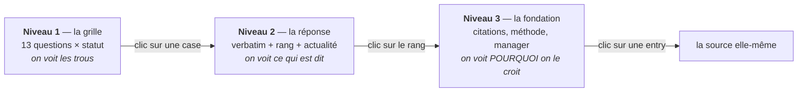

# Écran niveau 3 — le drill-down d'UNE réponse (spec v3 §8.1)

> **Ce document est une MAQUETTE, et c'est un contrat de lecture.** §8.1 exige que « chaque champ du
> contrat §2.4 ait **son pixel** ». Une exigence écrite en prose se vérifie à l'œil, donc se perd :
> chaque zone d'affichage porte ici le **chemin de contrat** qu'elle rend, entre `⟦ ⟧`, et
> `checks/check_framework_contract.py` §9 vérifie la **bijection** avec les feuilles réelles de
> `FrameworkAnswerServie`. Ajouter un champ au contrat sans lui donner un pixel fait rougir un
> assert nommé ; inventer un pixel qui ne correspond à aucun champ aussi.
>
> Le modèle affiché est `FrameworkAnswerServie`, jamais `FrameworkAnswer` : le niveau 3 est un
> **point de lecture**, donc il porte l'axe actualité recalculé. Un écran qui servirait la ligne
> stockée telle quelle afficherait le verdict d'avant le dernier événement matériel.

---

## Les trois niveaux, et ce que chacun a le droit de taire



Un niveau peut **résumer**, jamais **arrondir** : le niveau 1 affiche `approximé`, il n'affiche
jamais le nombre estimé comme s'il était mesuré. C'est le contrôle ④ porté jusqu'à l'écran.

---

## La maquette

```
╔══════════════════════════════════════════════════════════════════════════════════════╗
║  NVDA ⟦ticker_id⟧   ·   Qualité financière ⟦framework_id⟧   ·   qf_1 ⟦question_id⟧    ║
║  « Quelle est la rentabilité du capital employé, et est-elle défendue ? »             ║
║                                                    contrat v3.0.0 ⟦schema_version⟧   ║
╠══════════════════════════════════════════════════════════════════════════════════════╣
║                                                                                      ║
║  ┌─ LA RÉPONSE ─────────────────────────────────────────────────────────────────┐    ║
║  │  ● APPROXIMÉ ⟦statut⟧                              par analyste_1 ⟦analyste⟧  │    ║
║  │                                                                              │    ║
║  │  « ROIC de l'ordre de 12 % sur 2024 » ⟦reponse.verbatim⟧                      │    ║
║  │                                                                              │    ║
║  │      12,4 ⟦reponse.valeur⟧  %  ⟦reponse.unite⟧        élevé ⟦reponse.sens⟧    │    ║
║  │      └─ grisé et suffixé « ~ » tant que le statut est `approximé` :           │    ║
║  │         un nombre estimé ne se compose JAMAIS comme un nombre mesuré          │    ║
║  └──────────────────────────────────────────────────────────────────────────────┘    ║
║                                                                                      ║
║  ┌─ CE QUI LA FONDE ────────────────────────────────────────────────────────────┐    ║
║  │  Rang      B+ ⟦fondation.rang_derive⟧      ← DÉRIVÉ, jamais déclaré           │    ║
║  │  Nature    interprétation ⟦fondation.nature_effective⟧                        │    ║
║  │  Actualité ⚠ PÉRIMÉE ⟦fondation.actualite⟧                                    │    ║
║  │            « 10-K du 2024-02-21, antérieur au 8-K du 2025-03-04 »             │    ║
║  │                                        ⟦fondation.motif_actualite⟧            │    ║
║  │            └─ l'état SANS son motif serait un verdict inattaquable :          │    ║
║  │               on ne peut pas contester ce qui ne dit pas d'où il vient        │    ║
║  │                                                                              │    ║
║  │  Sources   #190  10-K FY2024 · tier A-        ⟦fondation.cited_entry_ids⟧     │    ║
║  │            #191  Presse spécialisée · tier B                                  │    ║
║  │            └─ cliquables : le niveau 3 se termine sur la source, pas sur      │    ║
║  │               une paraphrase de la source                                     │    ║
║  └──────────────────────────────────────────────────────────────────────────────┘    ║
║                                                                                      ║
║  ┌─ L'APPROXIMATION (affiché SI ET SEULEMENT SI statut = `approximé`) ──────────┐    ║
║  │  Méthode      règle de trois sur le CA 2024 ⟦approximation.methode⟧           │    ║
║  │  Ingrédients  #190, #191 ⟦approximation.ingredients_entry_ids⟧                │    ║
║  │  Hypothèses   • mix produit stable sur l'exercice                             │    ║
║  │               ⟦approximation.hypotheses_explicites⟧                           │    ║
║  │  Sensibilité  ±3 pts si le mix bouge de 10 % ⟦approximation.sensibilite⟧      │    ║
║  │  └─ les quatre sont affichés ENSEMBLE ou pas du tout : une méthode sans sa    │    ║
║  │     sensibilité se lit exactement comme une mesure                            │    ║
║  └──────────────────────────────────────────────────────────────────────────────┘    ║
║                                                                                      ║
║  ┌─ HORS SUJET (affiché SI statut = `sans objet`) ──────────────────────────────┐    ║
║  │  Motif       société sans chiffre d'affaires ⟦sans_objet.motif⟧               │    ║
║  │  Substitut   rotation des créances ⟦sans_objet.substitut_applique⟧            │    ║
║  │              → voir la réponse #7 ⟦sans_objet.substitut_answer_id⟧            │    ║
║  │  ou bien     « aucun substitut — c'est LA réponse » ⟦sans_objet.aucun_substitut⟧│  ║
║  │  └─ le hors-sujet s'affiche comme un RÉSULTAT, jamais comme une case vide     │    ║
║  └──────────────────────────────────────────────────────────────────────────────┘    ║
║                                                                                      ║
║  ┌─ LE MANQUE (affiché SI statut = `non fondable`) ─────────────────────────────┐    ║
║  │  Dimension    rentabilite ⟦gap.dimension⟧        Priorité  haute ⟦gap.priorite⟧│   ║
║  │  Manque       marge brute 2024 absente ⟦gap.manque⟧                           │    ║
║  │  Concerne     qf_1 ⟦gap.champs_cibles⟧                                        │    ║
║  │  Couverture   0 entry citable ⟦gap.coverage_actuelle⟧                         │    ║
║  │  Origine      curator ⟦gap.origine⟧                                           │    ║
║  │  Remède       [ COLLECTER ] ⟦gap.remede⟧    ← `rafraîchir` est un AUTRE bouton │    ║
║  │  Pistes       « nvidia 10-K cost of revenue 2024 » ⟦gap.queries_suggerees⟧    │    ║
║  │  └─ les deux remèdes ne partagent pas leur bouton : un champ périmé se        │    ║
║  │     rafraîchit, un champ vide se collecte, et les confondre fait payer une    │    ║
║  │     recherche complète là où une date postérieure suffisait                   │    ║
║  └──────────────────────────────────────────────────────────────────────────────┘    ║
║                                                                                      ║
║  ┌─ LE MANAGER ─────────────────────────────────────────────────────────────────┐    ║
║  │  ① Complétude              ✓ ok    ⟦manager.controles.completude⟧             │    ║
║  │  ② Fondation               ✓ ok    ⟦manager.controles.fondation⟧              │    ║
║  │  ③ Honnêteté de l'approx.  ✗ ko    ⟦manager.controles.honnetete_approximation⟧│    ║
║  │  ④ Non-substitution        ✓ ok    ⟦manager.controles.non_substitution⟧       │    ║
║  │                                                                              │    ║
║  │  Verdict   ⟳ RENVOYÉ ⟦manager.verdict⟧                                        │    ║
║  │  Motif     « sensibilité absente » ⟦manager.motif⟧                            │    ║
║  │  Produit   → mandat de recherche #3 ⟦manager.mandat_de_recherche_id⟧          │    ║
║  │            └─ CLIQUABLE. Un renvoi qui n'ouvrirait rien serait l'Écart B      │    ║
║  │               réinstallé dans l'écran : le lien EST la fermeture de l'écart   │    ║
║  └──────────────────────────────────────────────────────────────────────────────┘    ║
╚══════════════════════════════════════════════════════════════════════════════════════╝
```

---

## Les quatre règles d'affichage qui ne sont pas décoratives

1. **`③ honnêteté` s'affiche « — sans objet », jamais « ✓ ok », sur une réponse qui n'approxime
   pas.** Un ✓ vert sur un contrôle qui n'avait rien à contrôler est un vert vrai sur zéro ligne,
   et c'est la forme la plus rassurante que peut prendre un trou.
2. **Le rang est affiché avec sa dérivation au survol**, jamais nu : `B+ ← un cran sous A-, la plus
   faible des 2 citées`. Un rang nu se lit comme un jugement ; un rang dérivé se conteste.
3. **L'actualité n'a pas de pastille verte silencieuse.** `périmée` et `indéterminable` sont
   affichés en toutes lettres avec leur motif — une panne de flux ne doit jamais se lire
   « rien n'a changé ».
4. **Aucune zone n'affiche de score composite.** Rang, nature et actualité restent trois colonnes.
   Les fondre en une pastille unique ferait exactement ce que le diagnostic reproche à la v2.
