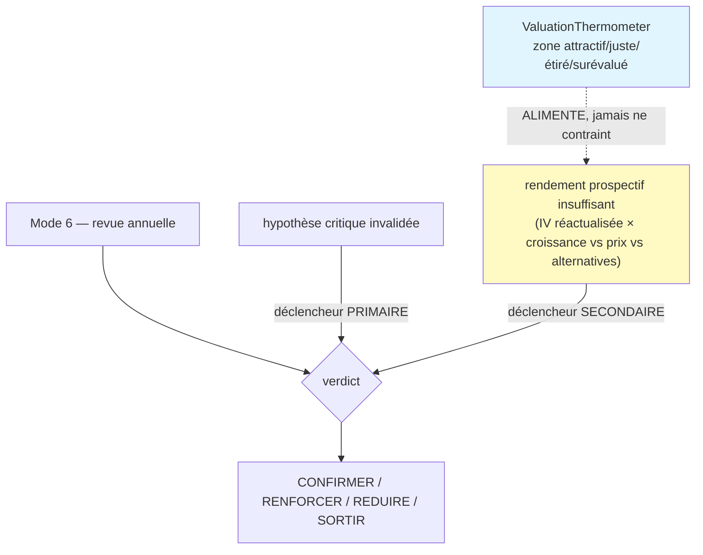

# Carte de provenance — Monitoring mode 6 + valuation thermometer

## Ce qui distingue cette carte

Le mode 6 est **la colonne vertébrale de la revue long terme** (audit §1.3). Là où les modes
trimestriels (1-5) n'escaladent que sur **franchissement de seuil d'invalidation pré-enregistré**
(anti-churn cognitif), le mode 6 relit annuellement thèse + research_memo + entries de l'année et
**produit toujours un verdict** : CONFIRMER / RENFORCER / REDUIRE / SORTIR, réactualise la
`valuation_range`, replanifie +365j.

Deux invariants métier tranchés par la DÉCISION #5 (§11) — c'est ce qui rend cette carte spécifique :

**Le thermomètre ne déclenche jamais seul une vente** (`contraignant=Literal[False]`). Et une sortie
sur valorisation n'est **jamais** un ratio de prix (`Prix > IV×1.15`, l'anti-pattern rejeté par
l'audit) : c'est un arbitrage **rendement prospectif** explicite.

## Twin table — revue (A) & réactualisation/traçabilité (B)

| Champ | nature | grounding | Vérification | Provisioning |
|---|---|---|---|---|
| `verdict` | **judgment** | délégué (hypothèses + rendement) | CONFIRMER/RENFORCER/REDUIRE/SORTIR | l'agent (opus/sonnet) |
| `hypotheses_reviewed[].statut` | **judgment** | refs (A2) | active/alerte/invalidee/confirmee ; pont vers H1-Hn figées | entries de l'année |
| `exit_trigger` | **contrôle** | — | requis si REDUIRE/SORTIR ; interdit si CONFIRMER/RENFORCER | déclencheur §11 |
| `rendement_prospectif` | **judgment** | — | requis+`suffisant=False` si sortie valorisation ; `suffisant=True` si RENFORCER | arbitrage prospectif (anti-seuil) |
| `valuation_range_updated` | **factual** | hérité (valuation) | `low ≤ base ≤ high` | IV réactualisée |
| `thermometer.zone` | **judgment** | reverse_dcf | attractif/juste/étiré/surévalué | contextuel |
| `thermometer.contraignant` | **contrôle** | — | `Literal[False]` — ne vend jamais seul (§11) | invariant structurel |
| `next_review_date` | **contrôle** | — | +365j | replanification annuelle |

## Garde-fous encodés (monitoring_mode6_schema.py — 14/14 vérifiés)

- **Explicabilité de sortie.** REDUIRE/SORTIR ⇒ `exit_trigger` renseigné : aucune sortie muette
  (pendant du NO-GO muet interdit au readiness).
- **Déclencheur primaire §11.** `exit_trigger='hypothese_invalidee'` ⇒ au moins une hypothèse au
  statut `invalidee`. La dégradation de thèse est la voie royale de sortie.
- **Anti-seuil-mécanique (§11, cœur DÉCISION #5).** `exit_trigger='rendement_insuffisant'` ⇒
  `rendement_prospectif` présent avec `suffisant=False`. On sort/réduit sur un arbitrage rendement/
  risque **prospectif** (IV réactualisée × croissance vs prix vs alternatives), **jamais** sur
  `Prix > IV×1.15`. On peut réduire thèse intacte si le rendement prospectif ne compense plus.
- **Thermomètre contextuel.** `contraignant=Literal[False]` : il alimente la réévaluation mais ne
  déclenche jamais seul une vente. On peut être en zone `surevalue` et **CONFIRMER**.
- **RENFORCER justifié.** ⇒ `rendement_prospectif.suffisant=True` (on renforce sur rendement attractif).
- **Réactualisation cohérente.** `valuation_range_updated` : `low ≤ base ≤ high` (héritée de C4).

## Hiérarchie modes (audit §1.3) — pourquoi le mode 6 est à part

Les modes trimestriels (2/4) flaguent RAS/REVIEW_REQUIRED et **n'escaladent que sur franchissement
de seuil d'invalidation pré-enregistré** (les `seuil_invalidation` figés au validate, carte C4). Le
mode 3 (décision review) est une escalade. Le **mode 6 est le seul à produire un verdict de revue de
plein droit** — c'est la revue LT qui empêche la thèse de dériver silencieusement pendant un an.

## Stockage

`monitoring_sessions` (mode=6, migration existante) ; `result_json` = ce contrat ; met à jour
`theses.valuation_range` et les statuts d'hypothèses ; replanifie via `calendar_events` (+365j).
SORTIR/REDUIRE → alimente l'`exit_plan` (carte C6).

## Les 3 points de synchronisation (G1, règle #19)

1. **Prompt monitoring-agent (mode 6)** — schéma de sortie = ce contrat (injection `[mode: 6]`).
2. **Frontend** — Page 5 (revue) : statuts d'hypothèses, `ValuationThermometer` (zone + action
   suggérée non contraignante), verdict + réactualisation IV.
3. **Import / validation** — `monitoring_mode6_schema.py`.

## Ancrage

- Pydantic vérifié (2.13.4, container backend) : `monitoring_mode6_schema.py` — 14 cas
  (explicabilité, déclencheurs §11, anti-seuil-mécanique, thermomètre contextuel, RENFORCER, réactualisation).
- Réutilise `ReverseDcf`/`NonEmptyRefs` (`analysis_v2_schemas.py`) et `ValuationRange` (C4).
- Amont : hypothèses figées au validate (C4). Aval : SORTIR/REDUIRE déclenche l'exit (C6).
