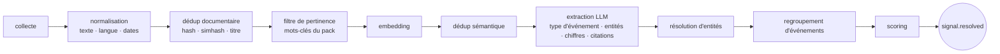

# Spécification fonctionnelle

## 1. Utilisateur et finalité

Un directeur de la stratégie, utilisateur principal, non technique dans l'usage quotidien :
5 à 10 minutes par jour, 30 minutes le vendredi. Des analystes pourront s'ajouter plus tard
(rôles prévus dès le schéma, §2.5).

Ce qu'il attend de l'outil, dans l'ordre :
1. **Ne pas être surpris** : aucune information importante de son marché ne doit lui parvenir
   par un tiers avant d'être passée par l'outil (mesuré par la revue de couverture, §14).
2. **Savoir quand changer d'avis** : ses questions clés et ses scénarios bougent avec les faits,
   et l'outil le lui dit.
3. **Transmettre** : produire en quelques minutes une note citée pour le comité exécutif.

## 2. Objets métier

Tous les objets sont génériques. Les valeurs sectorielles viennent du pack sectoriel (§11).
La colonne « Sensibilité » renvoie aux niveaux de `05-SORTIES-EXTERNES.md` §1.

### 2.1 Référentiel

| Objet | Description | Sensibilité |
|---|---|---|
| `perimeter` | Le périmètre de veille (une unité opérationnelle). Un seul actif en V1, plusieurs possibles | `amber` |
| `entity` | Registre d'identité commun : acteur, offre, programme, texte réglementaire, transaction, personne, et tout **type d'entité déclaré en configuration** (norme, site industriel…) | `green` |
| `actor_relation` | Rôle d'un acteur **relatif au périmètre** (`competitor_of`, `customer_of`…), avec segments et intensité 1-3. Un acteur peut cumuler plusieurs rôles | `amber` |
| `actor_edge` | Relation entre deux acteurs (filiale, partenaire, investisseur), indépendante du périmètre | `green` |
| `entity_milestone` | Date clé d'une entité : clôture d'appel d'offres, entrée en vigueur, closing, lancement. Alimente le calendrier | `green` |
| `taxonomy`, `taxonomy_term` | Toutes les classifications (domaines, types d'événements, segments, technologies, échelles…) | `green` |

Les types d'entités dont le moteur a besoin en SQL (`actor`) ont une table typée ; les autres
portent leurs attributs dans `entity.attributes`, validés par le JSON Schema de leur type
déclaré en configuration. **Ajouter un type d'entité ne demande ni migration ni code.**

### 2.2 Collecte et signaux

| Objet | Description | Sensibilité |
|---|---|---|
| `source` | Une instance de source (gabarit + paramètres), voir `04-SOURCES.md` | `green` |
| `raw_item` | Contenu brut collecté, immuable, horodaté, hashé, avec la réponse structurée d'origine | `green` (sauf note terrain : `red`) |
| `signal` | **Fait daté, atomique, sourcé.** L'unité de valeur du système | hérite de ses sources |
| `evidence` | Lien signal ↔ raw_item, avec la **citation exacte** | idem |
| `signal_link` | Relation entre signaux : `duplicate_of`, `follow_up_of`, `contradicts`, `corroborates` | idem |
| `observation` | **Fait chiffré** : (entité, métrique, valeur, unité, période, evidence). Métriques déclarées dans un catalogue en configuration | `green` |

Chaque signal porte un **type d'événement** (`event_type`, taxonomie : acquisition, levée,
contrat attribué, appel d'offres publié, lancement produit, essai, nomination, texte adopté,
entrée en vigueur, recrutement significatif, fermeture de site…). Chaque type d'événement
déclare en configuration son **schéma d'extraction** (les champs attendus : acquéreur, cible,
montant, date de closing…) et les **rôles** de ses entités (`subject`, `object`, `counterpart`).

### 2.3 Direction de la recherche

| Objet | Description | Sensibilité |
|---|---|---|
| `mandate` | Un mandat de veille. `label` : `amber`. `decision_supported` (la décision qu'il éclaire) : `red` | mixte |
| `key_question` | Question **falsifiable** avec horizon de réponse | `amber` |
| `indicator` | Ce qu'on observerait si la réponse était oui ou non. Porte un sens (`confirms`/`refutes`), un poids, et **une règle de correspondance déclarative** (§6) | `amber` |
| `probe` | Requête de recherche web dérivée d'une question clé, éditable | `amber` |
| `scenario_set` | Une incertitude majeure et 2 à 4 futurs mutuellement exclusifs | énoncés `amber` |
| `scenario` | Un futur plausible, avec ses indicateurs (signes avant-coureurs) | énoncé `amber`, vraisemblance `red` |
| `thesis` | Conviction stratégique de l'utilisateur, éventuellement rattachée à un scénario | `red` |
| `thesis_link` | Rattachement signal ↔ thèse (`supports`, `contradicts`, `neutral`), poids, justification | `red` |
| `forecast` | Une probabilité datée émise sur une question, un scénario ou une thèse ; sert à la calibration | `red` |

### 2.4 Saisies personnelles

| Objet | Description | Sensibilité |
|---|---|---|
| `field_note` | Note terrain reçue par l'alias `terrain@` ou saisie dans l'outil (salon, rendez-vous, rumeur) | `red` |
| `annotation` | Note de l'utilisateur sur n'importe quel objet | `red` |
| `feedback` | Jugement sur un signal : `relevant`, `noise`, `already_known`, `critical` | `amber` |

### 2.5 Diffusion et gouvernance

| Objet | Description |
|---|---|
| `app_user` | Utilisateur, avec un **rôle** : `owner` (voit tout), `analyst` (tout sauf `red`), `reader` (livrables partagés) |
| `digest` | Un brief produit : composition, période, envoi |
| `deliverable` | Un livrable produit à partir d'un gabarit (§12.3) |
| `egress_log` | Journal de tout ce qui a quitté le serveur (`05`) |
| `api_usage` | Coût de chaque appel payant |
| `coverage_review` | Revue a posteriori : événement majeur, détecté ou non, comment il a été appris sinon |

## 3. La géographie : trois rôles

Chaque signal porte jusqu'à trois annotations géographiques, chacune multivaluée :
`actor` (d'où vient celui qui agit), `market` (quel marché est visé), `jurisdiction` (quel cadre
réglementaire s'applique). Ce sont des lignes de `signal_geo` avec une colonne `role`.

- **Indicateur de couverture** : pour chaque zone active, nombre de sources en langue locale et
  part de contenus originaux. Une zone mal couverte est affichée comme telle.
- **Décalage inter-zones** (module radar) : pour chaque couple (type d'événement, segment),
  comparaison de la densité de signaux par zone sur 12 mois glissants ; alerte quand un motif
  est présent dans une zone active et absent d'une autre.

## 4. Taxonomies du noyau

Le moteur **exige la présence** de ces taxonomies, jamais leur contenu. Des valeurs par défaut
génériques sont fournies dans `config-exemple/noyau/taxonomies.yml` ; un pack sectoriel peut les
compléter.

| Taxonomie | Type | Défaut fourni |
|---|---|---|
| `watch_domain` | plate, multi | `DEM` demande et marché · `COMP` concurrence · `CUST` clients · `TECH` technologie · `CAP` capital · `REG` réglementaire · `POL` politique et budgets publics · `SUPP` approvisionnement · `TAL` talents · `PERC` réputation · `WEAK` signaux faibles |
| `event_type` | hiérarchique, simple | liste générique (§2.2), chaque terme avec son schéma d'extraction |
| `horizon` | ordonnée | `done` (0-3 mois) · `ongoing` (3-18 mois) · `early` (18 mois-5 ans) · `structural` (> 5 ans) |
| `watch_angle` | plate, multi | `market` · `innovation` |
| `relation_kind` | plate | `competitor_of`, `customer_of`, `supplier_of`, `investor_in`, `regulator_of`, `partner_of`, `research_partner_of`, `subsidiary_of` |
| `reliability_scale` | échelle double | Admiralty : source A-F, information 1-6 |
| `maturity_scale` | échelle | à fournir par le pack (ex. TRL 1-9 pour un secteur industriel) |
| `market_segment`, `tech_domain` | hiérarchiques | fournies par le pack |
| `metric` | plate | catalogue des métriques d'observation (unité, périodicité), fourni par le pack |

## 5. Classification : allégée au départ, enrichie par fonctions

Au démarrage (lot 1), un signal porte : **domaine principal**, **type d'événement**, **entités
résolues**, **zones géographiques**. Les autres annotations (angle, horizon, segments,
technologies, domaines secondaires) sont des **fonctions du module `signaux`** qu'on active
quand un écran les exploite réellement. Chaque annotation activée augmente le coût d'extraction :
l'écran des modules l'affiche.

## 6. Indicateurs déclaratifs

Un indicateur est rapproché des signaux de deux façons, dans cet ordre :

1. **Règle déclarative** (gratuite, déterministe), quand l'indicateur est structurable :

   ```yaml
   statement: "Acquisition d'un fournisseur du segment SEG-XX par un client du périmètre"
   match:
     event_type: acquisition
     subject: {relation: customer_of}      # l'acquéreur est client du périmètre
     object:  {segments: [SEG-XX]}         # la cible opère dans ce segment
   direction: confirms
   weight: 3
   ```

2. **Question vérifiable au LLM** (segmentée, `05` §3), sinon : l'indicateur est reformulé en
   question fermée (« ce texte annonce-t-il la mise en service d'une nouvelle usine par un acteur du segment SEG-XX ? ») et posée sur les signaux candidats présélectionnés par similarité d'embedding.

Un indicateur observé incrémente son compteur, s'affiche sur la question clé, le scénario ou la
thèse qui le porte, et peut déclencher une alerte.

## 7. Chaîne de traitement (module socle `signaux`)



1. **Collecte** : le connecteur écrit un `raw_item` (hash, charge utile d'origine).
2. **Normalisation** : texte principal, langue, traduction si nécessaire, **date de l'événement
   distincte de la date de publication**, avec sa précision (jour, mois, trimestre, inconnue).
3. **Déduplication documentaire** : hash exact, simhash, similarité de titre. Un doublon devient
   une `evidence` supplémentaire, jamais un nouveau signal. **Avant tout appel payant.**
4. **Filtre de pertinence** : mots-clés et alias dérivés du pack et du référentiel. Écarté =
   `discarded` avec motif, jamais supprimé.
5. **Embedding** puis **déduplication sémantique** au-delà d'un seuil configurable.
6. **Extraction** : type d'événement, champs de son schéma d'extraction, entités avec rôles,
   faits chiffrés (→ `observation`), citations exactes (→ `evidence`).
7. **Résolution d'entités** : rattachement au registre ; inconnue → candidate en file de
   validation, jamais créée silencieusement.
8. **Regroupement d'événements** : deux signaux de même type d'événement, mêmes entités
   principales et dates proches sont le même événement → fusion en `corroborates` ou
   `duplicate_of`. C'est ici que la corroboration devient fiable.
9. **Scoring** (§8), puis publication de l'événement `signal.resolved` sur le bus.

Les modules métier réagissent ensuite à `signal.resolved` (rapprochement aux indicateurs,
calendrier, fiches, radar…) sans que la chaîne les connaisse.

Les notes terrain (`red`) suivent une chaîne réduite : normalisation, résolution d'entités par
dictionnaire, rattachement manuel. Ni embedding externe ni LLM.

## 8. Scoring : importance et crédibilité

Deux scores sur 100, stockés séparément avec leur décomposition, affichés au survol.

```
crédibilité = 100 × confiance_extraction × renorm( 0.55 × fiabilité_source
                                                 + 0.45 × corroboration )
importance  = 100 × renorm( 0.35 × impact_périmètre
                          + 0.25 × proximité_questions
                          + 0.25 × nouveauté
                          + 0.15 × actionnabilité )
```

- `renorm` : une composante dont les prérequis ne sont pas réunis est neutralisée et son poids
  redistribué sur les composantes actives. La liste des composantes neutralisées est stockée et
  affichée. Sans cela, le système paraît cassé au démarrage.
- Pondérations par défaut dans le noyau, surchargeables par domaine dans le pack.
- `fiabilité_source` dérive de l'échelle de fiabilité de la source ; `corroboration` compte des
  sources **indépendantes** (groupe d'indépendance éditoriale, §2 de `04`) ; `nouveauté` est la
  distance sémantique aux signaux des 90 derniers jours ; `impact_périmètre` est évalué par le
  LLM à partir des segments et technologies du pack (`green`) et de l'intensité des relations
  (utilisée côté serveur, jamais envoyée).
- **Matrice du brief** : « à savoir absolument » exige importance ≥ seuil **et** crédibilité ≥
  seuil ; « important mais non confirmé » a sa zone propre (ex-quarantaine des rumeurs).
- Le `feedback` ajuste les pondérations par domaine avec une forte inertie.

## 9. Qualification des sources

Échelle de fiabilité paramétrable (Admiralty par défaut). Statuts : `pending`, `trial` (60 jours,
zone secondaire du brief, taux de pertinence mesuré, rétrogradation automatique sous un seuil),
`accepted`, `rejected`, `suspended`. Une source découverte (domaine récurrent dans les
recherches ou newsletters) reçoit une fiche automatique : affiliation, indépendance apparente,
fréquence, part de contenu original, extraits représentatifs. L'utilisateur tranche.

## 10. Modules métier et leurs fonctions

Chaque module est activable ; chaque fonction a un statut (`active`, `waiting` avec ce qui lui
manque, `planned`). Cette liste est le **contenu initial** des manifestes ; elle s'enrichit sans
réviser la spec (règle d'or 9).

| Module | Fonctions initiales (lot) |
|---|---|
| `collecte` *(socle)* | familles de connecteurs (0.5-1) · aperçu avant activation (1) · santé des sources et détection de dérive de format (1) · sources dérivées du référentiel (3) |
| `signaux` *(socle)* | chaîne §7 (0.5-1) · double score (1) · annotations optionnelles §5 (1+) · corroboration et détection de reprise (1) |
| `diffusion` *(socle)* | brief quotidien (1) · alertes Slack (1) · revue du vendredi (2) |
| `connaissance` | fiches acteur, technologie, segment générées depuis la base (3) · sections « Lecture » et « Ce qui changerait notre lecture » rédigées par LLM (3) · recherche plein texte et sémantique (3) · instantané hebdomadaire exportable (enveloppe document du dépôt) (3) |
| `observations` | extraction des faits chiffrés (1) · séries et comparaisons sur les fiches (3) |
| `questions_cles` | mandats, questions, indicateurs (2) · assistant qui refuse les questions non falsifiables (2) · indicateurs déclaratifs et questions vérifiables (2) · sondes Exa (2) · réponse courante et confiance (2) · revue de portefeuille des questions (2) |
| `scenarios` | jeux de scénarios et signes avant-coureurs (4) · vraisemblance historisée (4) |
| `theses` | board de thèses (4) · rattachement par les indicateurs, validé par l'utilisateur (4) · « convictions qui ont bougé » dans l'interface (4) |
| `calibration` | enregistrement des probabilités datées (4) · score de Brier à l'échéance (4) |
| `terrain` | réception des notes `terrain@` (1) · saisie rapide dans l'outil (2) · rattachement manuel aux entités et questions (2) |
| `concurrence` | fiches concurrents (3) · pages produits et carrières suivies (3) |
| `commande_publique` | avis de marché dans le périmètre (1) · calendrier des clôtures (3) · attributions aux concurrents suivis (3) |
| `reglementaire` | textes suivis et entrées en vigueur (3) |
| `technologie` | publications scientifiques (1) · brevets (3) · dérive lexicale (5) |
| `capital` | levées, acquisitions, cessions (3) |
| `calendrier` | calendrier rétrospectif (heatmap) et prospectif (échéances externes via `entity_milestone`) (3) |
| `livrables` | note d'une page sur une question clé (2) · dossier concurrent (3) · point de situation (3) · revue trimestrielle des scénarios (4) |
| `radar` | orphelins et clusters (5) · burst (5) · décalage inter-zones (5) · agent Scout (5) · angle mort de la semaine (5) |

## 11. Pack sectoriel et changement de secteur

**Un pack sectoriel** regroupe tout ce qui est propre à un secteur, et rien d'autre :
périmètre, zones actives et leur dynamique, segments, technologies (avec alias), types
d'événements additionnels, catalogue de métriques, échelle de maturité, acteurs de départ et
leurs relations, mandats et questions de départ, gabarits de sources spécifiques, instances de
sources, surcharges de pondération. Le pack de référence est `config-exemple/packs/spatial/`.

**Objectif : une nouvelle instance sectorielle opérationnelle en moins d'une journée.**

1. *Assistant de pack* : l'utilisateur décrit le secteur en quelques lignes ; le LLM (données
   `green` uniquement : description publique du secteur) propose segments, technologies,
   alias, types d'événements, métriques, acteurs publics majeurs et sources candidates. Tout est
   **proposé**, rien n'est activé sans validation.
2. Édition dans l'interface (mêmes écrans que la configuration courante).
3. Import/export du pack complet en YAML (partage, sauvegarde, revue).
4. `check_agnosticite.py` vérifie qu'aucun terme d'**aucun** pack présent n'apparaît dans le code.
5. Critère de preuve (lot 3) : instancier un second pack minimal d'un autre secteur (ex. santé)
   sur une base vide, sans modifier une ligne de code, et obtenir un brief.

## 12. Écrans

Priorité entre crochets.

### 12.1 [P1] Brief « Depuis votre dernière visite »
Page d'accueil, calculée **depuis la base** (`last_seen_at` vs `signal.first_seen_at`).
1. **À savoir absolument** : 0 à 5 cartes. Si vide : « rien de majeur », ce qui est une information.
2. **Important mais non confirmé** : 0 à 3 cartes.
3. Blocs par domaine, repliés au-delà de 3 cartes.
4. **Questions et scénarios qui ont bougé** (dès le lot 2).
5. **Angle mort de la semaine** (radar, quand actif).
6. **Convictions qui ont bougé** (`red`, interface seulement, jamais dans un courriel).

Carte : titre factuel neutre · date de l'événement · type d'événement · « so what » en une
phrase · scores importance/crédibilité avec détail · sources et niveau de corroboration ·
entités cliquables · actions (épingler, non pertinent, déjà su, critique, créer une question
clé, rattacher à une thèse, ajouter une annotation). Le brief est **plafonné** : mieux vaut 5
cartes utiles que 40.

### 12.2 [P1] Fiche signal
Toutes les evidences avec citations, chronologie des mises à jour, signaux liés, observations.

### 12.3 [P1] Modules et fonctions
Pour chaque module : fonctions actives, en attente (et ce qui leur manque, en clair),
planifiées ; coût estimé par fonction ; interrupteurs d'activation. Remplace l'écran
« maturité du système » de la v1.

### 12.4 [P1] Administration
Sources (liste, ajout guidé, aperçu, santé, qualification) · référentiel et file de validation
des entités · taxonomies · pack sectoriel (import/export, assistant) · **sorties externes**
(journal, revue, gabarits de prompts à valider — `05`) · **coûts** (mois en cours, projection,
plafond, mode `observe`/`enforce`) · coffre de secrets · utilisateurs et rôles.

### 12.5 [P2] Questions clés et scénarios
Portefeuille des questions (alimentation, coût, péremption, réponse courante), fiche question
(indicateurs observés, signaux rattachés, historique de confiance), jeux de scénarios avec
vraisemblance historisée.

### 12.6 [P2] Fiches entité, vues métier, calendrier
Fiches générées (acteur, technologie, segment, programme) · vues par domaine filtrables par
zone · calendrier rétrospectif et prospectif.

### 12.7 [P3] Board de thèses, calibration
Zone `red` : thèses, courbe de confiance, signaux confirmants/infirmants, indicateurs qui les
trancheraient ; calibration de l'utilisateur.

### 12.8 [P3] Radar, recherche conversationnelle
Recherche conversationnelle : réponses citées ; une question qui mobilise une donnée `red` est
refusée côté LLM et traitée par recherche plein texte uniquement.

## 13. Diffusion

- **Brief quotidien par courriel** via `comms-gateway`, heure configurable. Contenu `green`
  uniquement : cartes, so-what, liens. Les blocs `amber` et `red` sont remplacés par un
  décompte et un lien (« 2 questions clés ont bougé — voir »).
- **Alertes immédiates sur Slack** via `comms-gateway` : signal au-dessus du seuil d'un mandat,
  plafonnées à 3 par jour. Contenu `green` + lien.
- **Revue du vendredi** (dans l'interface, annoncée par courriel) : sources en attente, questions
  en stagnation, radar, **revue des sorties externes de la semaine** (`05` §5).
- **Livrables** : générés à la demande, exportés en PDF ou Markdown. Le gabarit filtre les
  contenus selon le rôle du destinataire (un livrable pour `reader` n'inclut jamais de `red`).

## 14. Métriques de pilotage

Calculées mensuellement, affichées dans l'administration : taux de pertinence (cartes non
marquées « bruit ») · **taux de couverture** (événements majeurs détectés / événements majeurs
réels, via `coverage_review`) · délai de détection médian · questions clés résolues · coût par
signal qualifié · part de chaque zone · dépendance maximale à une source par domaine · part des
sources ajoutées sans code · calibration de l'utilisateur (quand active).
