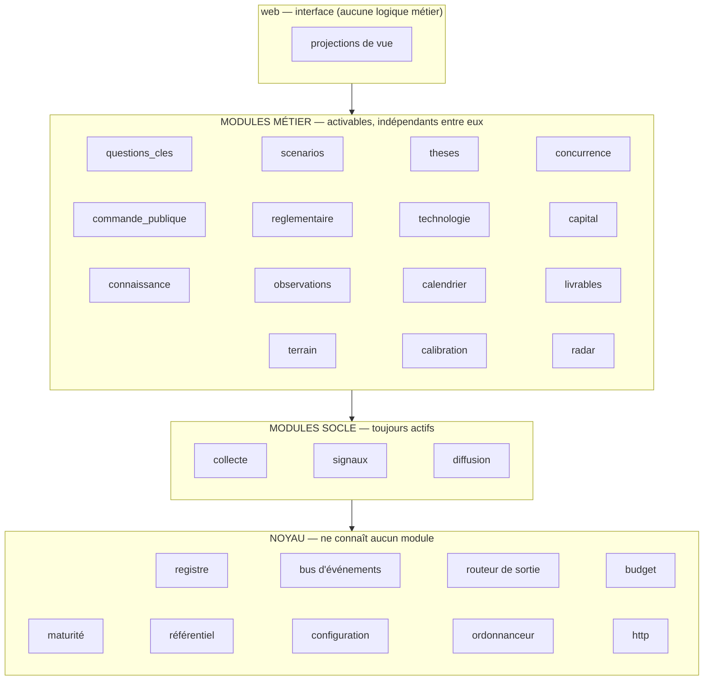

# Architecture

Ce fichier décrit l'architecture **cible**. Au lot 0, sa partie « registre » est recopiée dans
`ARCHITECTURE.md` à la racine du projet (modèle : `modeles/ARCHITECTURE.md`), qui devient le
document vivant. L'architecture **réalisée** n'est jamais décrite en prose : elle est prouvée
par les checks (§10).

## 1. Vue d'ensemble

*Analogie* : un ERP. Un socle commun (utilisateurs, base, sécurité, facturation des appels
payants), des modules qu'on active (Comptabilité, Stocks, Achats), et chaque module s'enrichit
de fonctions au fil des versions sans toucher aux autres.



## 2. Invariants d'architecture

| # | Invariant | Garant (§10) |
|---|---|---|
| I1 | Aucune valeur sectorielle dans le code | `check_agnosticite.py` |
| I2 | Toute sortie de données passe par `noyau.sorties` ; toute requête HTTP de collecte passe par `noyau.http` | `check_sorties.py` |
| I3 | Aucune donnée `red` dans une sortie ; aucune donnée `amber` non segmentée | `check_sensibilite.py` |
| I4 | Toute affirmation générée est rattachée à une `evidence` | `check_evidence.py` |
| I5 | Le brut est immuable ; tout traitement est rejouable depuis le brut | `check_brut_immuable.py` |
| I6 | Chaque fonction déclare ses prérequis ; aucune ne produit de résultat dégradé en silence | `check_manifestes.py` |
| I7 | Sens des dépendances : noyau ← socle ← métier ← web ; aucun import entre modules métier | `check_dependances.py` |
| I8 | Chaque module a un manifeste, un `ARCHITECTURE.md`, et figure au registre | `check_architecture.py` |
| I9 | Chaque table appartient à un module déclaré | `check_schema.py` |
| I10 | Toute étape payante est précédée d'un filtre gratuit | `check_manifestes.py` (ordre et coût déclarés de la chaîne) |

## 3. Couches et règles de dépendance

| Niveau | Contient | Peut importer | Communique avec les autres par |
|---|---|---|---|
| `noyau` | registre, bus, routeur de sortie, budget, maturité, référentiel, configuration, ordonnanceur, client HTTP, types | rien au-dessus | — |
| socle | `collecte`, `signaux`, `diffusion` | `noyau` | bus + tables socle |
| métier | un dossier par module | `noyau`, socle | bus + **exports** déclarés des autres modules (vues SQL en lecture seule) |
| `web` | routes, gabarits, projections | tout, en lecture ; écritures via les services des modules | — |

Un module métier ne lit jamais les tables d'un autre module métier : il lit ses **exports**
(vues déclarées dans son manifeste). C'est ce qui permet de désactiver ou refondre un module
sans casser les autres.

## 4. Le module et son manifeste

```
modules/<id>/
├── module.yml            # manifeste — détenteur unique de la déclaration du module
├── ARCHITECTURE.md       # cible du module → checks garants
├── functions/            # une fonction = un fichier (ou zéro si 100 % déclarative)
├── source_templates/     # gabarits de sources fournis par le module
├── extraction/           # schémas d'extraction (types d'événements)
├── deliverables/         # gabarits de livrables
├── views/                # projections d'écran
├── migrations/           # tables du module (chacune déclarée dans `tables` du manifeste)
└── tests/
```

```yaml
# modules/commande_publique/module.yml
id: commande_publique
label: "Commande publique"
level: metier                          # socle | metier
version: 1.0.0
sensitivity_max: green                 # plus haut niveau de donnée manipulée
tables: [commande_publique_award]
exports:                               # seules vues lisibles par d'autres modules
  - commande_publique_v_awards_by_actor
provides:
  taxonomy_terms:
    event_type: [tender_published, contract_awarded, tender_cancelled]
  source_templates: [ted_v3, boamp]
  entity_kinds: [program]
  digest_sections: [appels_offres_a_cloture]
  views: [calendrier_clotures, attributions_concurrents]
settings:                              # paramètres éditables dans l'interface
  closing_horizon_days: {type: int, default: 60}

functions:
  - id: avis_perimetre
    label: "Détecter les avis de marché dans le périmètre"
    status: active
    subscribes: [raw_item.collected]
    requires: {sources_of_template: {any: [ted_v3, boamp], min: 1}}
    cost: free

  - id: attributions_concurrents
    label: "Qui gagne quoi : attributions aux concurrents suivis"
    status: active
    subscribes: [signal.resolved]
    requires:
      actors_with_relation: {kind: competitor_of, min: 3}
    produces: [observation]
    cost: {llm_per_item_eur: 0.002}

  - id: profil_acheteurs
    label: "Profil des acheteurs publics"
    status: planned
    requires: {history_days: 180}
```

### 4.1 Vocabulaire des prérequis (`requires`)

Fermé et évalué par `noyau.maturite`. L'étendre est une évolution du noyau.

| Clé | Sens |
|---|---|
| `sources_active: {min}` | nombre de sources actives |
| `sources_of_template: {any, min}` | sources instanciées depuis certains gabarits |
| `independent_sources: {min}` | groupes d'indépendance éditoriale distincts |
| `signals: {min, event_type?, domain?}` | volume de signaux |
| `history_days: n` | ancienneté de l'historique |
| `zones_with_signals: {min_zones, min_signals}` | zones réellement alimentées |
| `actors_with_relation: {kind, min}` | référentiel amorcé |
| `key_questions_active: {min}` | questions clés actives |
| `function: <module>.<id>` | autre fonction active (même module ou socle) |
| `module: <id>` | module actif |
| `setting: <clé>` | paramètre renseigné (ex. clé API dans le coffre) |

### 4.2 Cycle de vie d'une fonction

`planned` (déclarée, pas codée) → `waiting` (codée, prérequis non réunis, ce qui manque est
affiché) → `active` → `disabled` (coupée par l'utilisateur). Le passage `waiting` → `active`
est automatique, évalué chaque nuit et à chaque changement de configuration.

### 4.3 Drapeaux de capacité

Remplacent les profils `frugal`/`standard` de la v1 : chaque module et chaque fonction ont un
interrupteur dans l'interface ; certains réglages (modèle LLM par usage, nombre de requêtes de
recherche par mois) sont des `settings` du noyau ou du module.

## 5. Bus d'événements

Table `event_outbox` (Postgres), consommée par les abonnés en `SKIP LOCKED`. Chaque événement a
un type, une charge utile minimale (identifiants, jamais de texte `red`), un horodatage, une clé
d'idempotence. Chaque abonné enregistre sa consommation (`event_consumption`) : rejouer un
événement pour un abonné est une opération normale.

Catalogue initial (le noyau le détient ; un module peut **déclarer** de nouveaux types dans son
manifeste) :

| Événement | Émis par | Exemple d'abonnés |
|---|---|---|
| `raw_item.collected` | collecte | signaux, commande_publique |
| `raw_item.discarded` | signaux | radar (orphelins) |
| `signal.resolved` | signaux | questions_cles, theses, concurrence, calendrier, connaissance |
| `signal.updated` | signaux | connaissance, diffusion |
| `observation.created` | signaux, modules | observations, connaissance |
| `entity.candidate` | signaux | interface (file de validation) |
| `indicator.observed` | questions_cles | scenarios, theses, diffusion |
| `key_question.moved` | questions_cles | diffusion, livrables |
| `scenario.moved` | scenarios | diffusion |
| `field_note.received` | terrain | theses (rattachement manuel proposé) |
| `source.degraded` | collecte | diffusion (alerte) |
| `capability.changed` | noyau.maturite | diffusion, interface |

## 6. Points d'extension

Chaque implémentation s'enregistre par décorateur auprès de `noyau.registre`, avec un nom
stable, ses prérequis, son coût estimé et son idempotence. Un module les fournit ; le noyau les
découvre.

| # | Point d'extension | Pour ajouter | En code ? |
|---|---|---|---|
| E1 | `ConnectorFamily` | une famille technique de collecte (`http_json`, `http_xml`…) | oui, rare |
| E2 | `SourceTemplate` | une API ou un type de site | **non**, YAML |
| E3 | `Transform` | une transformation nommée réutilisable dans un mappage | oui, petite fonction |
| E4 | `LLMProvider` / `EmbeddingProvider` / `SearchProvider` | un fournisseur externe | oui |
| E5 | `Channel` | un canal de diffusion (courriel, Slack…) | oui |
| E6 | `PipelineStage` | une étape de la chaîne socle | oui, rare |
| E7 | `ScoreComponent` | un critère de score | oui |
| E8 | `ExtractionSchema` | un type d'événement et ses champs | **non**, JSON Schema |
| E9 | `EntityKind` | un type d'entité | **non**, JSON Schema |
| E10 | `Function` (abonné d'événements ou tâche planifiée) | une fonction métier | oui, dans un seul module |
| E11 | `ViewProjection` | un écran | oui, dans un seul module |
| E12 | `DeliverableTemplate` | un livrable | **non** si gabarit seul, oui si calcul spécifique |
| E13 | `RadarDetector` | un détecteur de signal faible | oui, dans `radar` |

## 7. Chaîne socle

La chaîne de `01` §7 est un registre ordonné d'étapes (`PipelineStage`), déclaré dans le
manifeste de `signaux`, chaque étape avec `cost` et `idempotent: true`. Le check vérifie que
l'ordre respecte « gratuit avant payant » (I10). Une étape peut être propre à un
`content_type` (`applies_to`), ce qui permet un traitement différent pour un avis de marché,
une publication scientifique ou une newsletter sans dupliquer la chaîne.

## 8. Configuration

- **La base fait foi.** Tables de configuration (`config_*`, taxonomies, sources, gabarits,
  réglages de modules), éditées dans l'interface.
- **Un seul schéma de validation** (Pydantic) sert l'interface, l'import YAML et l'amorçage.
- **Versionnée** : chaque modification produit une ligne `config_change` ; `config_version` est
  l'identifiant du dernier changement, porté par chaque signal.
- **Import/export YAML** : noyau générique, pack sectoriel, ou configuration complète.
- **Amorçage** d'une base vide : noyau générique (`config-exemple/noyau/`) + pack actif.

## 9. Infrastructure et déploiement

| Brique | Choix |
|---|---|
| Hébergement | VPS existant, agrandi à ≥ 8 Go de RAM avant le lot 1 (D16) |
| Conteneurs | une image Python, trois processus : `web` (FastAPI), `worker` (abonnés + chaîne), `scheduler` (collecte planifiée, tâches périodiques). `docker compose` via `infrastructure/compose-deploy.sh` |
| Proxy | Traefik existant (labels ; `traefik.docker.network` si plusieurs réseaux) |
| Base | `shared-postgres`, base dédiée `db_strategic`, extensions `vector`, `pg_trgm`, `unaccent` |
| File et planification | Postgres (`SKIP LOCKED` ou `procrastinate`) |
| LLM et embeddings | DeepInfra (API compatible OpenAI) ; embeddings `BAAI/bge-m3`, 1024 dimensions |
| Recherche web | Exa |
| Courriel, Slack | `comms-gateway` (client dédié, quotas propres) |
| Entrées courriel | `newsletter-summary`, alias `veille@` et `terrain@` (`07`) |
| Détection de changement de page | famille `html_diff` interne (hash de la zone sélectionnée) ; `changedetection.io` non retenu au départ (RAM du VPS) |
| Interface | FastAPI + Jinja2 + HTMX + Tailwind (CSS précompilé) |
| Authentification | mot de passe + TOTP |
| Sauvegarde | `db_strategic` intégrée au dispositif de sauvegarde du VPS (à vérifier au lot 0, sinon `pg_dump` chiffré quotidien vers stockage objet) |
| Journaux | JSON structurés, identifiant de corrélation par contenu de bout en bout |

Organisation du projet :

```
projects/strategic-intelligence/
├── ARCHITECTURE.md          # registre cible (depuis modeles/), point d'entrée
├── 00-REPRISE.md            # état, prochain jalon, dettes, commandes de reprise
├── DECISIONS.md · PROPOSITIONS.md
├── docker-compose.yml · Dockerfile · .env (secret maître, gitignoré)
├── spec-v2/
├── prive/                   # gitignoré : données sensibles (import de mandats, archives)
├── config-exemple/          # noyau générique + packs
├── app/
│   ├── noyau/               # registre, bus, sorties, budget, maturite, referentiel, config, http, types
│   ├── modules/<id>/        # socle et métier, même structure
│   └── web/
├── migrations/              # migrations du noyau ; celles des modules vivent dans leur dossier
├── checks/                  # invariants d'architecture et de fonctionnement (§10)
└── tests/                   # tests unitaires (pytest)
```

## 10. Suivi d'architecture

### 10.1 Évaluation : faut-il reprendre le dispositif de portfolio-tracker ?

**Oui, dès le lot 0, adapté.** Trois raisons propres à ce projet :

1. **La promesse centrale est structurelle.** « Ajouter une source sans code », « ajouter une
   fonction dans un seul module », « aucun terme sectoriel dans le code », « rien de `red` ne
   sort » : ce sont des propriétés d'architecture, pas des fonctionnalités. Sans contrôle
   automatique, elles s'érodent sans qu'aucun test fonctionnel ne rougisse.
2. **Le développement sera fait par des sessions d'agent successives.** La v1 le reconnaissait
   (capsules, `arch-check`), mais décrivait le « réalisé » en prose dans une colonne de tableau.
   portfolio-tracker a montré que ce réalisé-là dérive : ce qui fait foi, c'est un check qui
   s'exécute.
3. **Les manifestes rendent le contrôle bon marché.** Ici les modules se déclarent dans un
   fichier lisible par machine ; le check compare manifeste, code et registre, sans heuristique.

**Ce qu'on reprend de portfolio-tracker** : un registre cible (`ARCHITECTURE.md`) détenteur
unique de la liste des modules ; un `ARCHITECTURE.md` par module qui mappe *invariant cible →
check garant* et marque ⚠️ les invariants non gardés ; `check_architecture.py` (bijection
registre ↔ modules, pointeurs de checks vivants, aucune garde orpheline) ; le harnais
anti-faux-verts (`_harness.py` : `strip_code`, `imports_symbol`, `Bilan.require`) recopié tel
quel ; un test négatif par check (`negatif_*.sh`, une mutation par invariant, rougissant sur son
assert nommé) ; `run_all.sh` dont le bilan se lit par sa forme ; le hook pré-commit qui exécute
`check_architecture.py` sur l'hôte, sans base.

**Ce qu'on adapte** : les manifestes deviennent une source de vérité supplémentaire contrôlée ;
les invariants de sensibilité exigent une base (check avec base, comme `avec_base.sh`) ; on
démarre avec **6 checks** au lot 0 plutôt qu'une batterie — un check par invariant réellement
présent, les autres marqués ⚠️ dette.

**Ce qu'on évite** : la prose de reprise qui gonfle (règle du dépôt : le récit va dans
`00-REPRISE-ARCHIVE.md`) ; les checks qui dépendent d'un tiers vivant sans distinguer « vert »
de « exercé ».

**Coût** : environ 1 à 1,5 jour au lot 0, puis ~15 % du temps de chaque ticket. C'est le prix de
la promesse « ajouter sans casser ».

### 10.2 Les checks d'architecture

| Check | Tient | Base requise |
|---|---|---|
| `check_architecture.py` | bijection registre `ARCHITECTURE.md` ↔ dossiers `app/modules/*` ↔ `module.yml` ↔ `ARCHITECTURE.md` de module ; tout check cité existe ; tout check est cité | non |
| `check_manifestes.py` | manifestes valides (schéma) ; bijection fonctions déclarées `active`/`waiting` ↔ fonctions enregistrées dans le code (analyse AST des décorateurs) ; vocabulaire `requires` fermé ; événements abonnés présents au catalogue ; chaîne socle ordonnée gratuit → payant | non |
| `check_dependances.py` | graphe d'imports (AST) : aucun import noyau → module, socle → métier, métier → métier ; `web` n'exécute pas de SQL | non |
| `check_sorties.py` | aucun import de client HTTP, SDK LLM, SMTP hors `noyau.sorties` et `noyau.http` (AST, sur le code dépouillé de sa prose) | non |
| `check_agnosticite.py` | aucun terme d'aucun pack (`label`, alias, codes d'acteurs, domaines de sources) dans `app/` | non |
| `check_schema.py` | chaque table de la base appartient au noyau ou figure dans `tables` d'un manifeste ; chaque table a une migration | oui |
| `check_sensibilite.py` | routeur de sortie : refus d'un `red`, refus d'un `amber` non segmenté, une ligne `egress_log` par sortie, filtrage des courriels | oui |
| `check_evidence.py` | aucune carte de brief, section de fiche ou livrable sans evidence | oui |
| `check_brut_immuable.py` | aucun `UPDATE`/`DELETE` sur `raw_item` hors colonnes de statut ; rejeu fantôme stable | oui |

Les 5 premiers sont livrés au lot 0 avec leur test négatif ; `check_sensibilite.py` aussi, car il
garde la promesse faite à l'utilisateur. Les autres arrivent avec le code qu'ils gardent.

### 10.3 Les `ARCHITECTURE.md` de module

Une page maximum, structure fixe :

```markdown
# <id>
> Cible : spec-v2/01 §10 et le manifeste. Réalisé : prouvé par les checks ci-dessous.
## Rôle            (3 lignes)
## Contrat         (événements consommés et émis, exports, tables)
## Ajouter une fonction à ce module   (la recette propre au module)
## Cible → garde   (invariant | check garant ; ⚠️ si aucun)
## Pièges          (ce qui a déjà cassé)
```

## 11. Recettes d'évolution

**Ajouter une source** : interface → gabarit existant → paramètres → aperçu → qualification →
essai. Si aucun gabarit ne convient : écrire un gabarit YAML (`04` §3). Si une transformation
manque : une fonction `Transform` + un test sur un échantillon figé copié du réel.

**Ajouter une fonction** : entrée `planned` dans le manifeste → code dans `functions/` avec son
décorateur → prérequis déclarés → check du module → passage à `active`. Aucun autre module touché.

**Ajouter un module** : dossier, manifeste, `ARCHITECTURE.md`, ligne au registre. Le check refuse
l'un sans les autres.

**Ajouter un type d'événement ou d'entité** : terme de taxonomie + JSON Schema, dans l'interface
ou le pack. Aucun code.

**Ajouter un secteur** : `01` §11.
