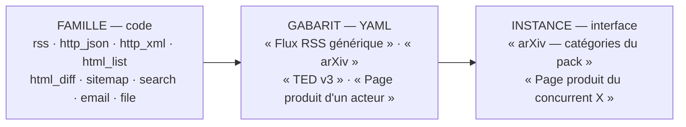
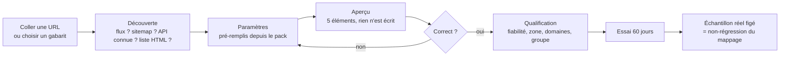

# Sources

Détenteur unique de tout ce qui concerne l'ajout, la description, la collecte et la
qualification des sources.

## 1. Principes

1. **La base fait foi, l'interface l'édite.** Le YAML ne sert qu'à l'import/export (packs,
   sauvegarde, revue). Aucun redémarrage n'est nécessaire pour ajouter ou modifier une source.
2. **Trois niveaux** : la *famille* (code, rare), le *gabarit* (YAML, une par API ou type de
   site), l'*instance* (paramètres métier saisis dans l'interface).
3. **Aucune source n'est active sans aperçu** : on voit les éléments qu'elle produirait avant de
   l'activer.
4. **Objectif mesuré** : 80 % des sources ajoutées après le lot 0.5 le sont sans commit dans
   `app/`. Mesure : `source.created_at` comparé aux commits touchant `app/` ; affiché dans les
   métriques de pilotage.



*Analogie* : une famille est un type de prise électrique, un gabarit est l'adaptateur pour un
appareil donné, une instance est l'appareil branché avec ses réglages.

## 2. L'instance de source

Ce que l'utilisateur renseigne (ou accepte tel que proposé) :

| Champ | Rôle |
|---|---|
| gabarit | le gabarit utilisé |
| paramètres | ceux que le gabarit déclare (mots-clés, URL, catégories, pays…), avec valeurs par défaut tirées du pack |
| libellé | nom lisible |
| entité liée | pour une source dérivée d'un acteur (§6) |
| langue, zone | alimentent l'indicateur de couverture |
| domaines | domaines de veille probables |
| primaire | brevet, avis officiel, texte réglementaire, communiqué de l'acteur concerné |
| groupe d'indépendance | deux sources du même groupe (même rédaction, même agence) ne se corroborent pas |
| sensibilité par défaut | `green` sauf `terrain@` (`red`) |
| fréquence | expression cron ; vide pour une source poussée (courriel, fichier) |
| fiabilité | code de l'échelle (Admiralty par défaut, ex. `B2`) |
| statut | `pending` → `trial` (60 jours) → `accepted` / `rejected` / `suspended` |

## 3. Le contrat de gabarit

Un gabarit est un document YAML validé par un JSON Schema unique (`noyau`). Le bloc ci-dessous est une **notation de référence** (les `a|b` listent les valeurs possibles), pas un exemple chargeable. Tous les champs
sauf `family`, `request` (ou équivalent de la famille) et `mapping` sont optionnels.

```yaml
template: <code>                 # stable
version: 1
family: http_json                # rss|http_json|http_xml|html_list|html_diff|sitemap|search|email|file
label: "…"
provided_by: <module_id>|pack:<code>|user
content_type: <terme content_type>          # article|tender|patent|preprint|regulation|press_release|newsletter|product_page|...
extraction_schema: <code>                   # schéma d'extraction par défaut (E8), sinon selon event_type détecté
bound_entity_kind: actor                    # gabarit dérivable du référentiel (§6), optionnel

params:                          # ce que l'instance renseigne ; génère le formulaire de l'interface
  <nom>: {type: str|int|bool|url|list[str]|list[iso2]|date, required: bool,
          default: …, default_from: "<chemin dans le pack ou le référentiel>", help: "…"}

request:
  method: GET|POST
  url: "…{{ param }}…"           # gabarits Jinja en bac à sable ; seules les variables déclarées
  query: {k: "…"}
  headers: {k: "…"}
  body: {…}                      # POST : objet templaté, sérialisé en JSON
  timeout_s: 30

response:
  format: json|xml|html|feed|text
  namespaces: {atom: "http://www.w3.org/2005/Atom"}    # XML
  items_path: "…"                # JSONPath (json), XPath (xml), sélecteur CSS (html)

mapping:                         # champs de RawItem
  source_native_id: <expression>
  url: <expression>
  title: <expression>
  content: <expression>
  published_at: {path: <expression>, parse: date|datetime, format: "…"}
  authors: <expression>
  event_date: {transform: earliest_date_in_text, fallback: published_at}
  <champ>: {const: …}            # valeur fixe
  <champ>: {path: …, transform: <nom>, args: {…}}

detail:                          # optionnel : liste → détail, un appel par élément
  request: {url: "{{ item.url }}"}
  response: {format: html}
  mapping: {content: {transform: main_text}}

split:                           # optionnel : un document → plusieurs éléments (newsletter)
  strategy: sections|links|none
  min_chars: 200

pagination:
  mode: none|offset|page|cursor|next_link|link_header
  param: "…" ; size_param: "…" ; size: 100 ; start: 0|1
  cursor_path: "…"               # mode cursor
  next_path: "…"                 # mode next_link
  stop_when: empty_page|short_page|max_pages
  max_pages: 20

incremental:
  mode: none|watermark|cursor|etag|content_hash
  field: published_at            # watermark
  overlap: 1d                    # relecture de sécurité ; la déduplication absorbe

auth:
  kind: none|api_key|bearer|basic|oauth2_client_credentials
  in: header|query ; name: "X-API-Key"
  secret_ref: <nom dans le coffre>
  token_url: "…"                 # oauth2

filters:                         # gratuits, avant tout traitement
  keywords_any: "{{ params.keywords }}"
  exclude_regex: ["…"]

limits:
  rate_limit_rpm: 10
  respect_robots: true
  max_items_per_run: 500

schedule_default: "0 6 * * *"
health:
  expect_min_items_per_run: 0    # 0 = source irrégulière
  silence_alert_days: 14
```

**Expressions** : JSONPath, XPath 1.0 ou sélecteur CSS selon `response.format`. L'opérateur
`a ?? b` prend la première valeur non vide.

**Transformations nommées (E3)**, bibliothèque initiale : `main_text` (extraction de contenu
principal), `strip_html`, `join`, `first`, `regex_extract`, `parse_date`, `earliest_date_in_text`,
`absolute_url`, `lookup` (table de correspondance déclarée dans le gabarit), `lang_detect`,
`truncate_chars`. Ajouter une transformation est le seul cas « petit code » prévu : une fonction
pure, testée sur un échantillon copié du réel.

## 4. Les familles

| Famille | Collecte | Particularités |
|---|---|---|
| `rss` | flux RSS/Atom | mappage par défaut fourni : aucun `mapping` à écrire pour un flux standard ; `detail` optionnel pour récupérer l'article complet |
| `http_json` | API JSON, GET ou POST | pagination, authentification, incrémental |
| `http_xml` | API XML ou Atom | `namespaces`, XPath |
| `html_list` | page de liste HTML sans flux | sélecteurs CSS pour les éléments, puis `detail` sur chaque lien |
| `html_diff` | changement d'une page | hash de la zone sélectionnée ; un changement = nouvelle `revision` du `raw_item`, contenu = texte + différence avec la révision précédente |
| `sitemap` | nouvelles URL d'un site | compare aux URL déjà vues ; `detail` sur les nouvelles |
| `search` | moteur de recherche (Exa) | exécute les `probe` ; l'`admiralty` est portée par le domaine atteint, pas par le moteur ; la requête est une sortie `amber` (`05`) |
| `email` | courriel poussé par newsletter-summary | pas de planification ; `split` pour les newsletters ; une instance par expéditeur, créée automatiquement en `pending` |
| `file` | dépôt dans l'interface | PDF, DOCX, HTML, texte ; sensibilité choisie au dépôt |

Toute requête HTTP de collecte passe par `noyau.http` : garde SSRF (http/https, ports 80/443,
IP résolue publique, redirections revalidées une à une — même principe que
`newsletter-summary/app/urlfetch.py`), `robots.txt`, `User-Agent` identifiant, limitation de
débit par domaine, liste de domaines interdits, tailles et durées bornées.

## 5. Les six cas pilotes

Ce sont les cas qui **prouvent le contrat** au lot 1 : chacun exerce une capacité différente.
Les URL et noms de champs des API tierces sont **à vérifier contre l'API réelle** avant de
considérer le gabarit acquis (`source_sample` capturé depuis une vraie réponse).

### 5.1 Newsletter — alias `veille@` (famille `email`)

Parcours : l'utilisateur abonne l'adresse `veille@…` à une newsletter → newsletter-summary
reçoit le courriel, applique la liste des expéditeurs autorisés, **le transmet sans LLM** à
strategic-intelligence (`07`) → la collecte crée un `raw_item` parent (le courriel) puis un
`raw_item` enfant par article (`split`), avec `parent_raw_item_id`.

```yaml
template: newsletter_email
version: 1
family: email
content_type: newsletter
params:
  sender: {type: str, required: true, help: "adresse de l'expéditeur, renseignée automatiquement"}
response: {format: html}
mapping:
  source_native_id: "$.message_id"
  title: "$.subject"
  content: {path: "$.html", transform: main_text}
  published_at: {path: "$.received_at", parse: datetime}
split:
  strategy: sections          # titres + paragraphes ; à défaut, un élément par lien d'article
  min_chars: 200
detail:                        # si l'article n'est qu'un titre + lien : récupérer la page
  when: "len(item.content) < 400 and item.url"
  request: {url: "{{ item.url }}"}
  response: {format: html}
  mapping: {content: {transform: main_text}}
filters:
  exclude_regex: ["(?i)se désabonner|unsubscribe|sponsored|partenaire"]
```

Premier courriel d'un nouvel expéditeur → instance créée en `pending`, fiche de qualification
automatique ; ses articles vont en zone secondaire du brief jusqu'à décision.

### 5.2 Flux RSS (famille `rss`)

```yaml
template: rss_generic
version: 1
family: rss
content_type: article
params:
  url: {type: url, required: true}
  full_text: {type: bool, default: false, help: "récupérer l'article complet si le flux ne donne qu'un extrait"}
detail:
  when: "params.full_text"
  request: {url: "{{ item.url }}"}
  response: {format: html}
  mapping: {content: {transform: main_text}}
incremental: {mode: watermark, field: published_at, overlap: 1d}
schedule_default: "0 * * * *"
```

Dans l'interface, coller l'URL d'un site suffit : la **découverte automatique** cherche un flux
(`<link rel="alternate">`, chemins usuels) et propose ce gabarit pré-rempli.

### 5.3 Site web sans flux — page d'actualités (famille `html_list`)

```yaml
template: html_news_list
version: 1
family: html_list
content_type: article
params:
  url: {type: url, required: true}
  item_selector: {type: str, required: true, help: "élément répété de la liste"}
  link_selector: {type: str, default: "a"}
  title_selector: {type: str, default: "h2, h3, a"}
  date_selector: {type: str, required: false}
request: {url: "{{ params.url }}"}
response:
  format: html
  items_path: "{{ params.item_selector }}"
mapping:
  url: {path: "{{ params.link_selector }}@href", transform: absolute_url}
  source_native_id: {path: "{{ params.link_selector }}@href", transform: absolute_url}
  title: "{{ params.title_selector }}"
  published_at: {path: "{{ params.date_selector }}", parse: date}
detail:
  request: {url: "{{ item.url }}"}
  response: {format: html}
  mapping:
    content: {transform: main_text}
    published_at: {transform: earliest_date_in_text, fallback: published_at}
incremental: {mode: content_hash}
schedule_default: "0 7 * * *"
```

Assistance dans l'interface : l'outil analyse la page, **propose** les sélecteurs (bloc répété
contenant un lien et un titre) et montre l'aperçu ; l'utilisateur corrige si besoin.

### 5.4 arXiv (famille `http_xml`)

```yaml
template: arxiv
version: 1
family: http_xml
content_type: preprint
params:
  categories: {type: "list[str]", default_from: "pack.sources.arxiv_categories"}
  keywords:   {type: "list[str]", default_from: "pack.tech_domains[*].aliases"}
request:
  method: GET
  url: "http://export.arxiv.org/api/query"
  query:
    search_query: "({{ categories | map('prefix','cat:') | join(' OR ') }}) AND ({{ keywords | map('quote') | map('prefix','abs:') | join(' OR ') }})"
    sortBy: submittedDate
    sortOrder: descending
    start: "{{ page.offset }}"
    max_results: 100
response:
  format: xml
  namespaces: {atom: "http://www.w3.org/2005/Atom"}
  items_path: "/atom:feed/atom:entry"
mapping:
  source_native_id: "atom:id/text()"
  url: "atom:id/text()"
  title: {path: "atom:title/text()", transform: strip_html}
  content: "atom:summary/text()"
  published_at: {path: "atom:published/text()", parse: datetime}
  authors: "atom:author/atom:name/text()"
pagination: {mode: offset, size: 100, stop_when: short_page, max_pages: 5}
incremental: {mode: watermark, field: published_at, overlap: 2d}
limits: {rate_limit_rpm: 20}   # l'API demande un délai entre requêtes : à vérifier et respecter
schedule_default: "0 4 * * *"
```

### 5.5 Page produit d'un concurrent (famille `html_diff`, dérivée du référentiel)

```yaml
template: actor_product_page
version: 1
family: html_diff
content_type: product_page
bound_entity_kind: actor
params:
  url: {type: url, required: true}
  selector: {type: str, default: "main", help: "zone surveillée ; exclure menus et pieds de page"}
request: {url: "{{ params.url }}"}
response: {format: html, items_path: "{{ params.selector }}"}
mapping:
  source_native_id: {const: "{{ params.url }}"}
  url: {const: "{{ params.url }}"}
  title: {transform: page_title}
  content: {transform: main_text}
incremental: {mode: content_hash}
schedule_default: "0 3 * * *"
```

Un changement produit une nouvelle révision du `raw_item` ; la chaîne reçoit le texte **et la
différence** avec la révision précédente, et l'extraction qualifie le changement (nouveau
produit, spécification modifiée, produit retiré, simple mise en forme → `discarded`).

### 5.6 Appels d'offres UE — TED (famille `http_json`, POST)

```yaml
template: ted_v3
version: 1
family: http_json
provided_by: commande_publique
content_type: tender
params:
  keywords:  {type: "list[str]", default_from: "pack.segments[*].keywords"}
  countries: {type: "list[iso2]", default_from: "pack.active_zones[*].iso"}
  cpv:       {type: "list[str]", default_from: "pack.sources.cpv_codes", required: false}
request:
  method: POST
  url: "https://api.ted.europa.eu/v3/notices/search"
  body:
    query: "…expression de recherche TED construite depuis keywords, countries, cpv…"
    fields: ["…champs à vérifier contre l'API…"]
    page: "{{ page.number }}"
    limit: 100
response: {format: json, items_path: "$.notices[*]"}
mapping:
  source_native_id: "$.publication-number"
  title: "…"
  published_at: {path: "$.publication-date", parse: date}
  url: {transform: ted_notice_url, args: {id: "$.publication-number"}}
pagination: {mode: page, start: 1, size: 100, stop_when: short_page, max_pages: 10}
incremental: {mode: watermark, field: published_at, overlap: 2d}
schedule_default: "0 5 * * *"
```

Ce gabarit est volontairement incomplet : c'est le cas où le contrat est exercé sur une vraie API
en POST. Il se finalise au lot 1 contre l'API réelle, avec capture d'un `source_sample`.

### Cas complémentaires (hors pilotes, même contrat)

- **Notes terrain — alias `terrain@`** : gabarit `field_note_email`, famille `email`, sensibilité
  `red`, pas de `split`, pas de `detail`, pas d'embedding ni de LLM ; crée un `field_note`.
- **Recherche Exa** : gabarit `exa_search`, famille `search`, exécute les sondes des questions clés.
- **Brevets EPO OPS** (`http_xml` + `oauth2_client_credentials`), **Registre fédéral NA**
  (`http_json` GET), **EUR-Lex** : lot 3.

## 6. Sources dérivées du référentiel

Un gabarit qui déclare `bound_entity_kind: actor` est proposé automatiquement quand on ajoute ou
consulte un acteur ayant des `web_domains` : newsroom (flux découvert automatiquement), page
produits (`actor_product_page`), page carrières (`html_diff`), plan du site (`sitemap`), relations
investisseurs si l'acteur est coté. L'utilisateur coche ; les sources acceptées démarrent en
`trial`.

*Exemple* : « J'ajoute le concurrent X » → 4 sources proposées → 3 acceptées → 60 jours d'essai
avec mesure du taux de pertinence.

## 7. Parcours « ajouter une source » dans l'interface



- L'aperçu est un `source_run` en mode `preview` : aucun `raw_item` écrit, aucun appel LLM.
- Un gabarit peut être créé ou modifié dans l'interface (éditeur YAML avec validation en direct
  et aperçu) par un utilisateur `owner` ; c'est le chemin « sans code » pour une API nouvelle.

## 8. Santé et dérive des sources

- À l'activation, un `source_sample` (réponse brute réelle + `RawItem` attendus) est capturé.
- À chaque exécution : 0 élément alors que `expect_min_items_per_run > 0`, champ obligatoire vide
  sur plus de la moitié des éléments, ou code HTTP d'erreur → `health = degraded`, événement
  `source.degraded`, alerte. Silence de `silence_alert_days` → alerte « probablement cassée ».
- Le rejeu du mappage sur les `source_sample` fait partie des checks (non-régression d'un
  gabarit modifié).

## 9. Qualification

Workflow de `01` §9. La fiche automatique d'une source découverte est produite à partir de
contenus `green` uniquement. La rétrogradation automatique d'une source en essai se fait sous un
taux de pertinence configurable (réglage du module `collecte`).

## 10. Secrets

Coffre en base (`secret`), chiffré par la clé maîtresse du `.env` (seule valeur secrète hors
base). Saisie dans l'interface, jamais réaffichée, référencée par `secret_ref`. Lecture réservée
au module `collecte` et au routeur de sortie. Ajouter une API à clé ne demande ni redéploiement
ni modification du `.env`.
