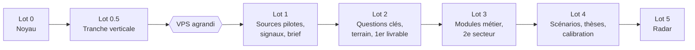

# Roadmap et backlog

Six lots. Un lot n'est commencé que lorsque les critères du précédent sont **verts et vérifiés en
conditions réelles** (déployé, exécuté contre les vrais services, observé). Chaque ticket porte
un identifiant utilisé en préfixe de commit. Les durées sont des ordres de grandeur de
développement par agent.

---

## Lot 0 — Noyau (6 à 8 jours)

Rien de métier : tout ce qui rend le reste ajoutable sans casser.

| Ticket | Contenu |
|---|---|
| L0-01 | Projet sur le VPS selon `CLAUDE.md` « Ajouter un projet » : base `db_strategic`, `docker-compose.yml` (réseau `coolify`, labels Traefik et middlewares propres `sigzip`/`siredirect`), `.env` 600, entrées dans `compose-deploy.sh`, `_KNOWN_PROJECTS`, `00-REPRISE.md` |
| L0-02 | Outillage : ruff, mypy strict, pytest ; `checks/` avec `_harness.py` recopié de portfolio-tracker, `run_all.sh`, hook pré-commit exécutant `check_architecture.py` |
| L0-03 | `ARCHITECTURE.md` depuis `modeles/`, `ARCHITECTURE.md` des modules socle ; `check_architecture.py` + `negatif_architecture.sh` |
| L0-04 | Schéma du noyau (migrations Alembic, `03-SCHEMA.sql` section NOYAU) ; amorçage d'une base vide |
| L0-05 | Configuration en base : schéma Pydantic unique, `config_change`, `setting`, import/export YAML du noyau et d'un pack |
| L0-06 | Registre, chargement des manifestes, `module_state`, `capability_state`, évaluation des prérequis ; `check_manifestes.py`, `check_dependances.py` + négatifs |
| L0-07 | Bus d'événements (`event_outbox`, `event_consumption`, `SKIP LOCKED`), ordonnanceur sur Postgres, processus `web`/`worker`/`scheduler` |
| L0-08 | Routeur de sortie : niveaux, règles S1-S5, `prompt_template` et validation, `egress_log`, mode simulation ; fournisseurs DeepInfra (LLM, embeddings) et factice ; `check_sorties.py`, `check_sensibilite.py` + négatifs |
| L0-09 | Garde-budget : `api_usage`, plafond, modes `observe`/`enforce`, bandeau, alerte d'anomalie |
| L0-10 | Coffre de secrets et chiffrement des colonnes `red` ; copie de la clé maîtresse dans `/root/secrets/` |
| L0-11 | `noyau.http` : garde SSRF, `robots.txt`, `User-Agent`, débit par domaine, domaines interdits |
| L0-12 | `check_agnosticite.py` + négatif |
| L0-13 | Authentification mot de passe + TOTP, rôles `owner`/`analyst`/`reader` |
| L0-14 | Écran « Modules et fonctions » minimal ; sauvegarde de `db_strategic` vérifiée par une restauration |

**Critères d'acceptation**
- Déploiement par `compose-deploy.sh` : `RESULT: success`, page de connexion servie en HTTPS.
- `bash checks/run_all.sh` : bilan `N vérifications OK, 0 échec` ; chaque check livré a rougi sur
  son assert nommé dans son `negatif_*.sh`.
- Un module factice ajouté par dossier + manifeste apparaît dans l'écran, s'active quand son
  prérequis est réuni, et **aucun autre fichier n'a été modifié**.
- Un envoi référençant un objet `red` est refusé sur chaque canal ; un envoi `amber` à deux
  objets est refusé ; chaque envoi (accepté ou refusé) a sa ligne `egress_log`.
- Une restauration de sauvegarde a été faite.

---

## Lot 0.5 — Tranche verticale (3 jours)

Une seule source, traversée complète, **aucun LLM**. Prouve les coutures, pas la valeur.

| Ticket | Contenu |
|---|---|
| L05-01 | Famille `rss` et gabarit `rss_generic` ; `source`, `source_run`, `source_cursor`, `raw_item` |
| L05-02 | Normalisation minimale : texte, langue, date d'événement et sa précision |
| L05-03 | Déduplication documentaire (hash, simhash, titre) |
| L05-04 | Signal sans LLM : titre, extrait, entités par correspondance sur le référentiel |
| L05-05 | Score avec deux composantes actives, renormalisation affichée |
| L05-06 | Liste des signaux, fiche signal |
| L05-07 | Ajout d'une source dans l'interface : formulaire généré depuis `params`, aperçu, activation |
| L05-08 | `check_schema.py` et `check_brut_immuable.py` + négatifs |

**Critères d'acceptation**
- Un article publié par la source apparaît dans l'interface en moins de 15 minutes.
- Scores non nuls malgré l'absence de corroboration et de nouveauté ; composantes neutralisées affichées.
- L'écran des modules liste chaque fonction en attente avec ce qui lui manque.
- **La deuxième source est ajoutée par l'interface, sans commit ni redémarrage.** Vrai critère de sortie.
- Coût externe : zéro.

**Prérequis avant le lot 1** : VPS agrandi (≥ 8 Go de RAM, disque augmenté), vérifié par `free`
et `df` (D16).

---

## Lot 1 — Sources pilotes, signaux, brief (3 semaines)

Le lot qui doit convaincre : un brief quotidien utile, alimenté par six types de sources.

| Ticket | Contenu |
|---|---|
| L1-01 | Contrat de gabarit complet (`04` §3), validation, éditeur YAML avec aperçu dans l'interface |
| L1-02 | Familles `http_json` (GET/POST), `http_xml`, `html_list`, `html_diff`, `email`, `file` ; transformations initiales |
| L1-03 | Découverte automatique (flux, sitemap, proposition de sélecteurs pour `html_list`) |
| L1-04 | `source_sample` et santé des sources ; événement `source.degraded`, alertes |
| L1-05 | Chantier newsletter-summary (`07`) : alias `veille@` et `terrain@`, mode « transmettre », point d'entrée de réception |
| L1-06 | **Six cas pilotes** (`04` §5) en production, chacun avec son échantillon réel |
| L1-07 | Embeddings DeepInfra `bge-m3`, table `embedding`, déduplication sémantique |
| L1-08 | Filtre de pertinence gratuit dérivé du pack |
| L1-09 | Extraction LLM : type d'événement, champs du schéma d'extraction, entités et rôles, citations, observations |
| L1-10 | Résolution d'entités, file de validation des candidates |
| L1-11 | Regroupement d'événements, corroboration par groupes d'indépendance, détection de reprise |
| L1-12 | Double score importance/crédibilité, matrice du brief |
| L1-13 | So-what (gabarit `green`) |
| L1-14 | Brief web « depuis votre dernière visite », actions sur les cartes, `feedback` |
| L1-15 | Brief par courriel et alertes Slack via `comms-gateway` (mode dev tant que les prérequis du gateway ne sont pas levés) |
| L1-16 | Réception des notes terrain : `field_note`, chiffrement, accusé sans contenu |
| L1-17 | Corpus de référence : 200 contenus réels annotés (doublon, type d'événement, entités, pertinence), rejeu fantôme comparatif |
| L1-18 | Écrans d'administration : sources, coûts, sorties externes (journal, validation des gabarits) |

**Critères d'acceptation**
- Les six cas pilotes produisent des signaux réels ; chacun a un `source_sample` capturé d'une
  vraie réponse.
- Parmi les sources ajoutées pendant le lot après les pilotes, ≥ 80 % l'ont été sans commit dans
  `app/` ; toute exception est une limite du contrat, consignée et corrigée dans le contrat.
- Paliers pratiqués : 1 source, puis 5, puis 20 ; brief cohérent à chaque palier ; les fonctions
  s'activent seules au franchissement de leurs prérequis.
- Corpus de référence : doublons non détectés < 5 %, faux doublons < 2 %.
- Aucune carte sans evidence (`check_evidence.py`) ; plafonds du brief respectés.
- Coût externe **mesuré** sur 7 jours réels et projeté sur le mois (mode `observe`), présenté à
  l'utilisateur avec la répartition par usage.
- L'utilisateur juge le brief utile trois matins consécutifs. **Sinon, ne pas passer au lot 2 :
  corriger la sélectivité et le so-what.**

---

## Lot 2 — Questions clés, terrain, premier livrable (2 semaines)

| Ticket | Contenu |
|---|---|
| L2-01 | Module `questions_cles` : mandats, questions, indicateurs (schéma, API, écrans) |
| L2-02 | Assistant de question : refus des questions non falsifiables, reformulation (gabarit `amber`) |
| L2-03 | Indicateurs déclaratifs (`match_rule`) et questions vérifiables (`check_question`) |
| L2-04 | Sondes : génération, édition, exécution via Exa (gabarit `exa_search`) |
| L2-05 | Rattachement signaux ↔ questions, réponse courante et confiance système |
| L2-06 | Revue de portefeuille des questions (alimentation, coût, péremption) |
| L2-07 | Module `terrain` : saisie rapide dans l'outil, rattachement manuel aux entités et questions |
| L2-08 | Module `livrables` : gabarit « note d'une page sur une question clé », filtrage par rôle, export PDF/Markdown |
| L2-09 | Revue du vendredi : sources en attente, questions en stagnation, **revue des sorties `amber`** |
| L2-10 | Workflow de qualification des sources découvertes, essai, rétrogradation |

**Critères d'acceptation**
- Les mandats de départ du pack sont actifs et alimentés.
- Un indicateur s'est déclenché sur un vrai signal par règle déclarative, un autre par question vérifiable.
- La revue du vendredi liste les objets `amber` sortis ; l'utilisateur l'a revue une fois.
- Une note d'une page a été produite, entièrement citée, et exportée.
- Une note terrain reçue par `terrain@` est rattachée à une question sans aucune sortie externe
  (vérifié dans `egress_log`).

---

## Lot 3 — Modules métier, connaissance, second secteur (3 semaines)

| Ticket | Contenu |
|---|---|
| L3-01 | Module `connaissance` : fiches acteur, technologie, segment, programme générées depuis la base ; sections « Lecture » et « Ce qui changerait notre lecture » par LLM, régénérées sur evidence nouvelle |
| L3-02 | Export « enveloppe document commune » (`KNOWLEDGE_ARCHITECTURE.md` §3) ; instantané hebdomadaire |
| L3-03 | Module `concurrence` : sources dérivées du référentiel (`04` §6), pages produits et carrières |
| L3-04 | Module `commande_publique` : calendrier des clôtures, attributions aux concurrents |
| L3-05 | Modules `reglementaire`, `technologie` (brevets EPO), `capital` |
| L3-06 | Module `observations` : séries et comparaisons sur les fiches |
| L3-07 | Module `calendrier` : rétrospectif (heatmap) et prospectif (`entity_milestone`) |
| L3-08 | Indicateur de couverture par zone ; recherche plein texte et sémantique |
| L3-09 | Livrables « dossier concurrent » et « point de situation » |
| L3-10 | Assistant de pack sectoriel ; import/export de pack |

**Critères d'acceptation**
- Chaque module ajouté l'a été **sans modifier un autre module** (vérifié par le diff et
  `check_dependances.py`).
- **Second secteur** : un pack minimal d'un autre secteur (ex. santé) instancié sur une base vide,
  sans modifier une ligne de `app/`, produit un brief ; `check_agnosticite.py` vert sur les deux packs.
- Chaque acteur d'intensité 3 a une fiche complète ; aucune affirmation de fiche sans evidence.
- Le calendrier prospectif contient au moins 30 échéances à 12 mois.

---

## Lot 4 — Scénarios, thèses, calibration (2 semaines)

| Ticket | Contenu |
|---|---|
| L4-01 | Module `scenarios` : jeux de scénarios, signes avant-coureurs, rapports de vraisemblance |
| L4-02 | Vraisemblance historisée (`red`), mise à jour par indicateurs observés et par l'utilisateur |
| L4-03 | Module `theses` : création, indicateurs, rattachement proposé par indicateurs et validé par l'utilisateur |
| L4-04 | Board de thèses, courbe de confiance, « convictions qui ont bougé » (interface seulement) |
| L4-05 | Module `calibration` : probabilités datées, résolution à l'échéance, score de Brier |
| L4-06 | Livrable « revue trimestrielle des scénarios » |
| L4-07 | Audit : 30 jours d'`egress_log` relus, tentative délibérée de fuite `red` par chaque canal, rapport |

**Critères d'acceptation**
- Aucune ligne d'`egress_log` sur 30 jours ne contient de texte `red` (test automatique + inspection).
- L'utilisateur a créé au moins un jeu de scénarios et 3 thèses, et validé des rattachements.

---

## Lot 5 — Radar (1,5 semaine)

Construit en dernier parce que ses fonctions exigent 90 à 180 jours d'historique pour s'activer.

| Ticket | Contenu |
|---|---|
| L5-01 | Orphelins et clusters, boucle de promotion orphelin → thème candidat → question clé |
| L5-02 | Burst sur `radar_trend_observation` (termes, entités, types d'événements, métriques) |
| L5-03 | Dérive lexicale |
| L5-04 | Décalage inter-zones |
| L5-05 | Agent Scout hebdomadaire (contenus `green` seulement) |
| L5-06 | « Angle mort de la semaine » dans le brief |
| L5-07 | Métriques de pilotage mensuelles, revue de couverture |

**Critères d'acceptation**
- Au moins un décalage inter-zones pertinent validé par l'utilisateur.
- Le Scout produit 3 à 5 hypothèses par semaine, dont au moins une jugée intéressante par mois.

---

## Après le lot 5

- Décision utilisateur : passage du budget en mode `enforce`, révision du plafond.
- Réévaluation d'une source sociale (mesure préalable : part des événements majeurs apparus
  d'abord sur la plateforme, sur 60 jours).

**Reportés, à ne pas anticiper** : multi-utilisateur au-delà des rôles, connecteurs internes
(CRM, réponses aux appels d'offres), client JavaScript, radar visuel, génération de
présentations, sondes camouflées, calendrier des décisions internes (refusé, D13).
